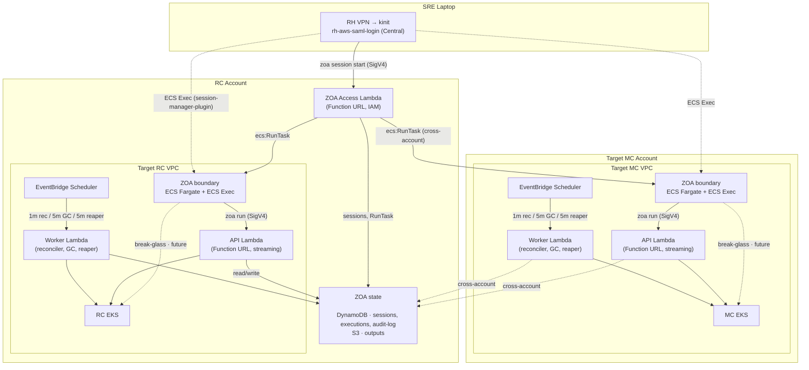

# ROSA Hyperfleet ZOA

A **serverless** Zero Operator Access implementation for the ROSA HCP Hyperfleet platform.

## Overview

ZOA ensures that operators have **no persistent, interactive, or unaudited access** to customer infrastructure. On the laptop, **`zoa`** discovers deployments and manages **boundary sessions**; inside **ZOA Boundary** (ephemeral ECS Fargate in the target VPC), the same CLI runs **Trusted Actions (TAs)** — the only supported way to read or change fleet state. Every session and run records **who**, **what**, and **reason** (Jira issue or PagerDuty incident).

This repository is the source of truth for the ZOA **framework**: CLI, Access/API/Worker Lambdas, boundary container, TA implementations, and docs.

## Components

| Component | Artifact | Runs on | Purpose |
|-----------|----------|---------|---------|
| **CLI (`zoa`)** | `zoa` binary | SRE laptop · boundary task | **Session lifecycle** and environment discovery on the laptop; **Trusted Actions** and investigation on the target VPC API from inside the boundary. |
| **ZOA Boundary** | `zoa-boundary` image | ECS Fargate (per target VPC) | Audited operator environment — **only supported place to run TAs**; ECS Exec transcript (CloudWatch) + agent context (`ZOA_SESSION.md`, offline TA catalog). |
| **Access Lambda** | `zoa-lambda` (`HANDLER_MODE=access`) | Lambda (RC account, no VPC) | Session plane: start/terminate/list/history, targets; `ecs:RunTask` for boundary (including cross-account MC). |
| **API Lambda** | `zoa-lambda` (`HANDLER_MODE=api`) | Lambda (per target VPC) | Execution plane: `zoa run`, sync TAs, audit reads; **identity bridge** (ECS task ARN → DynamoDB session → human operator). |
| **Worker Lambda** | `zoa-lambda` (`HANDLER_MODE=worker`) | Lambda (per target VPC) | Reconciler, GC, async TA execution, boundary session **reaper** (hard + inactivity deadlines). |
| **Async runner** | `zoa-runner` | K8s Job (target EKS) | Long-running async TAs; uploads to S3 |
| **Trusted Actions** | Go in `pkg/actions/` | Lambda + runner + boundary catalog | RBAC-scoped operations invoked via `zoa run` from the boundary task |

**Three images** from this repo: **`zoa-lambda`** (one binary, three `HANDLER_MODE`s), **`zoa-runner`** (async TAs in EKS Jobs), **`zoa-boundary`** (audited operator shell). All TA code lives in `pkg/actions/` and is built into lambda and runner; boundary carries the same `zoa` CLI and TA catalog as the API path.

### Key Properties

- **Boundary-first operations** — operators do not hold kubeconfig or cluster-admin on the laptop; they start a session, work in ECS Exec, and run TAs from inside the task
- **Dual audit** — **sessions** (Access API + ECS Exec logs + DynamoDB session rows) and **TA runs** (executions + audit log + optional S3 artifacts); laptop `session history` / `audit` for fleet visibility
- **Reason on everything** — `zoa session start --reason` and every `zoa run` (default `ZOA_REASON` in boundary)
- **Identity bridge** — API sees the ECS **task role ARN**; DynamoDB maps **task id → session → operator** for TA audit attribution
- **Zero standing access** — no persistent kubectl/aws credentials for fleet work; break-glass not implemented yet
- **SRE muscle memory** — CLI mirrors kubectl/aws-cli conventions (`-n`, `-o json`, `-A`, `--force`)
- **Per-execution RBAC** — each TA dispatch creates a scoped ServiceAccount + Role, destroyed on completion
- **Direct Lambda-to-EKS** — API/Worker in the same VPC as the target EKS cluster
- **Shared state (DynamoDB + S3)** — **sessions**, **executions**, and **audit** in RC (MC Lambdas assume cross-account); S3 for async output and long-term retention (365-day TTL on tables)
- **Write cooldown** / **max concurrent** — per target; bypassable with `--force`
- **HCP namespace protection** — `get_secret` and similar rules block customer `cluster-*` namespaces
- **FedRAMP-ready** — KMS at rest, PITR, deletion protection on stateful resources

### Why this shape

- **Serverless execution plane** — API/Worker/Access are Lambda; no always-on TA workers. Pay per invocation when operators run actions.
- **Ephemeral boundary compute** — ECS Fargate tasks exist only for the investigation window (reaper-enforced). Audited shell + tools (Claude, `jq`) without granting the laptop cluster access.
- **Failure domain isolation** — scoped per **target VPC** (API + Worker + boundary tasks for that EKS cluster) plus a **central Access** function for sessions; a failure in one MC/RC VPC does not take down another cluster's ZOA
- **No capacity planning for Lambdas** — concurrency and DynamoDB on-demand absorb bursts; boundary concurrency is bounded by ECS/Fargate quotas per account/VPC

### Failure Domains

**Operator path (sessions + TAs):**

| Component | Scope | On failure |
|-----------|-------|------------|
| **Lambda** | **Central (RC account):** Access — sessions, targets, `RunTask`. **Per target VPC:** API — sync `zoa run`; Worker — reconciler, GC, reaper, async dispatch (same `zoa-lambda` image, different `HANDLER_MODE`) | **Central:** cannot start/join/list sessions or resolve targets from the laptop; running boundary tasks may still `zoa run` if that VPC’s API is up. **Per VPC:** that cluster’s TAs and scheduled worker work stop; other clusters unaffected |
| **ECS Fargate (boundary)** | Per target VPC | Cannot start or attach to a new session; in-flight Exec may disconnect; task keeps running until reaper or `session terminate` |
| **DynamoDB** | Regional (sessions, executions, audit) | Cannot record sessions or dispatch TAs; identity bridge unavailable |
| **EKS API server** | Per cluster | TA fails; API returns error + execution logs inline |

**Sync (auto-approved) — the common case:**

Output is returned **inline in the HTTP response**. S3 archival happens best-effort for long-term retention — if S3 is down, the operator still gets output immediately.

**Async and manual-approval paths** (adds to the above):

| Component | Required by | On failure |
|-----------|-------------|------------|
| S3 + KMS | Async (runner uploads output) | Execution marked failed |
| EventBridge Scheduler | Async + manual-approval (triggers reconciler/GC/reaper) | Worker Lambda not invoked; approved TAs stuck; session reaper delayed |

Composite sync availability: **~99.95%** (~22 min/month downtime budget, bottlenecked by Lambda + EKS in the target VPC). Session start additionally depends on **Lambda (Access)** and **ECS**. See [storage](docs/architecture/storage.md) for sessions and the reaper.

## Architecture

ZOA uses **three Lambda deployments** from one image (`HANDLER_MODE`) plus **on-demand boundary ECS** per target VPC:

| Plane | Where | Role |
|-------|-------|------|
| **Access** | RC account (no VPC) | Sessions, targets, `RunTask`, session audit APIs |
| **API + Worker** | Each RC/MC VPC (one EKS cluster each) | TA execution, reconciler, GC, session reaper |
| **Boundary** | Same VPC as the session target | Operator shell; `zoa run` → API Lambda in that VPC |

- **API Lambda** — Function URL, IAM auth, `RESPONSE_STREAM`. Serves the boundary task's `zoa` client; sync TAs run in-process.
- **Worker Lambda** — EventBridge (1m reconciler, 5m GC, 5m boundary reaper); async TA via self-invoke + `zoa-runner` Jobs.
- **Access Lambda** — Function URL, IAM auth; laptop `zoa session` / `zoa targets` (deployments via Central SSM).

Separate functions because timeout, concurrency, and streaming vs buffered invoke differ per role.



> **Operator path:** **RH VPN** + **`kinit`** + **`rh-aws-saml-login`** (Central account) → **`zoa deployments`** → **`zoa targets <deployment>`** → **`zoa session start <deployment> <target> --reason TICKET`** → work inside boundary with **`zoa run`** → **`zoa session terminate`**. See [Operator workflow](docs/guides/operator-workflow.md). Break-glass and approval-gated TAs are not implemented yet.

### Execution Modes

All modes persist execution state in DynamoDB before dispatch.

| Mode | Approval | Flow |
|------|----------|------|
| **Sync, auto** | None | Boundary `zoa run` → API Lambda → execute in-process → output inline in HTTP response |
| **Async, auto** | None | Boundary `zoa run` → API Lambda → K8s Job → reconciler polls → `zoa output` / S3 |
| **Sync, manual** | Required | Boundary → API → pending → approve → reconciler → inline · *future* |
| **Async, manual** | Required | Boundary → API → pending → approve → reconciler → Job · *future* |

**Sync output delivery**: the API response contains the TA output (on success) or execution logs (on failure) directly — no second HTTP call or S3 fetch required. S3 archival happens asynchronously for long-term retention.

**Async output delivery**: `zoa-runner` uploads output/logs to S3 after Job completion. The CLI fetches via `GET /runs/{id}?include=output`.

For details on K8s resources and the streaming architecture, see [Implementation Details](docs/architecture/implementation.md).

## Container Images

| Image | Containerfile | Contents | Purpose |
|-------|---------------|----------|---------|
| `zoa-lambda` | `Containerfile` | `zoa-lambda` binary (UBI-minimal) | Deployed as Lambda function (API + Worker + Access modes) |
| `zoa-runner` | `Containerfile.runner` | `zoa-runner` + `zoa` CLI | Runs inside K8s Jobs for async TA execution |
| `zoa-boundary` | `Containerfile.boundary` | `zoa` CLI + aws/kubectl/jq + Claude Code | ECS Fargate task for audited SRE sessions — see [Boundary docs](docs/boundary/README.md) |

## Install the CLI

See [CLI Reference — Install](docs/cli-reference.md#install) for download
instructions and checksum verification.

To build from source: `make build` (requires Go 1.26+).

## Quick Start (contributors)

```bash
make all                # fmt → vet → lint → test → build
./bin/zoa version
make test-shell         # boundary banner / entrypoint bats (optional)
```

Operators use the installed `zoa` CLI and boundary sessions — see [Operator workflow](docs/guides/operator-workflow.md). API/CLI contract reference: [docs/README.md](docs/README.md).

## Repository Structure

High-level layout (see tree in-repo for full `internal/` and `pkg/` packages):

```
rosa-hyperfleet-zoa/
├── cmd/
│   ├── zoa/              CLI binary
│   ├── zoa-lambda/       Lambda entrypoint (access + api + worker)
│   └── zoa-runner/       Async Job runner (K8s Job entrypoint)
├── internal/             CLI, SigV4 client, ECS Exec, EKS auth, output, Access client, …
├── pkg/                  actions, api, handler, executor, store, scheduler, config, metrics, …
├── boundary/             zoa-boundary image: entrypoint, banner, home-sre skel, catalog assets
├── hack/                 demo-cli.sh, boundary catalog generator, dev tools
├── tests/shell/          bats tests for boundary shell scripts
├── test/e2e/             E2E Ginkgo suite (deep + smoke)
├── ci/                   CI scripts (lint, test, verify)
├── docs/                 Documentation — start at docs/README.md
├── Containerfile         zoa-lambda image (access + api + worker)
├── Containerfile.runner  zoa-runner image
├── Containerfile.boundary zoa-boundary image (ECS Fargate)
└── Makefile
```

## Documentation

Full map: **[docs/README.md](docs/README.md)** — operator workflow, TA authoring, API/CLI reference, architecture, storage, boundary runtime.

## Testing

```bash
make test                          # Unit tests with race detection
make test-e2e                      # Functional E2E (full), then monitoring E2E — needs ZOA_RC_API_URL / ZOA_MC_API_URL and RHOBS_API_URL
make test-e2e-smoke                # Functional smoke (~2min), then monitoring E2E — same env vars
```

`test-e2e` and `test-e2e-smoke` chain **`test/e2e-monitoring`** after functional tests. Other targets (`test-e2e-zoa`, `test-e2e-monitoring`, …): [E2E testing](docs/e2e-testing.md).

Two conformance gates ensure every Trusted Action stays tested:

- **Unit conformance** (`pkg/actions/conformance_test.go`, runs on every PR via `make test`):
  required metadata, naming conventions, scope-RBAC consistency, write-TA safety rules, timeout
  ceiling compliance, parameter uniqueness, and unit test file existence.
- **E2E conformance** (`test/e2e/conformance_test.go`, runs on every `make test-e2e`):
  queries the live Lambda registry, verifies every registered TA has a `ta_*` e2e test file,
  checks `knownActions` matches the live registry, and ensures smoke tests cover both `kube-api`
  and `aws-api` scopes.

## Infrastructure

ZOA infrastructure (Terraform) lives in [rosa-hyperfleet](https://github.com/openshift-online/rosa-hyperfleet). Wired from `terraform/config/regional-cluster/` and `terraform/config/management-cluster/`:

| Module | Where used | What it deploys |
|--------|------------|-----------------|
| [`zoa`](https://github.com/openshift-online/rosa-hyperfleet/tree/main/terraform/modules/zoa) | RC | DynamoDB (executions, audit, **boundary sessions**), S3 artifacts, KMS, ECR |
| [`zoa-lambda`](https://github.com/openshift-online/rosa-hyperfleet/tree/main/terraform/modules/zoa-lambda) | Each RC and MC VPC | **API + Worker Lambdas**, **boundary ECS** (Fargate task definition, log groups, boundary IAM), EventBridge, EKS access; on RC only, the **Access Lambda execution role shell** (`access-trust-role.tf`) |
| [`zoa-access`](https://github.com/openshift-online/rosa-hyperfleet/tree/main/terraform/modules/zoa-access) | **RC only** | **Access Lambda** (Function URL), invoker role, session-plane IAM (`ecs:RunTask` into per-VPC boundary, DynamoDB sessions, SSM targets) — does **not** run the boundary container |

MC stacks use `zoa-lambda` only and assume into RC for data; Access Lambda stays in the RC account. See module READMEs under `terraform/modules/zoa-lambda/` and `zoa-access/`.

- [ZOA Architecture ADR](https://github.com/openshift-online/rosa-hyperfleet/blob/main/docs/design/zoa-architecture.md) — platform context and integration
