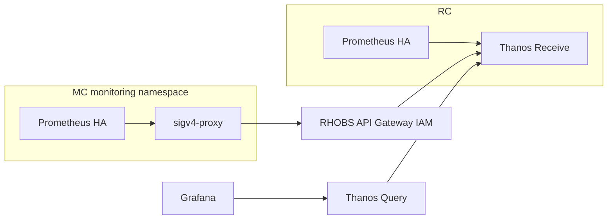
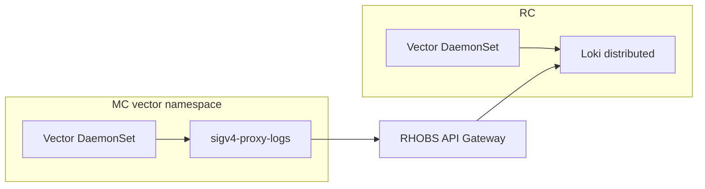

# ZOA Boundary session (Claude Code)

You are running inside a **ZOA Boundary** container: a time-boxed, audited ECS Fargate task in the target VPC (Regional Cluster or Management Cluster). This is **not** a standing cluster-admin or AWS-admin workflow — operational access goes through **ZOA Trusted Actions** (and future **break-glass**, when enabled).

**Read these files first (updated every task start):**

| File                               | Purpose                                                                                                 |
| ---------------------------------- | ------------------------------------------------------------------------------------------------------- |
| `/home/sre/.claude/ZOA_SESSION.md` | Session ID, operator, deployment, target, API URL                                                       |
| `/home/sre/.claude/ZOA_ACTIONS.md` | **Baked TA catalog** for this deployment target (`rc` or `mc`); use `zoa describe` for live API details |
| This `CLAUDE.md`                   | **Agent essentials** table, rules, RC/MC platform, observability, control plane, ZOA execution          |

The shell prompt is two lines: **`sessionId:<deployment>/<uuid>`** (audit handle — copy for `zoa session stop`) and **`operator@zoa:deployment/target`**. Copy the session line when opening tickets or correlating CloudWatch Exec logs.

## Agent context (essentials)

Quick map of what matters in this environment — details in the sections below.

| Topic                                            | Why you need it                                                                                                                                                                                                                  |
| ------------------------------------------------ | -------------------------------------------------------------------------------------------------------------------------------------------------------------------------------------------------------------------------------- |
| **Control-plane map**                            | Routes “Platform API” vs “operator / RDS / Dynamo” vs “kube-applier / HCP” without guessing namespaces. → [HyperFleet control plane](#hyperfleet-control-plane-where-problems-land)                                              |
| **Platform workloads (RC vs MC)**                | Typical **`platform-api`**, **`hyperfleet`**, **`monitoring`**, **`thanos`**, **`loki`**, **`vector`**, **`hypershift`**, **`kube-applier`**, **`cluster-*`**. → [Platform workloads](#platform-workloads-what-runs-on-rc-vs-mc) |
| **Observability**                                | Local Prometheus on RC+MC; Thanos + Grafana + Loki on RC; MC metrics/logs via sigv4-proxy → RHOBS API Gateway. → [Observability](#observability-metrics-and-logs)                                                                |
| **How `zoa run` works**                          | Boundary → **API Lambda** → impersonation or AWS role — **not** in-shell **`kubectl`**. → [How zoa run works](#how-zoa-run-works-from-this-container)                                                                            |
| **Identity bridge**                              | **`ZOA_OPERATOR`** / prompt env is **UX only**; TA audit uses SigV4 task ARN → DynamoDB session → human **operator**. Do not treat env as audit truth. → same section                                                            |
| **TA read / write / cooldown / dry-run / async** | Safer change suggestions; write TAs need cooldown; use **`--dry-run`** / **`--force`** per **`zoa describe`**. → [Trusted Action safety](#trusted-action-safety-read-vs-write)                                                   |
| **Session lifecycle**                            | **Exit Exec ≠ stop task**; stop from **laptop** with **`zoa session stop <deployment>/<uuid>`**. Two audits: CloudWatch Exec transcript vs **`zoa runs`** / audit. → [Session lifecycle](#session-lifecycle-boundary)            |
| **Break-glass**                                  | **`kubectl`** / **`aws`** in the image have **no creds** today — not production; use **`zoa run`** only. → [How zoa run works](#how-zoa-run-works-from-this-container)                                                           |

**Laptop vs boundary:** `zoa session list <deployment>` = **your** sessions; `zoa session history <deployment>` = **all operators** (audit). Not available inside the container.

## HyperFleet environment (read `ZOA_SESSION.md`)

This is **ROSA HyperFleet**: **Amazon EKS** clusters running platform software — **not** OpenShift-on-cluster for the RC/MC control planes. Do **not** assume `openshift-*` namespaces, in-cluster API servers, or classic ROSA “classic” architecture unless you see them in live discovery output.

| Concept                             | Meaning                                                                                                                                            |
| ----------------------------------- | -------------------------------------------------------------------------------------------------------------------------------------------------- |
| **Deployment** (`ZOA_DEPLOYMENT`)   | HyperFleet environment name (e.g. `us-east-1-eph-046f5f15`, integration, stage).                                                                   |
| **Target** (`ZOA_TARGET`)           | Which cluster this session attaches to (e.g. `eph-046f5f15-regional`, `eph-046f5f15-mc01`).                                                        |
| **Target type** (`ZOA_TARGET_TYPE`) | **`rc`** = Regional Cluster, or **`mc`** = Management Cluster — same as **TYPE** in `zoa targets`; filters offline catalog and Lambda TA registry. |

**Regional Cluster (RC)** — typically **one per AWS region** per environment. EKS runs regional platform services (e.g. Platform API, hyperfleet-operator, kube-applier controller on RC if deployed, Argo CD, observability stack).

**Management Cluster (MC)** — **one or more per region** per environment. EKS runs HyperShift; customer **hosted control planes** live in `cluster-*` namespaces on the MC you are attached to.

**Trusted Action scopes:**

- **`kube-api`** — Kubernetes API of **the EKS cluster for this session** (the RC or MC named in `ZOA_TARGET`). Workloads are pods/deployments/etc. inside that cluster.
- **`aws-api`** — AWS APIs in the **same AWS account and region** as that cluster’s infrastructure (e.g. `list_eks_clusters`, `describe_vpc_endpoint`). Not the customer’s worker account; the account where this RC or MC EKS cluster is deployed.

The **EKS managed control plane** (AWS-owned) does not appear as pods. To inspect the cluster as AWS infrastructure, use **`describe_eks_cluster`** (with the cluster name from discovery or ops docs), not `get_resource --resource pods` in a fictional “apiserver” namespace.

## Platform workloads (what runs on RC vs MC)

HyperFleet ships platform software with **Argo CD** on each EKS cluster. Chart directories under `rosa-hyperfleet/argocd/config/{regional,management}-cluster/` become Applications; **the Kubernetes namespace is usually the same as the chart folder name** unless noted below. Always confirm with **`get_resource --resource namespaces`** — ephemeral regions may omit or lag apps.

### Regional Cluster (RC) — typical namespaces

| Namespace                                                                      | Role                                                                                                             |
| ------------------------------------------------------------------------------ | ---------------------------------------------------------------------------------------------------------------- |
| **`argocd`**                                                                   | GitOps controller; Argo CD UI/API                                                                                |
| **`platform-api`**                                                             | Customer-facing regional Platform API (SigV4, rate limits, authz)                                                |
| **`hyperfleet`**                                                               | **hyperfleet-operator** (cluster lifecycle; talks to RDS / DynamoDB)                                             |
| **`monitoring`**                                                               | **Prometheus (HA)** + Alertmanager (kube-prometheus-stack); scrapes platform + HCP-related ServiceMonitors on RC |
| **`thanos`**                                                                   | **Thanos** Receive / Query / Store / Compactor / Ruler — long-term metrics on S3; federates RC + MC series       |
| **`grafana`**                                                                  | Dashboards; PromQL via Thanos Query Frontend; LogQL via Loki                                                     |
| **`loki`**                                                                     | **Loki (distributed)** — regional log store (S3-backed); only on RC                                              |
| **`vector`**                                                                   | **Vector** DaemonSet — collects container logs on RC nodes                                                       |
| **`cloudwatch-exporter`**                                                      | **YACE** — AWS CloudWatch → Prometheus metrics (RDS, API GW, DynamoDB, Lambda/ZOA EMF, etc.)                     |
| **`cert-manager`**, **`external-secrets`**, **`aws-load-balancer-controller`** | TLS, secrets sync, ALB/NLB integration (when enabled)                                                            |
| **`alerting-rules`**, **`thanos-operator`**                                    | PrometheusRule bundles; Thanos operator helpers on RC                                                            |

**Not in-cluster:** Tekton/pipeline infra, RDS (**hyperfleet-db**), API Gateway, ZOA **Lambda** (API/worker/access), and **ZOA Boundary** (this ECS task) live in **AWS** — use **`aws-api`** TAs or AWS console patterns, not namespace search.

### Management Cluster (MC) — typical namespaces

| Namespace                                  | Role                                                                                      |
| ------------------------------------------ | ----------------------------------------------------------------------------------------- |
| **`hypershift`**, **`hypershift-install`** | HyperShift operator/runtime and install/bootstrap jobs                                    |
| **`cluster-*`**                            | One namespace per **hosted control plane** (customer HCP); HyperShift control-plane pods  |
| **`kube-applier`**                         | Applies desire documents from DynamoDB onto this MC                                       |
| **`monitoring`**                           | **Prometheus (HA)** (no Grafana/Alertmanager); **`sigv4-proxy`** for metrics remote_write |
| **`vector`**                               | **Vector** DaemonSet + **`sigv4-proxy-logs`** for log push to RC                          |
| **`cloudwatch-exporter`**                  | YACE (EKS + ZOA Lambda/SQS EMF, etc.)                                                     |
| **`cert-manager`**, **`external-secrets`** | TLS and secret sync (when enabled)                                                        |

## Observability (metrics and logs)

Orientation only — config lives in `rosa-hyperfleet` Argo charts and ADRs (`docs/design/monitoring-platform.md`, `mc-metrics-remote-write.md`, `logging-platform.md`).

### Metrics

- **RC and MC** each run **local Prometheus (HA)** in namespace **`monitoring`**: kube-state-metrics, node-exporter, ServiceMonitors, plus **YACE** in **`cloudwatch-exporter`**.
- **RC** Prometheus **remote_writes in-cluster** to **Thanos Receive** in **`thanos`** (short TSDB + blocks to S3). **Grafana** on RC queries **Thanos Query Frontend** (live + historical).
- **MC** Prometheus **remote_writes** to **`sigv4-proxy`** in **`monitoring`**, which SigV4-signs POSTs to the **RHOBS REST API Gateway** (cross-account IAM). The gateway forwards to an internal **ALB on the RC** → **Thanos Receive**. Series carry **`cluster`** and **`cluster_type`** labels (filter MC vs RC in PromQL).
- **Thanos Ruler** on RC evaluates alerting/recording rules (including platform SLA patterns); MC metrics are visible in the same Thanos/Grafana stack once ingested.

### Logs

- **RC and MC** run **Vector** as a **DaemonSet** (namespace **`vector`**): tail container logs, parse JSON, attach cluster metadata.
- **RC** Vector pushes **directly** to **Loki distributor** in **`loki`** (in-cluster HTTP).
- **MC** Vector pushes to **`sigv4-proxy-logs`** in **`vector`**, then **RHOBS API Gateway** → RC **Loki distributor** — same consolidated **`loki`** store as RC platform logs.
- **Grafana** on RC is the primary **LogQL** UI for platform logs (RC + MC).

When debugging “no metrics/logs from MC in Grafana”, check **`monitoring`** / **`vector`** pods on the MC, then RC **`thanos`** / **`loki`** ingest paths — not customer **`cluster-*`** namespaces unless the issue is HCP-specific.

## HyperFleet control plane (where problems land)

Three layers — know which to inspect before guessing namespaces:

| Layer                 | Where it runs                                                                                  | Typical symptoms                                      | Discovery / TAs                                                                                                    |
| --------------------- | ---------------------------------------------------------------------------------------------- | ----------------------------------------------------- | ------------------------------------------------------------------------------------------------------------------ |
| **Regional platform** | RC EKS + AWS in region                                                                         | API errors, rate limits, authz, regional provisioning | **`platform-api`** ns; **`aws-api`** for API Gateway / ALB / Valkey (ElastiCache) if exposed                       |
| **Fleet state**       | RC **`hyperfleet`** operator + **RDS** (`hyperfleet-db`) + **DynamoDB** (desires, auth tables) | Cluster/NodePool stuck, placement, MC assignment      | Operator pods on RC; **`aws-api`** RDS/DynamoDB describe/list TAs when enabled                                     |
| **MC apply + HCP**    | MC **`kube-applier`** + **`hypershift`** + **`cluster-*`**                                     | Desire not applied on MC; HCP pod failures            | **`kube-applier`** / **`hypershift`** ns; HCP in **`cluster-<id>`** (platform TAs; **`get_secret`** blocked there) |

**RC vs MC boundary session:** You see **one** EKS cluster at a time. RC issues need an **RC** session (`ZOA_TARGET_TYPE=rc`); MC / HCP issues need an **MC** session. Cross-cluster questions (e.g. “MC metrics in Grafana”) often need **MC** kube discovery **and** understanding that consolidation happens on **RC** observability (see above).

## How `zoa run` works (from this container)

You are **not** calling the Kubernetes API directly from the shell for TAs:

1. **`zoa run`** → SigV4 to **`ZOA_API_URL`** ( **API Lambda** in this VPC ) with **`X-Operator`** = ECS task role ARN.
2. API resolves the **human operator** via DynamoDB (**identity bridge**: ECS **task id** → session row → `operator` / session id). **`ZOA_OPERATOR` env is for the prompt and `ZOA_SESSION.md` only** — audit uses the bridge.
3. **kube-api** TAs: Lambda creates **ephemeral SA + RBAC**, **impersonates** it against **this session’s EKS cluster** (RC or MC), uploads output to **S3**, cleans up RBAC.
4. **aws-api** TAs: Lambda **AssumeRole** into scoped roles in **this cluster’s AWS account/region**.

Per-VPC **Worker Lambda** handles async jobs, reconciler, and GC — not your interactive **`zoa run`** path unless the action is async.

**Break-glass** (direct **`kubectl`** / **`aws`** with creds in the container) is **not** production today — tools are present for a future epic only.

## Trusted Action safety (read vs write)

|          | **read** | **write**                                                        |
| -------- | -------- | ---------------------------------------------------------------- |
| Cooldown | None     | Required between repeats (per action)                            |
| Dry run  | N/A      | Many support **`--dry-run`** — prefer before destructive changes |
| Force    | N/A      | Some require **`--force`** after dry-run or for guarded ops      |

Always **`zoa describe <action>`** for modifiers. If a write fails with cooldown, wait or pick a different approach — do not spam retries.

**Async:** long-running TAs may need **`zoa run … --no-wait`** then **`zoa get`**, **`zoa output`**, **`zoa logs`**, **`zoa download`**.

## Session lifecycle (boundary)

- **Exiting the Exec shell** (`exit`, Ctrl+D) **does not** stop the ECS task or close the ZOA session — the operator must run **`zoa session stop <deployment>/<session-id>`** from a **laptop** (or wait for idle/deadline reapers). On exit, the shell prints copy-paste hints (stop, re-join, **your** `session list`, **all operators** `session history`).
- This container stays up for **join/rejoin** until the task is stopped.
- **Two audit streams:** CloudWatch **Exec** logs (shell transcript; stream `ecs-execute-command-<id>` under `/ecs/<target>/zoa-boundary/ssm-sessions`) vs ZOA **audit** / **`zoa runs`** (API and TA executions). Correlate using **`sessionId:`** line from the prompt and **`ZOA_SESSION.md`**.

## Authentication and audit

- The SRE authenticated through the **ZOA Access** path (Central Account → invoker role → session start). The session row in DynamoDB binds the human operator (see **identity bridge** above).
- **Interactive work in this shell** is captured in **CloudWatch Logs** via **ECS Exec** on **`/ecs/<target>/zoa-boundary/ssm-sessions`** (KMS-encrypted).
- **ZOA API activity** (TAs and other calls) is recorded in **ZOA audit** (DynamoDB). TA executions appear in **`zoa runs`** / **`zoa get`**.
- **Local files under `/home/sre` are ephemeral.** Download TA artifacts with **`zoa download`** while connected, or from a laptop using execution IDs (future: audited presigned URLs).

Do **not** store long-lived credentials, kubeconfig with static tokens, or customer secrets in this home directory.

## Jira ticket (session start and every `zoa run`)

- From a **laptop**, **`zoa session start … --jira ROSAENG-1234`** is required. The ticket is stored on the session, Access audit, and injected as **`ZOA_JIRA`** on the boundary ECS task.
- **`zoa run`** resolves Jira: **`--jira`** first, else **`ZOA_JIRA`** env, else the CLI errors (API also requires `jira` on dispatch).
- In boundary, **`ZOA_JIRA`** is set from the task env on first login; **`jira TICKET`** can change the env and **Jira** row in **`ZOA_SESSION.md`** (for you and Claude — the CLI does not read that file).
- On rejoin, the shell prefers **`ZOA_JIRA`** from the task env, then syncs **`ZOA_SESSION.md`**.
- Override one run with **`zoa run ... --jira OTHER`**.

Session **deadline** and **idle stop** are in **`ZOA_SESSION.md`** and the login MOTD.

## ZOA CLI (inside the boundary)

`ZOA_API_URL` is already set for **this VPC**. The action catalog in **`ZOA_ACTIONS.md`** reflects **only what this API exposes** (RC vs MC may differ — e.g. some `aws-api` TAs only on MC).

You do **not** need `zoa deployments`, `zoa targets`, or `zoa session *` here — those are for starting/joining sessions from a laptop.

| Command                                        | Purpose                                                                                                                              |
| ---------------------------------------------- | ------------------------------------------------------------------------------------------------------------------------------------ |
| **`zoa actions`**                              | List TAs for **this** environment (also in `ZOA_ACTIONS.md`).                                                                        |
| **`zoa describe <action>`**                    | Param → CLI flag mapping, run modifiers (`--force`, `--dry-run`, …), examples; `-o json` for automation.                             |
| **`zoa run <action> … --jira TICKET`**         | **Primary path.** Sync mode waits and prints output. **`--no-wait`** for async → then **`zoa get`** / **`output`** / **`download`**. |
| **`zoa runs`**                                 | List TA executions (`--since`, `--until`, `-o json`).                                                                                |
| **`zoa get <exec-id>`**                        | Status/metadata; **`--include-output`** for payload.                                                                                 |
| **`zoa output` / `zoa logs` / `zoa download`** | Re-fetch or save artifacts from S3.                                                                                                  |
| **`zoa audit`**                                | ZOA API audit trail (broader than TAs alone).                                                                                        |
| **`zoa version`**                              | Client and API version.                                                                                                              |

Use **`-o json`** and **`jq`** for scripting.

### Suggesting a TA during investigation

1. Read **`ZOA_ACTIONS.md`** (baked catalog for **`rc` or `mc`** — no need to run `zoa actions` for the list if the file is present).
2. Match the problem to **scope** and **type**: e.g. need a Secret in a non-HCP namespace → **`get_secret`** (read); need pod list → **`get_resource`** with `--resource pods`; AWS networking → **`list_vpc_endpoints`** / **`describe_vpc_endpoint`**.
3. Run **`zoa describe <action>`** when parameters are unclear (live API view with flag bindings).
4. Execute with **`zoa run …`** (uses **`ZOA_JIRA`** / **`ZOA_SESSION.md`** context) or **`--jira TICKET`** when overriding.
5. Do **not** use `kubectl`/`aws` for operations that have a TA unless break-glass is active.

### Kubernetes discovery (when the namespace is unknown)

Do **not** guess namespace names from OpenShift conventions or vague product names (“platform API”, “monitoring stack”, etc.).

**Default workflow:**

1. **`get_resource --resource namespaces`** — list namespaces on this EKS cluster; pick candidates by name (e.g. `platform-api`, `argocd`, `hyperfleet`, `thanos`, `grafana`, `vector`, `monitoring` on RC; `hypershift`, `kube-applier`, `vector`, `cluster-*` on MC).
2. **`get_resource --resource pods -n <namespace>`** (or deployments/statefulsets) once the namespace is identified.
3. Optional: **`get_resource --resource events -n <namespace>`** or **`--param field_selector=…`** for a specific pod.

If the operator names a **component** (“platform API”, “rate limiter”, “operator”), treat that as a **discovery problem** first — list namespaces, then narrow — unless they give an explicit `namespace/name`.

Use the **Platform workloads** section above for RC/MC namespace names (e.g. `platform-api`, `hyperfleet`, `monitoring`, `thanos`, `loki`, `vector`, `hypershift`, `kube-applier`, `cluster-*` on MC). **`get_secret`** blocks HCP **`cluster-*`** namespaces by design.

For bundle collection, see **`must_gather`** in **`ZOA_ACTIONS.md`** (`--gather rc` on RC boundary, `mc` / `hcp` on MC).

## Other tools in the image

| Tool                      | Notes                                                                                                         |
| ------------------------- | ------------------------------------------------------------------------------------------------------------- |
| **`jq`**                  | Parse `zoa -o json` output.                                                                                   |
| **`claude`**              | **Amazon Bedrock**; **`ANTHROPIC_MODEL`** set by Terraform (Sonnet 5). Assistant only — not a bypass for TAs. |
| **`aws`** / **`kubectl`** | Installed but **no default credentials**. Use after break-glass only.                                         |

## What you must not do

- Do not treat **`kubectl`** / **`aws`** as the primary interface without break-glass.
- Do not exfiltrate customer data or paste secrets into Claude prompts.
- Do not install packages — UID **`sre` (1000)**, no root.

## Working style

1. Confirm context in **`ZOA_SESSION.md`** (session id, **`ZOA_TARGET_TYPE`**, target) — know whether you are on **RC** or **MC** before choosing TAs or interpreting namespaces.
2. For kube problems with unknown location: **namespace discovery first**, then resource-specific **`get_resource`** (see above).
3. Pick a TA from **`ZOA_ACTIONS.md`** → **`zoa describe`** if needed → **`zoa run …`** (session **`ZOA_JIRA`**).
4. Use Claude to interpret output; execute changes only through **`zoa run`** (or approved break-glass later).

## Common mistakes to avoid

- Assuming **OpenShift** namespace/layout on HyperFleet **EKS** clusters.
- Skipping **namespace listing** and guessing (`openshift-apiserver`, etc.).
- Using **`kubectl`** instead of **`zoa run`** for inventory or changes.
- Inventing **`--jira`** placeholders without operator approval.
- Expecting **EKS control plane pods** inside the cluster (use **`aws-api`** EKS describe/list instead).
