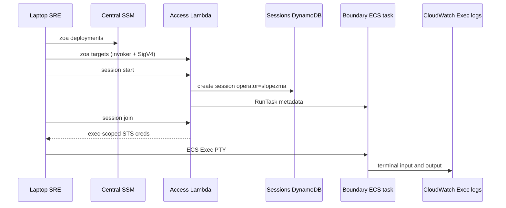
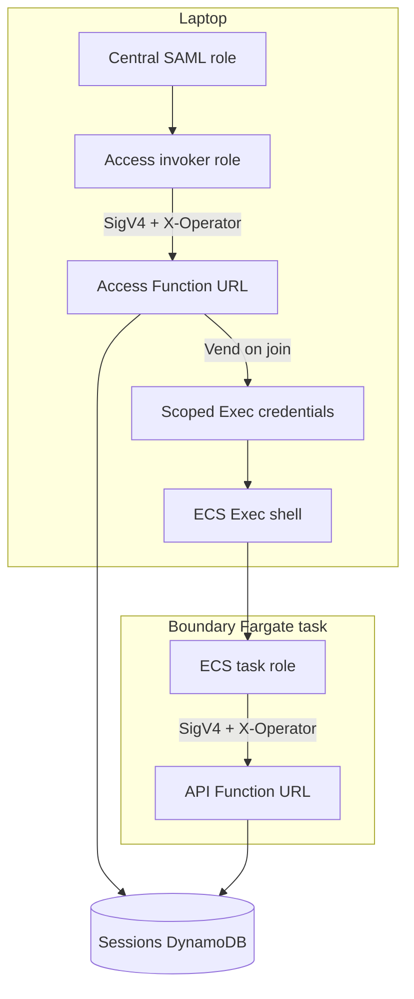

# ZOA Boundary — SRE access guide

End-to-end flow for audited access: laptop identity → discover deployments/targets → start a boundary session → work inside the container (TAs, optional Claude) → disconnect Exec → terminate the session from the laptop. Session **terminal I/O** is recorded to CloudWatch (ECS Exec PTY); see [session logging](../design/boundary-session-logging.md#what-ecs-exec-pty-logging-is).

## Prerequisites

1. **Kerberos ticket** — `kinit` with your Red Hat corporate principal (same as other HyperFleet / ROSA internal tooling).
2. **Central account session** — Log into the **Central AWS account** for the environment (e.g. integration, stage) using **Red Hat SAML** (`rh-aws-saml-login` or your team’s wrapper). Your active credentials must be able to read SSM deployment parameters and assume the ZOA Access **invoker** role.
3. **`zoa` CLI** — Install from [CLI reference](../cli-reference.md#install). Version should match or be compatible with the deployed Access Lambda.
4. **`session-manager-plugin`** — Required for `zoa session join` (ECS Exec).

Direct `kubectl` / `oc` against fleet clusters is **not** the production path; use boundary sessions and Trusted Actions.

## End-to-end SRE workflow

### 1. Corporate access and personal identity on the laptop

1. **Red Hat VPN** — reach internal tooling.
2. **`kinit`** — Kerberos ticket for your Red Hat principal.
3. **`rh-aws-saml-login`** (or team wrapper) — short-lived credentials in the environment’s **Central** AWS account with a **specific hub role** assigned by SAML.

You are **personally identified** on every ZOA call from the laptop: the CLI signs requests with **SigV4** and sends **`X-Operator`** = `sts:GetCallerIdentity().Arn`. For the invoker role, the **STS session name** on that ARN is your username (e.g. `slopezma`). That value becomes **`operator`** on session rows and in audit.

### 2. Discover deployments (Central SSM, no Lambda)

```bash
zoa deployments
```

Reads **`/zoa/deployments/`** in the **Central account** only (direct SSM from your Central credentials — no Access Lambda, no invoker assume yet).

Each **regional pipeline** registers its deployment when ZOA is provisioned (deployment name, Access Function URL, invoker role ARN, region). Entries are **removed when that regional deployment is destroyed**, so the list stays current for ephemeral and long-lived regions alike.

### 3. Discover targets (Access Lambda + RC SSM)

```bash
zoa targets <deployment>
```

1. CLI **assumes the invoker role** for that deployment (ARN from Central SSM), with **your username as the STS session name**.
2. CLI calls the deployment’s **Access Lambda** Function URL (SigV4 + `X-Operator`).
3. Access validates the caller is allowed to invoke the URL, then lists **targets** registered under **`/zoa/targets/<deployment>/`** in the **Regional Cluster (RC) account** Parameter Store.

Each parameter is one boundary-capable cluster: **RC** (`eph-…-regional`) and **MC** targets (e.g. `eph-…-mc01`) as provisioned. Terraform writes parameters at cluster bring-up and deletes them on destroy.

### 4. Start session, join Exec, and ownership

```bash
zoa session start <deployment> <target> --reason ROSAENG-1234
```

**Default:** after Access accepts the request, the CLI **waits for the boundary task**, performs a **hidden `session join`**, and opens **ECS Exec** — you land in the shell without a separate join command. Use **`--no-connect`** (or `-o json`) to only create the session and print metadata.

**On `session start`, Access:**

- Re-validates **Central account + invoker role + operator** (same as other Access APIs).
- Requires **`reason`** in the JSON body (CLI: **`--reason ROSAENG-1234`** or **`--reason '#123456'`** for a PagerDuty incident). Stores it on the session row and Access audit.
- Creates a row in **`zoa-boundary-sessions`** (DynamoDB): `operator`, deployment, target, `reason`, deadline, etc.
- Starts an **ECS Fargate** boundary task in the target VPC with env metadata (`ZOA_SESSION_ID`, `ZOA_OPERATOR`, `ZOA_TARGET`, `ZOA_API_URL`, `ZOA_TARGET_TYPE`, **`ZOA_REASON`**, …).

**On join (automatic or `zoa session join <deployment>/<session-id>`):**

- Access checks **`session.operator`** matches **your** invoker identity (**403** if not).
- Returns **vended STS credentials** scoped to **`ecs:ExecuteCommand` on that task only** (plus SSM messages and Exec KMS) — not deployment-admin power on your laptop.
- CLI runs **session-manager-plugin** → interactive shell as user **`sre`** (`runuser -u sre -- /bin/bash -l`).

Only **you** (the session owner) can **join** or **terminate** that session. `zoa session list <deployment>` shows **your** sessions; `zoa session history <deployment>` is the **audit view across all operators**.



### 5. Inside the boundary container

On first interactive login:

- **MOTD** (plain-text **message of the day** — Unicode ZOA banner, `Hello, <operator>`, session/deployment/target, pointers to docs). Implemented in `zoa-boundary-banner.sh`, shown once per Exec login via `15-zoa-motd.bashrc`.
- **Two-line prompt**: `sessionId:<deployment>/<uuid>` and `<operator>@zoa:<deployment>/<target>`.
- **`~/.claude/ZOA_SESSION.md`** — session facts written at task start.
- **`~/.claude/ZOA_ACTIONS.md`** — offline TA catalog (`zoa actions --offline`, filtered by RC vs MC).
- **`~/.claude/CLAUDE.md`** — HyperFleet architecture, boundary rules, TA workflow, observability pointers, namespace conventions.

**Session limits (MOTD):** hard termination time (from session `deadline` in DynamoDB) and inactivity termination (no Exec terminal activity for the configured window — whichever comes first). **`exit`** only disconnects Exec; the task keeps running until **`zoa session terminate`**, inactivity reap, or hard termination.

**Session reason:** after MOTD, login may prompt for a default reason (Enter to skip). **`reason TICKET`** (or the prompt) sets **`export ZOA_REASON`** and updates **`~/.claude/ZOA_SESSION.md`** for Claude. On rejoin, the shell reloads **`ZOA_REASON`** from that file. **`zoa run`** uses **`--reason`** if set, else **`ZOA_REASON`**, else CLI error (API also rejects missing `reason`). Valid values: Jira issue `ROSAENG-1234` or PagerDuty incident `#123456`.

**Work:**

- **`zoa run …`** — Trusted Actions (audited in DynamoDB). Output appears in the **same PTY** (Exec logs).
- **Claude Code** — optional; uses the same shell context. Prefer driving changes through **`zoa run`**; Claude output and approvals appear in the PTY transcript.

### 6. Leave the shell vs end the session

- **`exit` / Ctrl+D** — disconnects **ECS Exec only**. The **ECS task keeps running** until you terminate it or the **reaper** fires (deadline / inactivity).
- The shell prints **`==>` exit hints** (from `99-session-exit-reminder.bashrc`) on graceful `exit`. The **laptop `zoa` CLI** prints the same terminate/join hints when ECS Exec ends (including SSM inactivity disconnect).

From the **laptop**:

```bash
zoa session terminate <deployment>/<session-id>
```

Exec disconnect flushes the **PTY transcript** to CloudWatch (often within **1–2 minutes**). Correlate streams via **`exec_session_ids`** on `zoa session history -o json` — see [Grafana Explorer](../design/boundary-session-logging.md#viewing-session-logs-in-grafana-explorer).

## Identity and SigV4

ZOA uses **IAM + SigV4** end to end. Every HTTPS call to a ZOA Function URL is signed; AWS **IAM auth on the URL** decides which principals may invoke at all. The **`zoa` CLI** also sends an **`X-Operator`** header set to **`sts:GetCallerIdentity().Arn`** for the **same credentials** used to sign the request — that ARN is how Access and the API Lambda learn _who_ is calling.

**Operator** (for sessions and audit) means your **human SRE username** (e.g. `slopezma`), derived from the **session name** on an assumed-role ARN:

`arn:aws:sts::ACCOUNT:assumed-role/ROLE_NAME/SESSION_NAME` → username = `SESSION_NAME` when you use the **invoker** role on the laptop.

Inside a boundary container the situation is different: many tasks share the **same ECS task role**. Attribution uses the **identity bridge** (below) — not shell env vars.

### Three credential layers (do not mix them)

| Layer            | Where           | AWS credentials                                                            | What it proves                                                           |
| ---------------- | --------------- | -------------------------------------------------------------------------- | ------------------------------------------------------------------------ |
| **1. Access**    | Laptop          | Central hub → **invoker** role                                             | You may call **session/target** APIs on the Access Function URL          |
| **2. ECS Exec**  | Laptop → shell  | **Vended** short-lived creds (exec-scoped role + tight **session policy**) | You may open **SSM/ECS Exec only on this one task**                      |
| **3. API (TAs)** | Inside boundary | **ECS task role** (shared role per task definition)                        | You may call **`zoa run` / actions** on the per-VPC **API** Function URL |



### Laptop path (summary)

The numbered steps above are the canonical flow. In short: **Central SSM** for deployments → **invoker + Access** for targets and sessions → **vended exec creds** for one task only. Cross-account **RunTask / terminate** in the deployment account is performed by **Access** service roles — not by handing broad STS power to your laptop.

### Who can Exec into which ECS task?

Only an SRE who passes **both** checks:

1. **Ownership** — Access `session join` returns **403** if the invoker identity does not match the session’s stored **`operator`**.
2. **Scope** — Even with invoker, **ECS Exec** uses the **vended** credentials from join, not your invoker role. Those credentials are bound to **one task ARN**. Guessing another task’s ARN does not grant Exec.

Knowing a task id is **not** enough; you need a successful **join** as the session owner.

### Inside the boundary: task role, operator, and Trusted Actions

**ECS task role (layer 3)** — All boundary tasks for a target share the **same IAM task role** on the task definition. The role is **not** unique per SRE. What differs per running task is the **ECS task id**, which appears as the **session name** on the task role’s assumed-role ARN when the container signs requests.

**`zoa` in the container** — Uses the task role via the default credential chain, signs **SigV4** to **`ZOA_API_URL`**, and sets **`X-Operator`** to **`GetCallerIdentity().Arn`** (the task-role ARN including the **task id**).

**Identity bridge (how the API knows the human operator)** — The API Lambda does **not** treat `ZOA_OPERATOR` or the prompt as audit truth. On every API request it:

1. Reads **`signer_arn`** from **`X-Operator`** (SigV4 caller ARN).
2. **First:** looks up **`task-id-index`** in sessions DynamoDB using the ARN’s session name (ECS **task id** on boundary tasks).
3. **On hit:** sets **operator** and **session id** from the session row (created at **session start** on Access with **signer_arn**, **account_id**, and human **operator**).
4. **On miss (temporary — laptop `zoa run` today):** **operator** = username from the invoker ARN session name; **session id** empty.

IAM on the Function URL decides who may call; the bridge only attributes humans. Full schema and GSI layout: [boundary identity and storage](../design/boundary-identity-and-storage.md).

The SRE cannot change the ECS task id or repoint the session mapping from inside the shell. Every **`zoa run`** records **operator**, **signer_arn**, and **session_id** in execution and audit data.

**`ZOA_OPERATOR` in the container env** — Set at **RunTask** for the **prompt**, `ZOA_SESSION.md`, and ergonomics. **Audit and TA attribution use the identity bridge**, not this env var.

**What the task role cannot do** — Invoke **Access**, modify session rows in DynamoDB, or widen ECS/IAM. It is scoped to the **API** plane (Trusted Actions, audit reads, Bedrock where configured, exec logging, etc.).

| Where you run `zoa` | Function URL         | Credentials signing SigV4    | How **operator** is determined                    |
| ------------------- | -------------------- | ---------------------------- | ------------------------------------------------- |
| Laptop              | **Access**           | **Invoker** role             | Username from invoker ARN session name            |
| Laptop (Exec only)  | _(AWS ECS/SSM APIs)_ | **Vended exec-scoped** creds | Same human; policy limits to one task             |
| Boundary container  | **API**              | **ECS task role**            | DynamoDB lookup: task id → session → **operator** |

More detail: [Architecture](architecture.md) (Access vs API split).

## Discover deployments

```bash
zoa deployments
```

Central SSM only — see [§2 above](#2-discover-deployments-central-ssm-no-lambda). Column reference:

| Column           | Meaning                                                                                   |
| ---------------- | ----------------------------------------------------------------------------------------- |
| **DEPLOYMENT**   | Name passed to `zoa session` and `zoa targets` (e.g. `us-east-1`, `us-east-1-eph-abc123`) |
| **ACCESS URL**   | ZOA Access Lambda Function URL                                                            |
| **INVOKER ROLE** | Role to assume before calling Access                                                      |

## Discover targets

```bash
zoa targets <deployment>
# or: zoa targets -d <deployment>
```

Access + RC Parameter Store — see [§3 above](#3-discover-targets-access-lambda--rc-ssm). Use the **target id** from the `TARGET` column in `zoa session start`.

## Start and join a session

See [§4 above](#4-start-session-join-exec-and-ownership). Quick reference:

```bash
zoa session start <deployment> <target> --reason ROSAENG-1234
zoa session start <deployment> <target> --reason ROSAENG-1234 --no-connect
zoa session join <deployment>/<session-id>       # reconnect later
```

### Prompt and MOTD

On **ECS Exec login**, a plain-text **MOTD** prints once (Unicode **ZOA** banner, `Hello, <operator>`, session fields, and pointers to **`~/.claude/CLAUDE.md`**, **`ZOA_SESSION.md`**, **`ZOA_ACTIONS.md`**). Requires a UTF-8 terminal (standard for modern SSH/ECS Exec). The shell then uses a **two-line prompt**:

- Line 1: `sessionId:<deployment>/<uuid>` — copy this for `zoa session terminate`.
- Line 2: `<operator>@zoa:<deployment>/<target>` — who and where.

Session facts and **`ZOA_ACTIONS.md`** (rendered at task start via `zoa actions --offline -o markdown`, filtered by **`ZOA_TARGET_TYPE` / TYPE in `zoa targets`**) live under `/home/sre/.claude/` with **`CLAUDE.md`**. The embedded offline catalog is a hint; the **live API** is authoritative when connected (`zoa actions`, `zoa describe` without `--offline`).

## Work inside the boundary

```bash
zoa actions
zoa describe get_resource
zoa run get_resource --resource pods -n openshift-ingress --reason ROSAENG-1234
```

**`--reason` is required** on every `zoa run` (Jira issue or PagerDuty incident, e.g. `ROSAENG-1234`, `#123456`).

Read [Trusted Actions guide](../trusted-actions.md) for authoring; [CLAUDE.md](https://github.com/openshift-online/rosa-hyperfleet-zoa/blob/main/boundary/home-sre/.claude/CLAUDE.md) in the image explains Claude + TA rules.

## End a session

See [§6 above](#6-leave-the-shell-vs-end-the-session). From the **laptop**:

```bash
zoa session list <deployment>      # your sessions (last 24h default)
zoa session history <deployment>   # all operators (audit)
zoa session terminate <deployment>/<session-id>
```

Reaper rules (deadline / inactivity): [Session reaper](../design/boundary-session-reaper.md).

## Terminate from inside the boundary?

**Not supported.** Session lifecycle belongs to **Access**; the boundary task role is scoped to **API** Lambda (TAs). Running `zoa session terminate` inside the container would require Access routes and task-role wiring we deliberately avoid. Use the **exit reminder**, the **prompt**, `session list`, and **laptop terminate** instead.

## Troubleshooting

| Symptom                       | Check                                                                                                                                                                                                                                                               |
| ----------------------------- | ------------------------------------------------------------------------------------------------------------------------------------------------------------------------------------------------------------------------------------------------------------------- |
| `deployments` empty           | Central credentials; SSM path `/zoa/deployments/`                                                                                                                                                                                                                   |
| `session start` fails         | Invoker role trust; target exists in `zoa targets`                                                                                                                                                                                                                  |
| Exec handshake fails          | `session-manager-plugin`; KMS/exec-scoped role (see [session logging](../design/boundary-session-logging.md))                                                                                                                                                       |
| `zoa run` fails               | `ZOA_API_URL` in container; task role on API Function URL resource policy                                                                                                                                                                                           |
| Claude / Bedrock errors       | Bedrock model enabled in account; see hyperfleet `zoa-boundary` Bedrock agreements                                                                                                                                                                                  |
| Session transcript in Grafana | [ECS Exec logs](../design/boundary-session-logging.md#viewing-session-logs-in-grafana-explorer) — `ssm-sessions` + `exec_session_ids` from `zoa session history`; Claude TUI can look noisy but transcript is valid for forensics; use **`zoa runs`** for TA detail |
