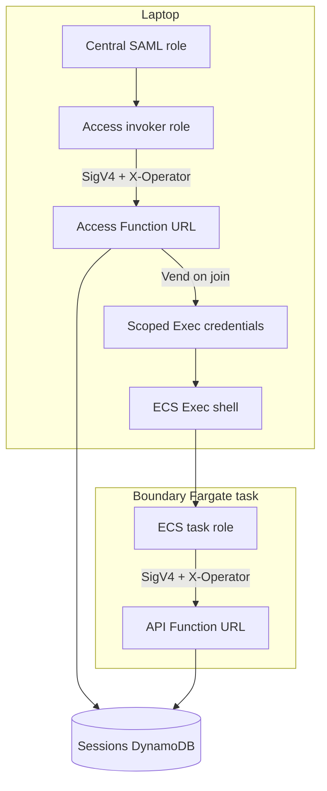

# ZOA Boundary — SRE access guide

## Prerequisites

1. **Kerberos ticket** — `kinit` with your Red Hat corporate principal (same as other HyperFleet / ROSA internal tooling).
2. **Central account session** — Log into the **Central AWS account** for the environment (e.g. integration, stage) using **Red Hat SAML** (`rh-aws-saml-login` or your team’s wrapper). Your active credentials must be able to read SSM deployment parameters and assume the ZOA Access **invoker** role.
3. **`zoa` CLI** — Install from [CLI reference](../cli-reference.md#install). Version should match or be compatible with the deployed Access Lambda.
4. **`session-manager-plugin`** — Required for `zoa session join` (ECS Exec).

Direct `kubectl` / `oc` against fleet clusters is **not** the production path; use boundary sessions and Trusted Actions.

## Identity and SigV4

ZOA uses **IAM + SigV4** end to end. Every HTTPS call to a ZOA Function URL is signed; AWS **IAM auth on the URL** decides which principals may invoke at all. The **`zoa` CLI** also sends an **`X-Operator`** header set to **`sts:GetCallerIdentity().Arn`** for the **same credentials** used to sign the request — that ARN is how Access and the API Lambda learn _who_ is calling.

**Operator** (for sessions and audit) means your **human SRE username** (e.g. `slopezma`), derived from the **session name** on an assumed-role ARN:

`arn:aws:sts::ACCOUNT:assumed-role/ROLE_NAME/SESSION_NAME` → username = `SESSION_NAME` when you use the **invoker** role on the laptop.

Inside a boundary container the situation is different: many tasks share the **same ECS task role**. Attribution uses the **identity bridge** (below) — not shell env vars.

### Three credential layers (do not mix them)

| Layer            | Where           | AWS credentials                                                            | What it proves                                                           |
| ---------------- | --------------- | -------------------------------------------------------------------------- | ------------------------------------------------------------------------ |
| **1. Access**    | Laptop          | Central hub → **invoker** role                                             | You may call **session/target** APIs on the Access Function URL          |
| **2. ECS Exec**  | Laptop → shell  | **Vended** short-lived creds (exec-scoped role + tight **session policy**) | You may open **SSM/ECS Exec only on this one task**                      |
| **3. API (TAs)** | Inside boundary | **ECS task role** (shared role per task definition)                        | You may call **`zoa run` / actions** on the per-VPC **API** Function URL |



### Laptop path (discovery and sessions)

1. **Red Hat VPN** — corporate network path to internal tooling.
2. **`kinit`** — Kerberos ticket for your Red Hat principal (typically only works on VPN).
3. **RH SAML login** — short-lived credentials in the environment’s **Central** AWS account. You receive a **narrow hub role**: enough for SSM discovery and ZOA Access, **not** deployment-account admin.
4. **`zoa deployments`** — reads **`/zoa/deployments/`** in Central (**SSM** only).
5. **`zoa targets` / `zoa session start|stop|list`** — CLI assumes the deployment **invoker** role (ARN from SSM), with **your username as the STS session name**, then **SigV4** to the **Access** Function URL.
6. **`zoa session start`** — Access creates a **DynamoDB session** with **`operator`** = your username (from the invoker ARN) and provisions the boundary task when you join.
7. **`zoa session join`** — Access checks **you own the session** (`session.operator` must match your invoker identity). It returns **`exec_credentials`**: temporary keys whose IAM policy allows **`ecs:ExecuteCommand` only on that task’s ARN** (plus SSM messages and the Exec KMS key). You do **not** Exec with deployment-admin roles.

Cross-account **RunTask / stop** in the deployment account is performed by **Access** using its service roles — not by handing broad STS power to your laptop.

### Who can Exec into which ECS task?

Only an SRE who passes **both** checks:

1. **Ownership** — Access `session join` returns **403** if the invoker identity does not match the session’s stored **`operator`**.
2. **Scope** — Even with invoker, **ECS Exec** uses the **vended** credentials from join, not your invoker role. Those credentials are bound to **one task ARN**. Guessing another task’s ARN does not grant Exec.

Knowing a task id is **not** enough; you need a successful **join** as the session owner.

### Inside the boundary: task role, operator, and Trusted Actions

**ECS task role (layer 3)** — All boundary tasks for a target share the **same IAM task role** on the task definition. The role is **not** unique per SRE. What differs per running task is the **ECS task id**, which appears as the **session name** on the task role’s assumed-role ARN when the container signs requests.

**`zoa` in the container** — Uses the task role via the default credential chain, signs **SigV4** to **`ZOA_API_URL`**, and sets **`X-Operator`** to **`GetCallerIdentity().Arn`** (the task-role ARN including the **task id**).

**Identity bridge (how the API knows the human operator)** — The API Lambda does **not** treat `ZOA_OPERATOR` or the prompt as audit truth. For requests signed by the **boundary task role**, it:

1. Reads the caller ARN from **`X-Operator`** (task role + **ECS task id**).
2. Looks up the session in DynamoDB by **task id** (`task-id-index`).
3. Sets **operator** and **session id** from that **session record** (written at **session start** on Access).

The SRE cannot change the ECS task id or repoint the session mapping from inside the shell. Every **`zoa run`** records the resolved **operator**, the raw **signer ARN**, and **session id** in execution and audit data.

**`ZOA_OPERATOR` in the container env** — Set at **RunTask** for the **prompt**, `ZOA_SESSION.md`, and ergonomics. **Audit and TA attribution use the identity bridge**, not this env var.

**What the task role cannot do** — Invoke **Access**, modify session rows in DynamoDB, or widen ECS/IAM. It is scoped to the **API** plane (Trusted Actions, audit reads, Bedrock where configured, exec logging, etc.).

| Where you run `zoa` | Function URL         | Credentials signing SigV4    | How **operator** is determined                    |
| ------------------- | -------------------- | ---------------------------- | ------------------------------------------------- |
| Laptop              | **Access**           | **Invoker** role             | Username from invoker ARN session name            |
| Laptop (Exec only)  | _(AWS ECS/SSM APIs)_ | **Vended exec-scoped** creds | Same human; policy limits to one task             |
| Boundary container  | **API**              | **ECS task role**            | DynamoDB lookup: task id → session → **operator** |

More detail: [Architecture](architecture.md) (Access vs API split).

## Discover deployments

```bash
zoa deployments
```

Reads **`/zoa/deployments/`** in the Central account (SSM). Each row is one regional ZOA installation:

| Column           | Meaning                                                                                   |
| ---------------- | ----------------------------------------------------------------------------------------- |
| **DEPLOYMENT**   | Name passed to `zoa session` and `zoa targets` (e.g. `us-east-1`, `us-east-1-eph-abc123`) |
| **ACCESS URL**   | ZOA Access Lambda Function URL                                                            |
| **INVOKER ROLE** | Role to assume before calling Access                                                      |

No Access call is needed for this step — only SSM read in Central.

## Discover targets

```bash
zoa targets -d <deployment>
```

Lists clusters registered for that deployment (RC and MC targets). Use the **target id** from the `TARGET` column in `zoa session start`.

## Start and join a session

```bash
# Positional: deployment then target
zoa session start <deployment> <target>

# Example
zoa session start us-east-1-eph-f37869e8 mc01
```

The CLI assumes the invoker role, calls Access, creates a DynamoDB session, and returns a session id.

```bash
zoa session join <deployment>/<session-id>
```

Opens ECS Exec into the boundary container as user **`sre`**.

### Prompt and session id

On **ECS Exec login**, a plain-text MOTD prints once (Unicode **ZOA** banner, `Hello, <operator>`, session fields, and pointers to **`~/.claude/CLAUDE.md`**, **`ZOA_SESSION.md`**, **`ZOA_ACTIONS.md`**). Requires a UTF-8 terminal (standard for modern SSH/ECS Exec). The shell then uses a **two-line prompt**:

- Line 1: `sessionId:<deployment>/<uuid>` — copy this for `zoa session stop`.
- Line 2: `<operator>@zoa:<deployment>/<target>` — who and where.

Session facts and **`ZOA_ACTIONS.md`** (rendered at task start via `zoa actions --offline -o markdown`, filtered by **`ZOA_TARGET_TYPE` / TYPE in `zoa targets`**) live under `/home/sre/.claude/` with **`CLAUDE.md`**. The embedded offline catalog is a hint; the **live API** is authoritative when connected (`zoa actions`, `zoa describe` without `--offline`).

## Work inside the boundary

```bash
zoa actions
zoa describe get_resource
zoa run get_resource --resource pods -n openshift-ingress --jira ROSAENG-1234
```

**`--jira` is required** on every `zoa run` (e.g. `ROSAENG-1234`, `HPSTRAT-62`).

Read [Trusted Actions guide](../trusted-actions.md) for authoring; [CLAUDE.md](https://github.com/openshift-online/rosa-hyperfleet-zoa/blob/main/boundary/home-sre/.claude/CLAUDE.md) in the image explains Claude + TA rules.

## End a session

From your **laptop** (not required from inside the container):

```bash
zoa session list <deployment>    # if you lost the id
zoa session stop <deployment>/<session-id>
```

Exiting the Exec shell (`exit` or Ctrl+D) **does not** stop the ECS task or close the session row. Stop explicitly with `zoa session stop`, or the **reaper** will stop the task when:

- the session **deadline** is reached (max duration, default 4h from Access config), or
- there has been no **ECS Exec terminal activity** for the idle window (default 1h; includes tasks that never got a join).

Details: [Session reaper](../design/boundary-session-reaper.md).

When you leave the shell, the boundary prints **`==>`** hints with the exact `zoa session stop`, `join`, `list`, and `history` commands for your laptop.

There is **no** `session stop --current` with local state — you may run **multiple sessions** in parallel; use `session list` and the prompt’s session line.

## Stop from inside the boundary?

**Not supported.** Session lifecycle belongs to **Access**; the boundary task role is scoped to **API** Lambda (TAs). Running `zoa session stop` inside the container would require Access routes and task-role wiring we deliberately avoid. Use the **exit reminder**, the **prompt**, `session list`, and **laptop stop** instead.

## Troubleshooting

| Symptom                 | Check                                                                                                         |
| ----------------------- | ------------------------------------------------------------------------------------------------------------- |
| `deployments` empty     | Central credentials; SSM path `/zoa/deployments/`                                                             |
| `session start` fails   | Invoker role trust; target exists in `zoa targets`                                                            |
| Exec handshake fails    | `session-manager-plugin`; KMS/exec-scoped role (see [session logging](../design/boundary-session-logging.md)) |
| `zoa run` fails         | `ZOA_API_URL` in container; task role on API Function URL resource policy                                     |
| Claude / Bedrock errors | Bedrock model enabled in account; see hyperfleet `zoa-boundary` Bedrock agreements                            |
