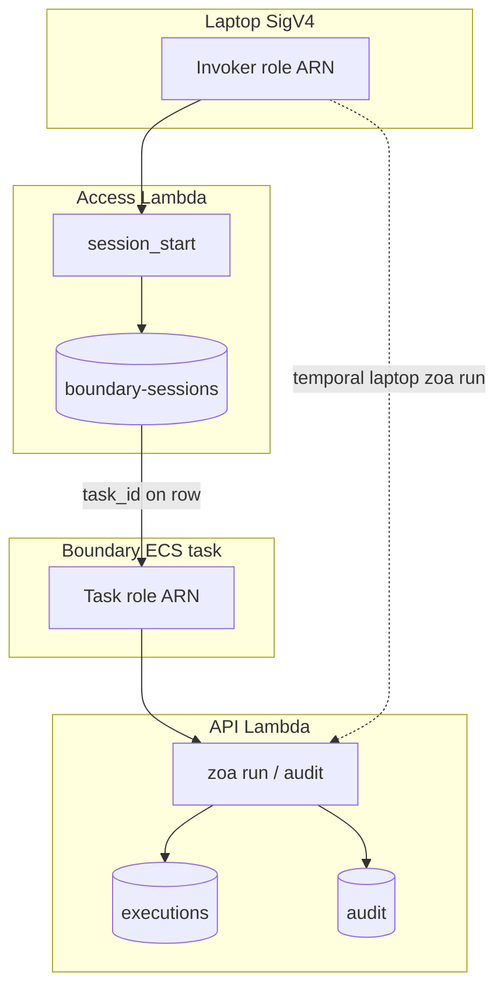

# ZOA Boundary — Identity, audit schema, and sessions storage

This document is the **agreed implementation plan** for uniform operator attribution across **sessions**, **runs (executions)**, and **audit**; DynamoDB index policy for `boundary-sessions`; and CLI output contracts. Keep it in sync with code comments at the cited entry points.

**Related:** [boundary-session-reaper.md](./boundary-session-reaper.md), [boundary-session-logging.md](./boundary-session-logging.md), [sre-access-guide.md](../boundary/sre-access-guide.md).

---

## Goals

1. **One identity vocabulary** everywhere: `operator`, `signer_arn`, `session_id`, `account_id` (where applicable).
2. **Tamper-proof boundary attribution** via **task id → session row** (identity bridge), not client headers or role-name heuristics.
3. **IAM (Terraform) decides who may call** API / Access Lambdas; application code **attributes** humans for audit.
4. **DynamoDB indexes justified** like executions/audit: each GSI documents **who queries it** and **how often**.
5. **CLI:** default table shows resolved `operator` (not truncated); `-o wide` and `-o json` expose the **same** identity field set (full ARNs in json/wide).

---

## Identity fields (uniform schema)

| Field        | Meaning                                             | Sessions                                      | Executions         | Audit                               |
| ------------ | --------------------------------------------------- | --------------------------------------------- | ------------------ | ----------------------------------- |
| `operator`   | Resolved **human** SRE (`slopezma`)                 | At `session_start`                            | At dispatch        | Per request                         |
| `signer_arn` | Full **SigV4** assumed-role ARN for this call/event | Invoker at start (rename from `operator_arn`) | Caller at dispatch | Caller                              |
| `session_id` | Boundary session UUID                               | **Table PK** (`sessionId`)                    | If from boundary   | When known                          |
| `account_id` | Caller AWS account (`X-Account-ID`)                 | **Add at start**                              | Yes                | Yes (`accountId` PK on audit table) |

**Not identity:** `reason` (change ticket or incident on TA dispatch), `task_id` / `task_arn` (ECS resources on **session row** only).

---

## Two Lambdas — two paths

| Lambda     | Identity at write                                                                                                                                                                       |
| ---------- | --------------------------------------------------------------------------------------------------------------------------------------------------------------------------------------- |
| **Access** | `ExtractSREIdentity(signer_arn)` → `operator`; store `signer_arn`, `account_id`, new `session_id`; later `task_id` / `task_arn` from ECS. **Does not** run the task-id bridge on write. |
| **API**    | `resolveIdentity` (below) → `operator`, `signer_arn`, `session_id` on executions and audit.                                                                                             |

---

## API Lambda: `resolveIdentity` (document in `pkg/api/identity.go`)

**Every** API request has `signer_arn` (from `X-Operator` / IAM). The STS **session name** is the last `/` segment of that ARN.

**Do not** use IAM role **name** patterns (e.g. `*-zoa-boundary-task`) for correctness. **IAM resource policies (TF)** control who may invoke; this function only **attributes**.

### Algorithm (always in this order)

1. **Identity bridge (first):**  
   `sessionName := last segment of signer_arn`  
   `row := sessionStore.GetByTaskID(sessionName)` — GSI **`task-id-index`** (`taskId` = ECS task UUID).
   - **FOUND** → `operator = row.operator`, `session_id = row.sessionId`.
   - This is the **normal boundary `zoa run` path** (~99% today; 100% after IAM lockdown).

2. **Temporal fallback (only on bridge miss):**  
   `operator = ExtractSREIdentity(signer_arn)` (session name = human), `session_id = ""`.
   - **Laptop `zoa run`:** bridge misses (no row with `taskId = "slopezma"`); fallback is **correct**.
   - **Boundary misconfig / race:** bridge misses; fallback may set `operator` to task UUID — **log/metric** and fix ops data.
   - **Future:** when API invoke is **boundary-task-only**, this path is break-glass only; consider removing or hard-failing.

**Optional performance only:** skip step 1 Dynamo read when `sessionName` is clearly not a task UUID (straight to step 2 for laptop). Same semantics.

### Code comment requirement

At top of `ResolveIdentity` and call sites (`pkg/api/router.go` `recordAudit`, `pkg/api/dispatch.go`), maintain a short block comment pointing to **this doc** and summarizing steps 1–2. Mark step 2 with `// TEMPORARY: laptop TA until IAM restricts API invoke to boundary task role`.

---

## Sessions DynamoDB (`boundary-sessions`)

**Terraform:** `rosa-hyperfleet/terraform/modules/zoa/dynamodb.tf`  
**Access patterns:** `pkg/store/session.go`, Access `pkg/api/access.go`

### Primary key and attributes

| Dynamo attribute                        | JSON         | Purpose                                                                                                    |
| --------------------------------------- | ------------ | ---------------------------------------------------------------------------------------------------------- |
| **`sessionId`** (PK)                    | `session_id` | UUID created at **`session_start`** — join/stop/exec-attached, `ZOA_SESSION_ID`, links in executions/audit |
| `operator`                              | `operator`   | Human SRE at start                                                                                         |
| `signerARN` (Dynamo) / **`signer_arn`** (JSON) | `signer_arn` | Invoker ARN at session start (same attribute name as executions/audit)                                     |
| **`accountId`** (new)                   | `account_id` | From `X-Account-ID` at start                                                                               |
| `taskId`                                | `task_id`    | ECS task UUID — **same value as STS session name on task role** (identity bridge key)                      |
| `taskArn`                               | `task_arn`   | Full ARN for ECS APIs (stop, exec)                                                                         |
| `dateBucket`                            | —            | Daily partition for list/history (`YYYY-MM-DD`)                                                            |
| `ttl`                                   | —            | Same as other tables: **`DYNAMODB_TTL_DAYS`** (default **365**)                                            |

**Clarification:** `sessionId` ≠ `taskId`. One session row holds **both**: PK is session UUID; GSI looks up by task id after RunTask.

### GSI policy — keep exactly three

Document each index in Terraform with an **operation → index** table (same style as executions/audit in `dynamodb.tf`).

| GSI                         | Key                             | Consumer                                                                                  | Frequency                | Remove?             |
| --------------------------- | ------------------------------- | ----------------------------------------------------------------------------------------- | ------------------------ | ------------------- |
| **`task-id-index`**         | PK=`taskId`                     | `GetByTaskID` — **identity bridge**                                                       | Per boundary TA dispatch | **Keep — critical** |
| **`status-deadline-index`** | PK=`status`, SK=`deadline`      | Reaper `ListExpired`, idle candidate queries — [reaper doc](./boundary-session-reaper.md) | EventBridge worker tick  | **Keep — critical** |
| **`date-bucket-index`**     | PK=`dateBucket`, SK=`createdAt` | `ListAll` — `zoa session list` / `history`                                                | Human CLI                | **Keep**            |

**Remove from Terraform** (no code queries today):

- `operator-index` — `ListByOperator` unused by Access list handler (`ListAll` used instead).
- `status-index`, `target-index` — not referenced in `pkg/store/session.go` list paths (legacy `List()` uses **Scan**).

After removal in TF, plan applies for existing environments (index drop is safe if unused).

### Session listing — bounded queries

Same pattern as **`zoa runs`** / **`zoa audit`**:

- CLI **`session list`** and **`session history`**: default **`--since 24h`** on the flag (pass query param; do not rely only on server default).
- Server `ListAll` walks **`date-bucket-index`** day-by-day; filters (`operator`, `status`, `target`) as **FilterExpression** on those queries.

---

## Executions and audit (reference)

Already documented in `rosa-hyperfleet` `dynamodb.tf`:

- **Executions:** PK `executionId`; GSIs `target-status-index` (machine), `date-bucket-index` (CLI).
- **Audit:** PK `accountId` + SK `timestamp`; GSI `date-bucket-index` (CLI).

API already stores `operator`, `signer_arn`, `session_id` on executions/audit at write. **Gap:** CLI client types and table output (see below).

---

## Terraform / config (boundary limits)

In `rosa-hyperfleet` `config/defaults.yaml` (rendered to pipeline JSON):

| Key                                         | RC `zoa_lambda`     | RC `zoa_access`                            | MC `zoa_lambda` |
| ------------------------------------------- | ------------------- | ------------------------------------------ | --------------- |
| `zoa_boundary_session_idle_timeout_seconds` | Worker reaper + env | RunTask `ZOA_SESSION_IDLE_TIMEOUT_SECONDS` | Worker reaper   |
| `zoa_boundary_session_max_duration_hours`   | —                   | `SESSION_MAX_DURATION_HOURS`               | —               |

Single config source; no duplicate literals in `main.tf`.

---

## Reason (boundary + CLI) — settled

- `zoa run`: `--reason` → `ZOA_REASON` → error (`internal/cli/reason`); CLI **does not** read `ZOA_SESSION.md`.
- Boundary: `reason` helper + login hydrate/prompt; MOTD shows session limits + reason (Jira or `#incident`).

---

## CLI output contract

| Mode              | Identity columns                                                              |
| ----------------- | ----------------------------------------------------------------------------- |
| **Default table** | `operator` only (full username, **no truncate**)                              |
| **`-o wide`**     | `operator`, `signer_arn`, `session_id` (+ business columns; full ARN strings) |
| **`-o json`**     | **Same fields as wide**, JSON encoding                                        |

**Implementation debt:**

- Extend `internal/client` `Execution`, `AuditEntry`, `Session` with `signer_arn`, `session_id`, `account_id`.
- `zoa audit` / `zoa session`: add **`-o wide`** where missing.
- Remove `Truncate(operator, …)` in `runs.go` / `audit.go`.

---

## Implementation phases

### Phase A — Identity (rosa-hyperfleet-zoa)

| Task                                                                                                  | Files / notes                                     |
| ----------------------------------------------------------------------------------------------------- | ------------------------------------------------- |
| Refactor `ResolveIdentity`: bridge first (`GetByTaskID`), fallback extract; **remove role-name gate** | `pkg/api/identity.go`, tests                      |
| Document algorithm in code → link this file                                                           | `identity.go`, `router.go`, `dispatch.go`         |
| Access `recordAccessAudit` aligned (done)                                                             | `pkg/api/access.go`                               |
| Session start: set **`account_id`** and **`signer_arn`** (Dynamo `signerARN`, same as executions)     | `pkg/store/session.go`, `access.go`, client types |
| CLI: `session list` default `--since 24h`                                                             | `internal/cli/session.go`                         |

### Phase B — CLI / client parity (rosa-hyperfleet-zoa)

| Task                                                 | Files                                         |
| ---------------------------------------------------- | --------------------------------------------- |
| Client struct fields                                 | `internal/client/types.go`                    |
| Wide + json identity columns; no operator truncation | `runs.go`, `audit.go`, `session.go`, `get.go` |
| `zoa audit -o wide`                                  | `audit.go`                                    |

### Phase C — DynamoDB Terraform (rosa-hyperfleet)

| Task                                                                     | Files                               |
| ------------------------------------------------------------------------ | ----------------------------------- |
| Drop unused session GSIs (3 remain)                                      | `terraform/modules/zoa/dynamodb.tf` |
| Fix comments: PK = session UUID; TTL = `DYNAMODB_TTL_DAYS`               | same                                |
| Operation → index tables for **sessions** (match executions/audit style) | same                                |

### Phase D — Docs and guides

| Task                                                  | Files                                          |
| ----------------------------------------------------- | ---------------------------------------------- |
| This design doc (maintain)                            | `docs/design/boundary-identity-and-storage.md` |
| SRE guide: identity triple, bridge vs laptop          | `docs/boundary/sre-access-guide.md`            |
| API reference: `signer_arn`, `account_id` on sessions | `docs/api-reference.md`                        |
| Epic plan cross-link                                  | `docs/design/zoa-boundary-epic-plan.md`        |

Run `npx prettier --write` on edited markdown before merge.

---

## Code comment checklist (for reviewers)

When touching identity or sessions storage, ensure:

- [ ] `ResolveIdentity` header comment: bridge → fallback, link to this doc, `TEMPORARY` on fallback.
- [ ] `DynamoDBSessionStore.GetByTaskID`: comment **identity bridge — task-id-index**.
- [ ] `ListAll`: comment **date-bucket-index — CLI session list/history; default 24h**.
- [ ] Reaper session queries: comment **status-deadline-index** (see reaper doc).
- [ ] Access `handleSessionStart`: comment stores **operator / signer_arn / account_id**; task ids added later on activate.
- [ ] TF `boundary_sessions`: block comment with GSI table (who / frequency).

---

## Future state

1. **IAM:** API Lambda Function URL / resource policy allows **only** boundary task role (+ break-glass).
2. **Fallback:** remove or return 403 when bridge misses (no laptop TA).
3. **Optional:** `caller_kind` enum in audit json (`human` \| `boundary_task`) derived from bridge hit/miss for dashboards only.

---

## Summary one-liner

> **Access** creates sessions (human from invoker ARN). **API** attributes TAs: **task-id GSI first**, else **ARN session name** (temporary laptop). **Three session GSIs.** **Uniform `operator` + `signer_arn` + `session_id` + `account_id`.** **CLI wide = json** for identity fields.
