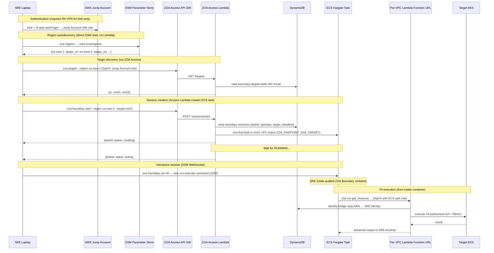
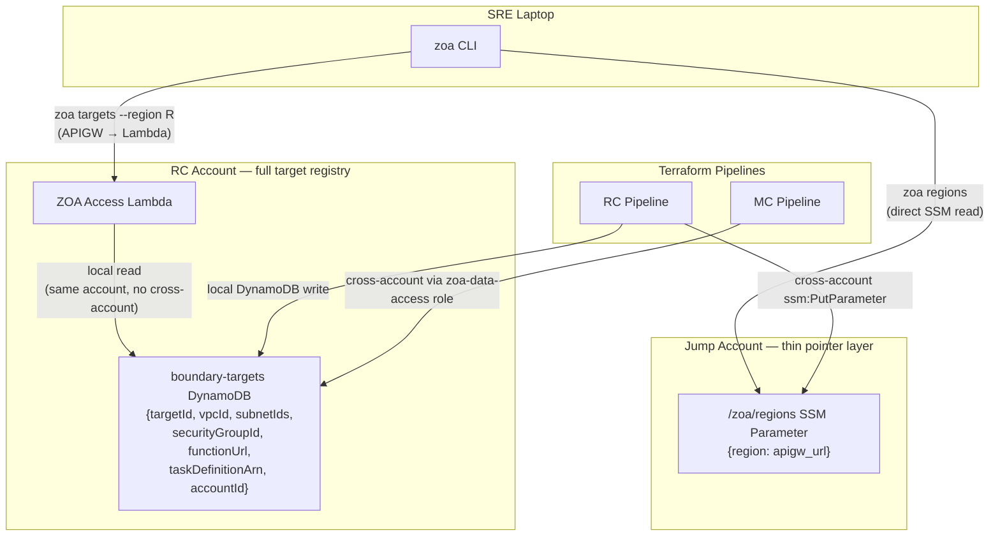
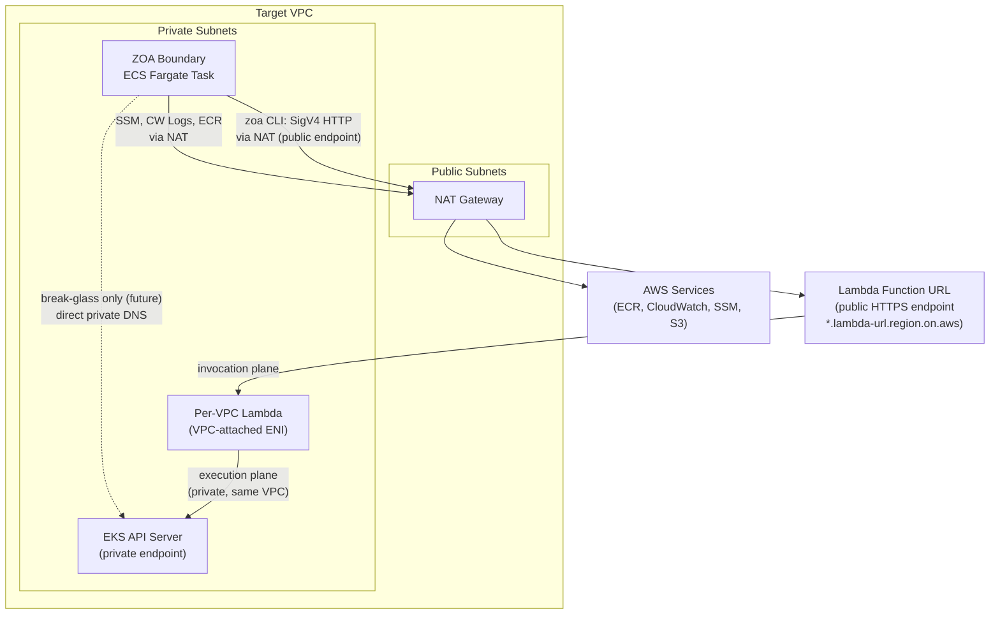
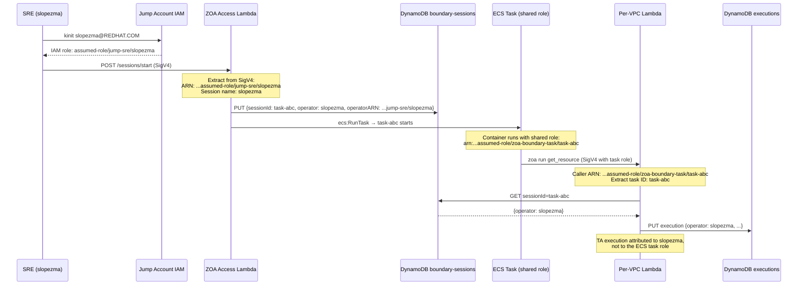

# ZOA Boundary + Access Lambda Epic Plan (ROSAENG-60291)

## Context

Today, SREs call per-VPC Lambda Function URLs **directly from their laptop** (the `TEMPORARY` path in the architecture diagram). This epic delivers the **target state**: SREs interact with ZOA exclusively from audited, time-boxed ECS Fargate containers ("ZOA Boundary") placed inside each target VPC.

The epic follows the format of [ROSAENG-65229](https://redhat.atlassian.net/browse/ROSAENG-65229) (ZOA Lambda Rearchitecture).

### Why this matters

The direct laptop path was a bootstrapping shortcut. It has fundamental gaps:

- **No session auditing**: No record of terminal I/O or command history — SRE actions between TA executions are invisible
- **No network isolation**: SRE laptop on corporate VPN can reach any Function URL — lateral movement is possible if credentials are compromised
- **No identity bridge**: The SRE's personal IAM role is the only identity — no per-session attribution, no time-boxing, no single-SRE enforcement
- **FedRAMP non-compliant**: FedRAMP requires complete audit trails for all privileged operations, including interactive sessions — not just TA executions
- **No break-glass path**: Without a container in the target VPC, there is no private network path for future break-glass EKS access (EKS is fully private, no public endpoint)

### Architecture diagrams

#### 1. End-to-end SRE workflow

Shows the complete flow from SRE authentication through TA execution inside a boundary container. Two authentication domains are visible: Jump Account (laptop to APIGW) and ECS task role (container to Function URL).



#### 2. Two-layer discovery architecture

Shows why region pointers live in the Jump Account (CLI needs them before contacting any ZOA service) while target details live in the RC account (ZOA Access Lambda needs them to create ECS tasks, and they contain sensitive infrastructure data like VPC IDs and subnet IDs that should not leak to the Jump Account).



#### 3. Network topology per target VPC

Shows the network paths from the ZOA Boundary container. The container lives in a private subnet alongside the per-VPC Lambda. Function URL traffic goes through NAT Gateway (Function URLs are public HTTPS endpoints even though the Lambda is VPC-attached — VPC attachment only affects the Lambda's outbound network, not its invocation endpoint). EKS API access is direct (private endpoint, same VPC) and reserved for future break-glass use only.



#### 4. Identity bridge flow

Shows how SRE identity is preserved across the authentication domain boundary. The SRE authenticates to the Jump Account with their personal identity (kinit → Kerberos → SAML → IAM role with session name). The ZOA Access Lambda records this identity when creating the ECS task. Inside the container, all requests use the shared ECS task role — the per-VPC Lambda resolves the task ARN back to the originating SRE via DynamoDB lookup. This ensures every TA execution is attributed to the correct SRE, even though the container uses a shared role.



#### 5. Session lifecycle and reaper

Shows the full lifecycle of a boundary session from creation through termination, including the reaper safety net. The reaper runs on the per-VPC Worker Lambda (same EventBridge infrastructure as the existing reconciler/GC) and enforces the 4h hard deadline. Sessions that the SRE exits cleanly trigger an S3 sync of workspace artifacts before termination.

```mermaid
stateDiagram-v2
    [*] --> creating: zoa boundary start
    creating --> active: ECS task RUNNING
    creating --> failed: ECS task failed to start

    active --> stopping: zoa boundary stop (SRE exit)
    active --> terminated: reaper (4h deadline exceeded)

    stopping --> terminated: S3 sync complete + ecs:StopTask

    failed --> [*]
    terminated --> [*]

    note right of active: SRE can join/disconnect/rejoin\nSession state persists in container\nSSM records all terminal I/O
    note right of stopping: Graceful: SIGTERM → S3 sync\n/home/sre workspace → S3 WORM\nMax 30s for sync, then force stop
    note right of terminated: Reasons: sre_exit, deadline_exceeded,\nreaper, error\nDynamoDB updated, metric emitted
```

## Epic Description (for ROSAENG-60291)

### Proposed Title
**ZOA Boundary: Audited SRE Access Containers + ZOA Access Lambda**

### Proposed Description Structure (matching ROSAENG-65229 format)

**TL;DR**: Today SREs call per-VPC Lambda Function URLs directly from their laptop — a temporary bootstrapping path that bypasses session auditing, network isolation, and the identity bridge needed for FedRAMP compliance. This epic delivers the target ZOA access model: SREs authenticate via their AWS Jump Account, autodiscover available regions/targets via SSM Parameter Store, and create time-boxed ECS Fargate containers ("ZOA Boundary") placed inside target VPCs. All TA execution happens exclusively from within these containers. The ZOA Access Lambda (public API Gateway, no VPC attachment) handles session lifecycle and approval routing. The direct laptop-to-Function-URL path is removed once boundary containers are operational.

**What will be delivered:**
- ZOA Access Lambda (Go, no VPC) + public API Gateway with custom domain per region
- ZOA Boundary container image (`Containerfile.boundary` in rosa-hyperfleet-zoa) with zoa CLI, aws CLI v2, kubectl, jq, tar, Claude Code (Bedrock)
- ZOA CLI commands for session management (`zoa regions`, `zoa targets`, `zoa boundary start/stop/list/join`)
- SSM Parameter Store autodiscovery in Jump Account (regions, APIGW URLs)
- Identity bridge: ECS task ARN to SRE identity via DynamoDB
- DynamoDB `boundary-sessions` table for session state tracking
- Boundary session reaper (Lambda or EventBridge-triggered GC for 4h timeout)
- Terraform modules: `zoa-access` (Lambda + APIGW), `zoa-boundary` (ECS task definition, IAM, SG)
- Konflux pipeline for ZOA Boundary container image
- Per-region pipeline step to publish metadata to Jump Account SSM Parameter Store
- Full observability stack: EMF metrics, YACE scrape, alerting rules, recording rules, Grafana dashboard
- Documentation (architecture, CLI reference, SRE runbook)
- E2E testing for boundary session lifecycle
- Removal of direct laptop-to-Function-URL temporary path (bastion stays until break-glass epic)

---

## Child Issues (13 stories)

### 1. ZOA Access Lambda + API Gateway

**Summary**: ZOA Access Lambda — session management and approval routing via public API Gateway

**Description**: Implement a dedicated Lambda function (no VPC attachment, in the RC account) behind a regional public API Gateway with custom domain (`https://zoa-access.{region}.hyperfleet.example.com`). The Access Lambda handles:

- **Session lifecycle**: `POST /sessions/start`, `GET /sessions`, `POST /sessions/stop/{id}`
- **Placement routing**: resolve target cluster to VPC to Function URL from `boundary-targets` DynamoDB table (or SSM Parameter Store in RC)
- **Cross-account session creation**: `sts:AssumeRole` into MC account to `ecs:RunTask` there
- **Identity recording**: map SigV4 caller (Jump Account role) to SRE identity, write to `boundary-sessions` DynamoDB table

Key design: Access Lambda does NOT create EKS access entries or execute TAs. Keeps IAM minimal.

API Gateway provides: custom domain (CLI autodiscovery by convention), WAF integration (IP-based rules, geo-blocking), and is NOT in the TA execution path.

Resource-based policy: ONLY Jump Account roles (one per environment: dev, int, stage, prod).

**Repos**: `rosa-hyperfleet-zoa` (Lambda code), `rosa-hyperfleet` (Terraform)

---

### 2. ZOA Boundary Container Image

**Summary**: ZOA Boundary container image — audited SRE shell for target VPC access

**Description**: Create `Containerfile.boundary` in `rosa-hyperfleet-zoa` repo. This is a purpose-built container for HyperFleet ZOA (not reusing `rosa-boundary` from ROSA v1 — that image is tightly coupled to OCM, Backplane, and ROSA v1 credential flows).

**Pre-installed tooling (superset of current bastion `platform-image/Dockerfile` tools):**
- `zoa` CLI (built from same repo)
- AWS CLI v2
- `kubectl`
- `helm` (inspect Helm releases on target clusters)
- `k9s` (TUI for k8s — SRE productivity)
- `stern` (multi-pod log tailing)
- `oc` (OpenShift CLI — must-gather, adm inspect)
- `yq` (YAML processing)
- `jq`, `tar`, `gzip`, `unzip`, `zip`
- `vim`, `less`, `git`, `procps-ng` (ps), `bind-utils` (dig/nslookup), `findutils`, `which`
- Claude Code (Amazon Bedrock integration)
- `auditd` + CloudWatch agent (session recording)

**Excluded from bastion image (not needed for SRE operations):**
- `terraform` (infra provisioning belongs in pipelines, not SRE shells)
- `skopeo` (image mirroring)
- `python3 + boto3` (aws CLI covers AWS operations)
- `postgresql`/`psql` (RDS access should go through TAs, not direct psql)

**Runtime properties:**
- Non-root `sre` user (uid=1000)
- `ZOA_ENDPOINT` env var injected at task creation (per-VPC Lambda Function URL)
- `ZOA_TARGET` env var (target identifier: rc, mc01, etc.)
- SSM Session Manager ready (ECS Exec support)
- Time-boxed: 4h hard deadline (container exits, not extendable)
- Session artifacts synced to S3 on exit (SIGTERM handler)
- Network-isolated: only reaches Lambda Function URLs (via NAT) and EKS API (same VPC, for break-glass only)

**Break-glass readiness** (no EKS access today, but prepared for future):
- `~/.kube/` and `~/.aws/` directories are writable but start empty (no hardcoded kubeconfig)
- Reserved env var `ZOA_BREAKGLASS_ROLE_ARN` (empty by default — break-glass epic will inject it)
- EKS API reachable from container (same VPC, SG allows 443 to EKS) — but no EKS Access Entry exists for the task role
- `kubectl` and `aws eks get-token` are installed — they just need credentials to work

Base image: UBI9 (consistent with zoa-lambda and zoa-runner).

**Repo**: `rosa-hyperfleet-zoa`

---

### 3. ZOA CLI — Session Management Commands

**Summary**: CLI commands for region discovery, target listing, and boundary session lifecycle

**Description**: Add session-management commands to the `zoa` CLI. These commands talk to the ZOA Access API Gateway (not the per-VPC Function URL).

**New commands (from SRE laptop):**

| Command | Purpose | Endpoint |
|---|---|---|
| `zoa regions` | List ZOA-enabled regions (autodiscover from Jump Account SSM Parameter Store) | SSM Parameter Store (direct) |
| `zoa targets --region R` | List available targets in a region (rc, mc01, mc02...) | ZOA Access APIGW |
| `zoa boundary start --region R --target T` | Create ECS task, wait for RUNNING, print connect info | ZOA Access APIGW |
| `zoa boundary list --region R` | List own boundary sessions (active/stopped) | ZOA Access APIGW |
| `zoa boundary stop --region R ID` | Graceful stop (S3 sync, then terminate) | ZOA Access APIGW |
| `zoa boundary join --region R ID` | Reconnect to existing session via SSM | ZOA Access APIGW + SSM |

**Design decisions:**
- `--region` required for all boundary/target commands (tells CLI which APIGW to call)
- Region APIGW URL autodiscovered: CLI reads a fixed-name SSM parameter in Jump Account (`/zoa/regions`) containing a JSON map of `{region: apigw_url}`
- `zoa boundary start --connect` and `zoa boundary join` both wrap `aws ecs execute-command` under the hood, which requires the **`session-manager-plugin`** binary installed on the SRE's laptop (same dependency as rosa-boundary v1 — this is standard SRE tooling)
- `zoa boundary start` flags: `--connect` (auto-join after RUNNING), `--no-wait`, `--timeout` (default 4h)
- Naming follows kubectl/aws-cli muscle memory patterns

**Prerequisite**: `session-manager-plugin` must be installed on the SRE's laptop. It handles the WebSocket session protocol for `ecs execute-command`. Install: `brew install --cask session-manager-plugin` (macOS) or RPM (Linux). The CLI should detect its absence and print a clear error message with install instructions.

**Ownership and listing rules:**

| Command | Visibility | Ownership enforcement |
|---|---|---|
| `zoa boundary list` | **All SREs' sessions** (active and inactive) | None — any SRE can see all sessions for situational awareness (who is connected where) |
| `zoa boundary stop` | Own sessions only | Server-side: Access Lambda validates `operator == caller` |
| `zoa boundary join` | Own sessions only | Server-side: Access Lambda validates `operator == caller` |

`zoa boundary list` supports filters similar to `zoa runs`: `--status active|terminated|all`, `--target`, `--operator` (filter by SRE username), `--since`, `--before`. Default: `--status active` (show who is currently connected).

**SRE identity across re-authentication:**

`rh-aws-saml-login` produces temporary STS credentials with a session name derived from the SRE's Kerberos principal (e.g., `slopezma`). Each re-authentication produces **different credentials** (new access key, secret key, session token) but the **session name is stable** because it comes from the Kerberos identity.

The SigV4 ARN looks like: `arn:aws:sts::123:assumed-role/jump-sre/slopezma`
- `jump-sre` — the IAM role name (stable, same for all SREs or per-tier)
- `slopezma` — the session name from SAML (stable per SRE, derived from Kerberos principal)

**Critical design rule**: the `operator` field in `boundary-sessions` DynamoDB must store the **username extracted from the SigV4 session name** (e.g., `slopezma`), NOT the full temporary credential ARN. Ownership checks compare `operator == caller_session_name`. This way, an SRE who re-authenticates (gets new temporary credentials) can still join/stop their own sessions.

Open question: does `rh-aws-saml-login` always use the Kerberos principal as the STS session name? If it uses something else (e.g., a random string or timestamp), we need an alternative identity anchor. This must be validated during implementation.

**Repo**: `rosa-hyperfleet-zoa`

---

### 4. SSM Parameter Store Autodiscovery (Jump Account)

**Summary**: Region and target autodiscovery via AWS Parameter Store in Jump Account

**Description**: Each regional pipeline (Tekton/Terraform) publishes metadata to a well-known SSM Parameter Store path in the AWS Jump Account. The ZOA CLI reads these parameters to autodiscover available regions and endpoints.

**Two-layer discovery architecture:**

| Data | Location | Writer | Reader |
|---|---|---|---|
| Region list + APIGW URLs | Jump Account SSM (`/zoa/regions`) | RC Terraform (cross-account) | CLI directly |
| Target registry (rc, mc01, VPCs, Function URLs, subnets, task defs) | RC account DynamoDB (`boundary-targets` table) | RC + MC Terraform pipelines (local) | ZOA Access Lambda (local, same account) |

Jump Account stays thin (just region pointers). All operational detail (VPCs, subnets, SGs, task role ARNs) stays in RC — the ZOA Access Lambda reads it locally without cross-account calls.

**Parameter layout (Jump Account):**
- `/zoa/regions` — JSON map: `{"us-east-1": {"apigw_url": "https://zoa-access.us-east-1.hyperfleet.example.com", "enabled": true}, ...}`
- Written by each region's RC Terraform pipeline via cross-account `sts:AssumeRole`
- On region teardown, Terraform removes the region entry

**Target registry (RC account, DynamoDB `boundary-targets` table):**
- PK: `targetId` (e.g., `rc`, `mc01`)
- Attributes: `vpcId`, `subnetIds`, `securityGroupId`, `ecsClusterArn`, `taskDefinitionArn`, `functionUrl`, `accountId`, `status` (enabled/disabled)
- Written by RC and MC Terraform pipelines as part of ZOA module outputs
- Read by ZOA Access Lambda when creating boundary sessions or listing targets

**Pipeline integration:**
- RC Terraform: writes `/zoa/regions` to Jump Account SSM (cross-account `ssm:PutParameter`)
- RC Terraform: writes RC target entry to `boundary-targets` DynamoDB (local)
- MC Terraform: writes MC target entries to `boundary-targets` DynamoDB (cross-account via `zoa-data-access` role, same mechanism MCs already use for executions table)

**Prerequisites:**
- AWS Jump Account per environment (dev, int, stage, prod) — may need another team to provision if not existing
- Cross-account IAM role in Jump Account allowing `ssm:PutParameter` from RC pipeline role

**Repos**: `rosa-hyperfleet` (Terraform pipeline step, DynamoDB table)

---

### 5. Identity Bridge — ECS Task ARN to SRE Identity

**Summary**: Map ECS task role ARN to originating SRE identity for audit attribution

**Description**: Inside a ZOA Boundary container, SigV4 requests are signed with the ECS task role (not the SRE's personal role). The per-VPC Lambda must resolve the ECS task identity back to the SRE who created the session.

**Flow:**
1. ZOA Access Lambda creates ECS task, records `{taskId, taskArn, operator, region, target, createdAt, deadline}` in `boundary-sessions` DynamoDB table
2. Inside container, `zoa` CLI calls per-VPC Function URL with SigV4 (task role)
3. Per-VPC Lambda extracts task ID from caller ARN: `arn:aws:sts::ACCOUNT:assumed-role/zoa-boundary-task-role/TASK_ID`
4. Lambda queries `boundary-sessions` DynamoDB: task ID to SRE identity
5. All executions attributed to that SRE in the existing `executions` and `audit` tables (same `operator` field already in use)

**Current state**: Today the `Operator` field stores the full IAM ARN from SigV4 (e.g., `arn:aws:sts::123:assumed-role/sre-role/slopezma`). The session name portion already carries the SRE identity. With the boundary model, the ARN changes to the ECS task role, so the DynamoDB lookup becomes necessary.

**Identity stability across re-authentication**: The `operator` field must store the **username** (extracted from the SigV4 session name, e.g., `slopezma`), not the full temporary ARN. This ensures that an SRE who re-authenticates to the Jump Account (gets new temporary credentials) can still be matched to their existing boundary sessions and TA executions. The full ARN is stored separately as `operatorARN` for audit/forensic purposes.

**Ownership enforcement**: The per-VPC Lambda and ZOA Access Lambda both compare `operator == caller_session_name` for ownership checks (stop, join). Listing is unrestricted — any SRE can see all sessions.

**Repo**: `rosa-hyperfleet-zoa` (API middleware), `rosa-hyperfleet` (DynamoDB table Terraform)

---

### 6. DynamoDB Tables — Boundary Sessions

**Summary**: DynamoDB table for boundary session state tracking

**Description**: New `boundary-sessions` DynamoDB table (in the existing `modules/zoa/` regional data layer):

**Schema:**
- PK: `sessionId` (ECS task ID)
- Attributes: `operator`, `operatorARN`, `targetCluster`, `region`, `taskArn`, `ecsCluster`, `status` (active/stopping/terminated), `createdAt`, `deadline`, `terminatedAt`, `terminationReason`, `vpcId`
- GSI: `operator-index` (PK=operator, SK=createdAt) — for `zoa boundary list` filtering by SRE
- TTL: 30 days (session metadata, not long-term audit — the audit table already covers FedRAMP)

**Session statuses:**
- `creating` — ECS RunTask called, waiting for RUNNING
- `active` — container is RUNNING, SRE can join
- `stopping` — graceful shutdown initiated (S3 sync in progress)
- `terminated` — container stopped (reason: sre_exit / deadline_exceeded / reaper / error)
- `failed` — ECS task failed to start

**Repo**: `rosa-hyperfleet` (Terraform)

---

### 7. Boundary Session Reaper

**Summary**: Automated cleanup of expired and forgotten boundary sessions

**Description**: Extend the existing per-VPC Worker Lambda with a `reaper` scheduled task (EventBridge, every 5m) that terminates expired boundary containers:

1. Query `boundary-sessions` DynamoDB: `targetCluster = MY_TARGET AND status = active AND deadline < now`
2. For each expired session: `ecs:StopTask` (local, same account)
3. Update DynamoDB: `status=terminated, reason=deadline_exceeded`
4. Emit `ZOA/ReaperTerminations` CloudWatch metric

**Design:**
- 4h hard deadline, not extendable (new container = fresh audit trail)
- Reaper runs on the same per-VPC Worker Lambda (already has EventBridge schedules for reconciler/GC)
- IAM: Worker Lambda role needs `ecs:StopTask` + `ecs:DescribeTasks` for local ECS cluster
- Future enhancement: inactivity-based early termination (query CloudWatch Logs for last SSM event)

**Repos**: `rosa-hyperfleet-zoa` (reaper code), `rosa-hyperfleet` (Terraform EventBridge schedule + IAM)

---

### 8. Terraform Infrastructure — ZOA Access + Boundary

**Summary**: Terraform modules for ZOA Access Lambda, API Gateway, ECS task definitions, IAM, and security groups

**Description**: New and modified Terraform modules:

**New module: `terraform/modules/zoa-access/`**
- API Gateway (regional, REST/HTTP, public)
- Custom domain + Route53 record (`zoa-access.{region}.hyperfleet.example.com`)
- WAF WebACL (IP-based rules for Red Hat ranges, geo-blocking)
- Lambda function (no VPC, same `zoa-lambda` image with `HANDLER_MODE=access`)
- IAM execution role: `ecs:RunTask` (RC + cross-account MC), DynamoDB read/write, `sts:AssumeRole`, CloudWatch Logs
- Lambda resource-based policy: ONLY Jump Account roles

**New module: `terraform/modules/zoa-boundary/`**
- ECS task definition (Fargate, ZOA Boundary image from ECR)
- ECS cluster (or reuse existing per-VPC ECS cluster if available)
- IAM task role:
  - `lambda:InvokeFunctionUrl` (per-VPC Lambda only)
  - `bedrock:InvokeModel`, `bedrock:InvokeModelWithResponseStream`, `bedrock:ListInferenceProfiles` — scoped to specific models and the deployment region only (see Bedrock section below)
  - `ssmmessages:*` (ECS Exec / SSM session)
  - CloudWatch Logs
- IAM task execution role: ECR pull, CloudWatch Logs
- Security group: egress to Lambda Function URL (443), EKS API (443 — for future break-glass), AWS service endpoints, Bedrock endpoint (443). No inbound.
- S3 bucket/prefix for session artifact escrow

**Bedrock access control (Claude Code in boundary container):**

Bedrock is **regional** — each region has its own endpoint and model catalog. This aligns with the per-region HyperFleet model: the ECS task role in `us-east-1` only permits Bedrock calls to `us-east-1`.

| Concern | Design |
|---|---|
| Which models allowed | Terraform variable `allowed_bedrock_models` (default: only Haiku for cost control). IAM policy scopes `bedrock:InvokeModel` to specific model ARN patterns. |
| Regional scope | Resource ARN includes `${var.region}` — no cross-region inference permitted by default. Prevents cost surprises from routing to expensive regions. |
| Cost control | Haiku-only default keeps costs low (~$0.25/M input tokens vs $15/M for Opus). Production can override to allow Sonnet/Opus if justified. |
| Model availability | Not all models are available in all regions. Terraform variable allows per-region customization. |

Conceptual IAM resource scoping:
```
arn:aws:bedrock:${region}::foundation-model/anthropic.claude-3-5-haiku-*
arn:aws:bedrock:${region}:*:inference-profile/${region}.anthropic.claude-3-5-haiku-*
```

Note: rosa-boundary v1 uses a wide-open policy (`arn:aws:bedrock:*:*:foundation-model/*` — all models, all regions). ZOA Boundary should be tighter from day one.

**Modified: `terraform/modules/zoa/`**
- Add `boundary-sessions` DynamoDB table
- Add `boundary-targets` table (or SSM Parameter Store) for target registry

**Modified: `terraform/modules/zoa-lambda/`**
- Update Lambda resource-based policy: add ZOA Boundary task role as permitted caller
- Add `ecs:StopTask` + `ecs:DescribeTasks` to Worker Lambda IAM (reaper)
- Add reaper EventBridge schedule

**Cross-account wiring:**
- ZOA Access Lambda needs `sts:AssumeRole` into MC account to `ecs:RunTask` there
- MC's ZOA Boundary task role needs to be added to MC's per-VPC Lambda resource policy

**Repo**: `rosa-hyperfleet`

---

### 9. Konflux Pipeline — ZOA Boundary Image

**Summary**: Konflux build pipeline for ZOA Boundary container image

**Description**: Register `zoa-boundary` as a new Konflux Component alongside existing `zoa-lambda` and `zoa-runner`:

- `Containerfile.boundary` in `rosa-hyperfleet-zoa`
- UBI9 base image (consistent with other ZOA images)
- IntegrationTestScenario (Enterprise Contract)
- Push to Quay: `quay.io/redhat-user-workloads/rosa-tenant/zoa-boundary:<commit-sha>`
- Skopeo mirror to ECR (same pipeline step as zoa-lambda/zoa-runner)
- `.tekton/zoa-boundary-pull-request.yaml` and `.tekton/zoa-boundary-push.yaml`
- MintMaker/renovate config updated

**Repo**: `rosa-hyperfleet-zoa` (Containerfile + Tekton), `rosa-hyperfleet` (ECR + skopeo mirror)

---

### 10. Documentation

**Summary**: Architecture docs, CLI reference, and SRE runbook for ZOA Boundary

**Description**: Documentation deliverables:

- **Update `docs/design/zoa-architecture.md`** (rosa-hyperfleet): Move ZOA Access Lambda, rosa-boundary Integration, and Break-Glass sections from "Future Considerations" to the main body. Update architecture diagrams to show boundary as deployed (remove `PLANNED` labels).
- **Update `README.md`** (rosa-hyperfleet-zoa): Update architecture diagram to show boundary as deployed. Remove `TEMPORARY` direct laptop path.
- **New: `docs/boundary.md`** (rosa-hyperfleet-zoa): ZOA Boundary user guide — how to start/stop/join sessions, autodiscovery, troubleshooting, container tooling reference.
- **Update `docs/cli-reference.md`** (rosa-hyperfleet-zoa): Add `zoa regions`, `zoa targets`, `zoa boundary` command family.
- **New: `docs/sop/boundary-troubleshooting.md`** (rosa-hyperfleet): SOP for stuck sessions, reaper failures, Jump Account access issues.

**Repos**: `rosa-hyperfleet`, `rosa-hyperfleet-zoa`

---

### 11. E2E Testing

**Summary**: End-to-end tests for boundary session lifecycle and ZOA Access Lambda

**Description**: Extend the existing Ginkgo e2e suite:

- **Session lifecycle**: start to stop to list to verify terminated
- **Identity bridge**: verify TA executions from boundary container are attributed to correct SRE
- **Reaper**: verify expired sessions are terminated
- **Region/target autodiscovery**: verify CLI can discover regions and targets
- **Cross-account**: verify MC boundary sessions work (Access Lambda creates task in MC VPC)
- **Negative tests**: unauthorized caller rejected, wrong Jump Account role rejected, non-creator cannot join/stop

Wire into CI: `openshift/release` Prow job configuration for boundary e2e (may need separate from existing ZOA e2e due to Jump Account dependency).

**Repos**: `rosa-hyperfleet-zoa` (tests), `rosa-hyperfleet` (CI infra), `openshift/release` (Prow jobs)

---

### 12. Observability — ZOA Access Lambda + Boundary Sessions

**Summary**: EMF metrics, alerting rules, and Grafana dashboard panels for ZOA Access Lambda and boundary sessions

**Description**: Extend the existing ZOA observability stack (EMF -> CloudWatch -> YACE -> Prometheus -> Thanos -> Grafana) to cover the new components. Mirrors the pattern from [ROSAENG-65234](https://redhat.atlassian.net/browse/ROSAENG-65234).

**EMF metrics (emitted from ZOA Access Lambda):**

| Metric | Dimensions | Purpose |
|---|---|---|
| `BoundarySessionCreated` | region, target, operator | Session start rate |
| `BoundarySessionTerminated` | region, target, reason (sre_exit / deadline / reaper / error) | Termination tracking |
| `BoundarySessionDurationSeconds` | region, target | Session length distribution |
| `BoundarySessionActive` | region, target | Current active sessions (gauge) |
| `BoundaryReaperTerminations` | region, target | Reaper-forced terminations |
| `AccessLambdaRequestCount` | method, path, statusCode | API traffic |
| `AccessLambdaLatencyMs` | method, path | Response time |
| `AccessLambdaErrors` | method, path, errorType | Error breakdown |
| `IdentityBridgeLookupMs` | target | DynamoDB identity resolution latency |
| `IdentityBridgeFailures` | target, reason | Failed identity resolutions |

**YACE CloudWatch Exporter:**
- Add `ZOA-Access` custom namespace scrape job (RC only — Access Lambda is not per-VPC)
- Add ECS metrics scrape for boundary task containers (task count, CPU, memory)

**Alerting rules (PrometheusRule CR in `alerting-rules/templates/zoa-boundary.yaml`):**
- `ZOABoundaryReaperStalled` (critical) — no reaper terminations when expired sessions exist
- `ZOABoundarySessionCreationFailures` (warning) — elevated session creation error rate
- `ZOAAccessLambdaErrors` (warning) — elevated 5xx rate on Access Lambda
- `ZOAIdentityBridgeFailures` (warning) — identity resolution failures (SRE attribution broken)
- `ZOABoundaryOrphanedSessions` (warning) — active sessions past deadline without reaper action

**Recording rules:**
- `zoa_boundary:session_creation_success_rate:5m`
- `zoa_boundary:active_sessions:current`
- `zoa_access:request_success_rate:5m`

**Grafana dashboard:**
- Extend existing ZOA dashboard (or new "ZOA Boundary" dashboard) with panels: active sessions, session creation rate, session duration histogram, reaper activity, Access Lambda latency/errors, identity bridge health

**Monitoring e2e:**
- Thanos-based specs validating metric presence, recording rules, and alert rule groups (same pattern as existing `test/e2e/monitoring_test.go`)

**Repos**: `rosa-hyperfleet-zoa` (EMF emission code), `rosa-hyperfleet` (YACE config, alerting rules, Grafana dashboard)

---

### 13. Remove Direct Laptop-to-Function-URL Temporary Path

**Summary**: Remove temporary direct SigV4 path from laptop to per-VPC Lambda Function URLs

**Description**: Once boundary containers are operational and validated:

- Remove the `TEMPORARY` direct SigV4 path from laptop to per-VPC Function URLs
- Update per-VPC Lambda resource-based policies: remove SRE IAM roles, keep ONLY ZOA Boundary task roles
- Update architecture diagrams to remove `TEMPORARY` annotations

**Note**: The current `terraform/modules/bastion/` is NOT removed in this epic. The bastion remains until the break-glass epic is delivered — SREs still need bastion for direct EKS access scenarios that break-glass will eventually replace. Bastion decommission will be a story in the break-glass epic.

This is the final story in this epic — depends on all others being validated in production.

**Repo**: `rosa-hyperfleet`

---

## Key Design Considerations

### SRE Identity at SigV4 Level — Foundational for Approval Workflow

Every ZOA API request (both ZOA Access and per-VPC Lambda) must carry the **originating SRE's identity** at the SigV4 level. This is not just for audit — it is foundational for the future **approval workflow epic**, where the system must answer:

- **Who is requesting?** (SRE A requests break-glass)
- **Who is approving?** (SRE B approves — must be a different person)
- **What role/group do they belong to?** (SRE, team lead, manager, director — approval policies may vary by requester/approver seniority)
- **Are they authorized for this scope?** (e.g., only on-call SREs can request kube-admin break-glass)

The identity model chosen now constrains what the approval workflow can enforce later. Three possible approaches — the decision does NOT need to be made in this epic, but the boundary design must not preclude any of them:

| Approach | How identity flows | Pros | Cons |
|---|---|---|---|
| **IAM role mapping in Jump Account** | Each SRE (or role tier: sre, lead, director) maps to a different IAM role. SigV4 ARN directly encodes the role. | Simple — identity is the ARN. Lambda reads role from SigV4 with zero external calls. | IAM-heavy. Requires per-tier (or per-user) role management in Jump Account. Adding new tiers requires IAM changes. |
| **SAML session tags** | Kerberos/SAML federation injects attributes (username, groups, department) as AWS session tags. Tags flow through SigV4 and are extractable by Lambda. | Rich identity without per-user IAM roles. Group memberships available at request time. | Depends on SAML IdP (rh-aws-saml-login) supporting tag injection. Tag size limits (500 chars total). |
| **External identity store (LDAP/Rover)** | Lambda receives SRE username from SigV4 session name, then looks up group memberships and role from Red Hat LDAP or a Rover dump cached in S3. | Most flexible — full org chart, group memberships, geo, team. Decoupled from IAM. | Adds a dependency (LDAP/S3 cache). Cache staleness risk. Extra latency on first lookup. |

**What this epic must ensure:**
- The SRE's **username** (not just an opaque ARN) is captured and stored in `boundary-sessions` and propagated to all downstream tables (`executions`, `audit`)
- The identity bridge (story 5) preserves the original SRE identity through the ECS task role boundary — the per-VPC Lambda must know who the SRE is, not just that "an ECS task called me"
- The DynamoDB schema for `boundary-sessions` should store both the username AND the full ARN — the ARN encodes which IAM role was used (useful if we go with role-mapping), the username is the human-readable key (useful for LDAP lookup or session tag approaches)
- No hard dependency on a specific identity resolution mechanism — the approval workflow epic will make this decision based on what the SAML federation and Jump Account IAM setup can support

### Break-Glass Readiness — Container and Infra Preparation

Break-glass is a separate epic, but the boundary container and Terraform must be designed now to support it without redesign. The core requirement: when break-glass is approved, the SRE should just type `kubectl` or `aws` — no manual credential setup, no `sts assume-role`, no kubeconfig editing.

**How break-glass could work (conceptual, exact mechanism TBD in break-glass epic):**

For **kube break-glass** (kube-read / kube-write / kube-admin):
1. SRE requests: `zoa breakglass request --scope kube-write`
2. Approver approves from laptop: `zoa approve <id> --region R`
3. Per-VPC Lambda reconciler creates an EKS Access Entry for a break-glass IAM role, mapped to a pre-deployed ClusterRoleBinding (e.g., `breakglass-write` ClusterRole)
4. SRE activates: `zoa breakglass connect <id>` — CLI or Lambda generates a kubeconfig (EKS endpoint + CA from config, token via `aws eks get-token` using the break-glass role) and writes it to `~/.kube/config`
5. SRE types `kubectl get pods` — it just works

For **AWS break-glass** (aws-read / aws-write / aws-admin):
1. Same request/approve flow
2. Per-VPC Lambda reconciler does `sts:AssumeRole` to the break-glass IAM role, stores credentials in DynamoDB (encrypted, short-lived)
3. `zoa breakglass connect <id>` fetches credentials and exports `AWS_ACCESS_KEY_ID`, `AWS_SECRET_ACCESS_KEY`, `AWS_SESSION_TOKEN` into the shell
4. SRE types `aws ec2 describe-instances` — it just works

**What this epic must prepare:**

| Layer | What to prepare now | Why |
|---|---|---|
| **Containerfile** | Install `kubectl`, `aws` CLI (already planned). Ensure the `sre` user's `~/.kube/` and `~/.aws/` directories are writable. No hardcoded kubeconfig — these dirs start empty and are populated dynamically by `zoa breakglass connect`. | SRE must be able to use kubectl/aws CLI after break-glass activation without container restart |
| **ECS task role (IAM)** | Structure the role policy so that `sts:AssumeRole` to break-glass roles can be added later as a Terraform variable (e.g., `breakglass_role_arns = []` — empty by default, populated when break-glass epic ships). Do NOT hardcode the break-glass roles now. | Adding break-glass should be `terraform apply` with a new variable, not an IAM redesign |
| **Security group** | Egress to EKS API (443) already in the plan — this is the network path for `kubectl` from the boundary container. Ensure this rule exists from day one, even though it's only used by break-glass. | Without this SG rule, kubectl from the container cannot reach the private EKS API |
| **EKS access** | Do NOT create an EKS Access Entry for the boundary task role now. Today, boundary containers should have NO EKS access — they only talk to Lambda. Break-glass epic will dynamically create/revoke Access Entries per session. | Zero standing EKS access — the whole point of ZOA |
| **DynamoDB** | The `boundary-sessions` table schema should have optional fields for break-glass state: `breakglassScope`, `breakglassStatus`, `breakglassExpiresAt`. These can be NULL/empty until break-glass ships. | Avoids DynamoDB table migration when break-glass is added |
| **Container env vars** | Reserve `ZOA_BREAKGLASS_ROLE_ARN` env var (empty by default). Break-glass epic will inject a per-scope role ARN when activating access. | CLI knows where to find the role for `aws eks get-token` / `sts assume-role` |

**Key principle**: The boundary container starts with **zero EKS access and zero AWS privilege beyond Lambda Function URL + Bedrock**. Break-glass dynamically injects access (EKS Access Entry + IAM role), and the `zoa breakglass connect` command configures the SRE's shell. When break-glass expires, the reconciler revokes the Access Entry and the credentials expire naturally (STS TTL).

### Network Path: Function URL via NAT Gateway

The ZOA Boundary container reaches per-VPC Lambda Function URLs through NAT Gateway. This is because Lambda Function URLs are **public HTTPS endpoints** (`*.lambda-url.region.on.aws`) even when the Lambda is VPC-attached — VPC attachment only controls the Lambda's outbound execution network (ENIs in private subnets for reaching EKS, DynamoDB, etc.), not its inbound invocation endpoint.

Traffic from NAT Gateway to a Lambda Function URL in the same region stays on the AWS backbone network (does not traverse the public internet), and Function URLs require SigV4 authentication (unauthenticated requests are rejected before Lambda code runs). The resource-based policy will restrict callers to ONLY ZOA Boundary task roles.

A future hardening story could replace Function URL with a VPC Endpoint for Lambda (SDK `lambda:InvokeWithResponseStream`) or a Private API Gateway with VPC Endpoint — eliminating the publicly-addressable endpoint entirely. This is not required for this epic but the container and CLI design do not preclude it.

---

## Open Questions / Dependencies

1. **Jump Account provisioning**: Do Jump Accounts already exist per environment (dev, int, stage, prod)? If not, need another team to provision them. This is a blocker for stories 3, 4, and 11.
2. **Custom domain DNS**: Who owns the DNS zone for `hyperfleet.example.com` (or whatever the real domain is)? Route53 hosted zone delegation needed for API Gateway custom domains.
3. **Break-glass interaction**: Story 7 (reaper) and the boundary container design should account for future break-glass EKS access entries. Not implementing break-glass in this epic, but IAM and network design must not preclude it.
4. **Bedrock model availability per region**: Not all Claude models are available in all AWS regions. Need to verify Haiku availability in each HyperFleet deployment region and adjust `allowed_bedrock_models` accordingly.
5. **SSM Session Manager plugin**: SREs need `session-manager-plugin` installed on their laptops for `zoa boundary join`. Is this already standard SRE tooling? (It is for rosa-boundary v1.)
6. **rh-aws-saml-login session name stability**: Does `rh-aws-saml-login` always use the Kerberos principal (e.g., `slopezma`) as the STS session name? If it uses something else (random string, timestamp), we need an alternative identity anchor for ownership checks across re-authentications. This is critical for the identity bridge design.
