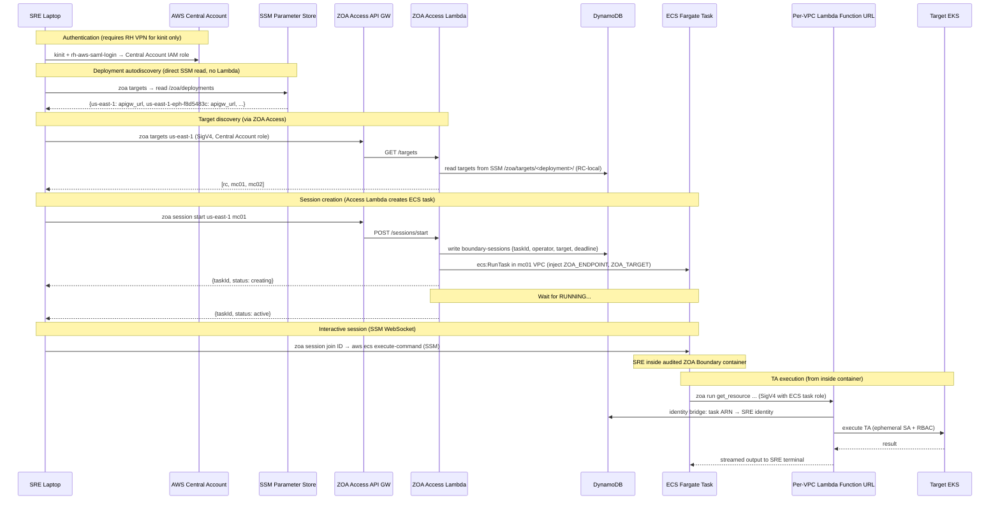
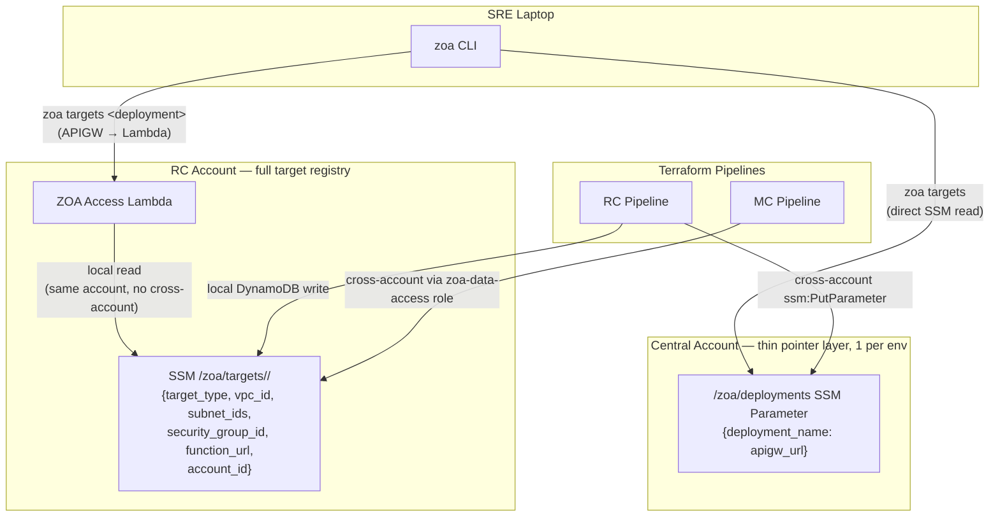
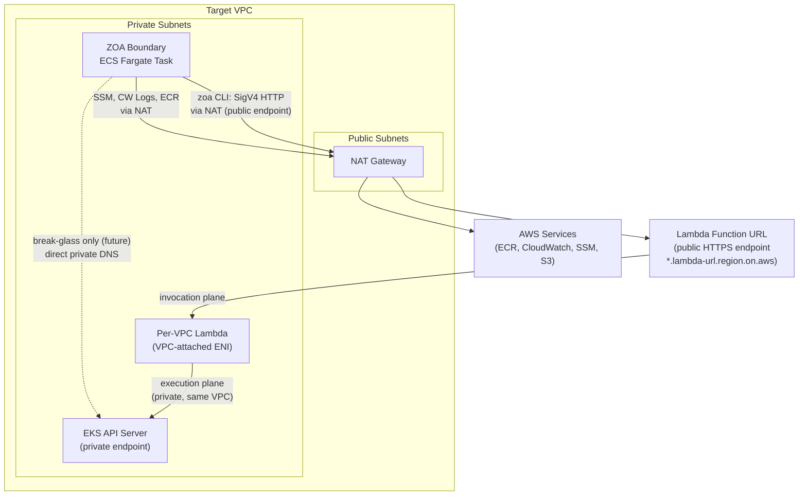
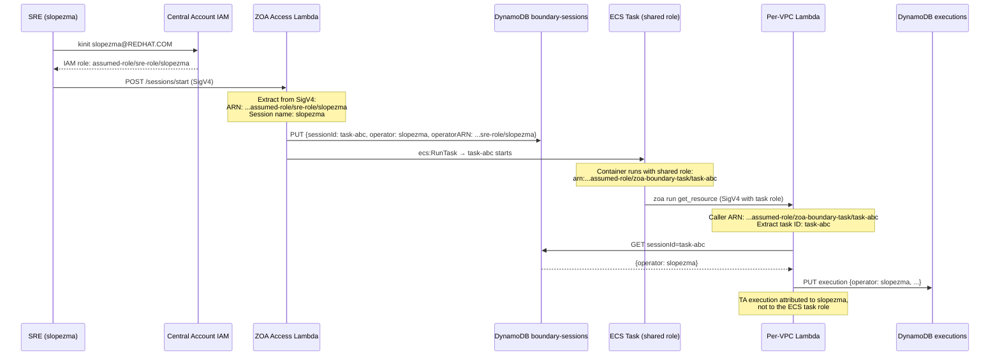
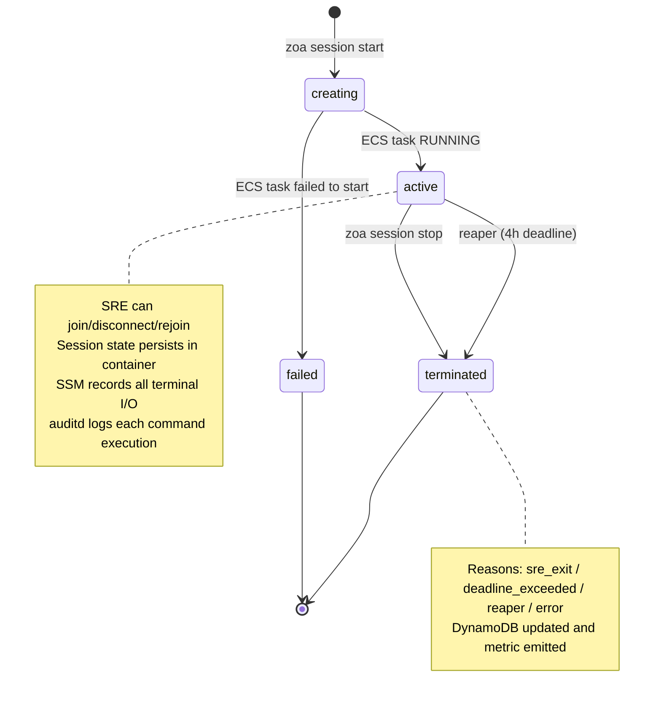
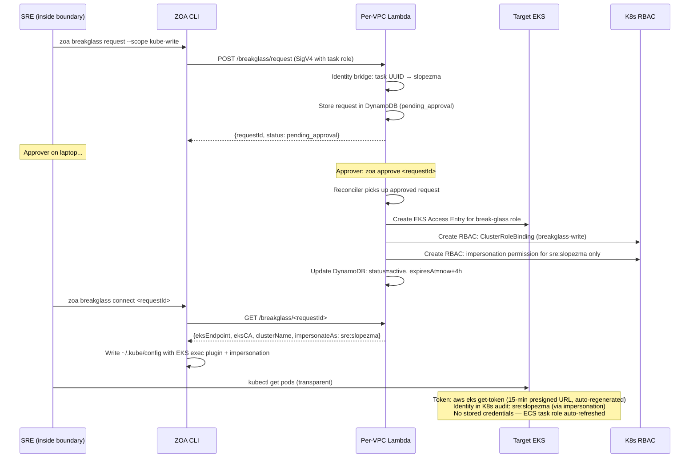
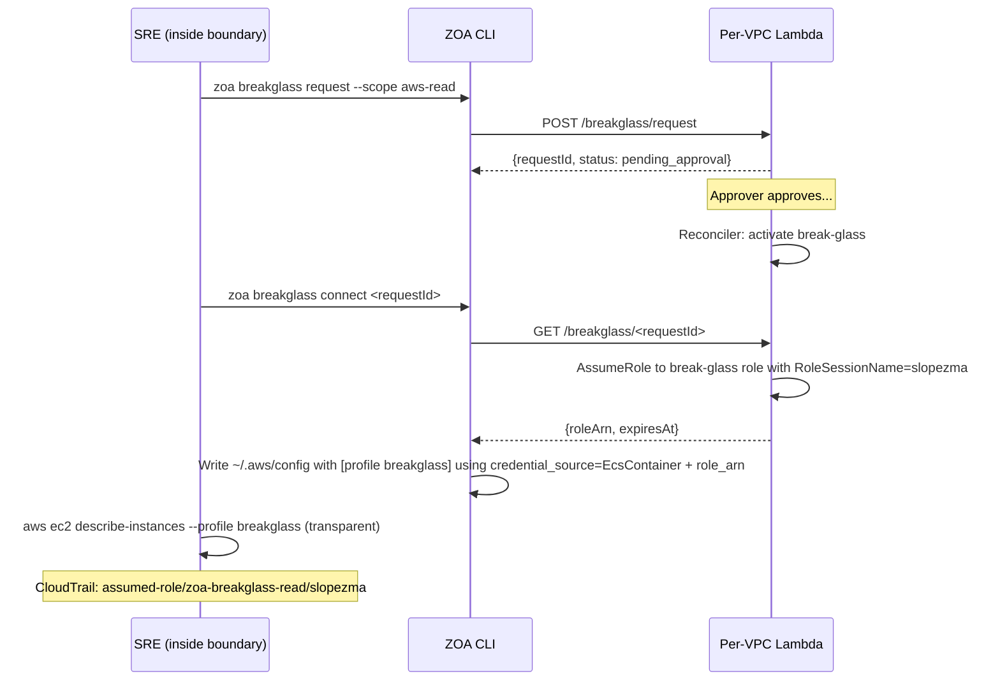

# ZOA Boundary + Access Lambda Epic Plan (ROSAENG-60291)

## Context

Today, SREs call per-VPC Lambda Function URLs **directly from their laptop** (the `TEMPORARY` path in the architecture diagram). This epic delivers the **target state**: SREs interact with ZOA exclusively from audited, time-boxed ECS Fargate containers ("ZOA Boundary") placed inside each target VPC.

The epic follows the format of [ROSAENG-65229](https://redhat.atlassian.net/browse/ROSAENG-65229) (ZOA Lambda Rearchitecture).

### Why this matters

The direct laptop path was a bootstrapping shortcut. It has fundamental gaps:

- **No session auditing**: No record of terminal I/O or command history — SRE actions between TA executions are invisible
- **No network isolation**: SRE laptop on corporate VPN can reach any Function URL — lateral movement is possible if credentials are compromised
- **No identity bridge**: The SRE's personal IAM role is the only identity — no per-session attribution, no time-boxing, no single-SRE enforcement
- **FedRAMP non-compliant**: FedRAMP requires complete audit trails for all privileged operations, including interactive sessions — not just TA executions
- **No break-glass path**: Without a container in the target VPC, there is no private network path for future break-glass EKS access (EKS is fully private, no public endpoint)

### Architecture diagrams

#### 1. End-to-end SRE workflow

Shows the complete flow from SRE authentication through TA execution inside a boundary container. Two authentication domains are visible: Central Account (laptop to APIGW) and ECS task role (container to Function URL).


```mermaid
sequenceDiagram
    participant SRE as SRE Laptop
    participant JA as AWS Central Account
    participant PS as SSM Parameter Store
    participant AGW as ZOA Access API GW
    participant AL as ZOA Access Lambda
    participant DDB as DynamoDB
    participant ECS as ECS Fargate Task
    participant FU as Per-VPC Lambda Function URL
    participant EKS as Target EKS

    Note over SRE,JA: Authentication (requires RH VPN for kinit only)
    SRE->>JA: kinit + rh-aws-saml-login → Central Account IAM role

    Note over SRE,PS: Deployment autodiscovery (direct SSM read, no Lambda)
    SRE->>PS: zoa targets → read /zoa/deployments
    PS-->>SRE: {us-east-1: apigw_url, us-east-1-eph-f8d5483c: apigw_url, ...}

    Note over SRE,AL: Target discovery (via ZOA Access)
    SRE->>AGW: zoa targets us-east-1 (SigV4, Central Account role)
    AGW->>AL: GET /targets
    AL->>DDB: read targets from SSM /zoa/targets/<deployment>/ (RC-local)
    AL-->>SRE: [rc, mc01, mc02]

    Note over SRE,ECS: Session creation (Access Lambda creates ECS task)
    SRE->>AGW: zoa session start us-east-1 mc01
    AGW->>AL: POST /sessions/start
    AL->>DDB: write boundary-sessions {taskId, operator, target, deadline}
    AL->>ECS: ecs:RunTask in mc01 VPC (inject ZOA_ENDPOINT, ZOA_TARGET)
    AL-->>SRE: {taskId, status: creating}
    Note over AL,ECS: Wait for RUNNING...
    AL-->>SRE: {taskId, status: active}

    Note over SRE,ECS: Interactive session (SSM WebSocket)
    SRE->>ECS: zoa session join ID → aws ecs execute-command (SSM)
    Note over ECS: SRE inside audited ZOA Boundary container

    Note over ECS,EKS: TA execution (from inside container)
    ECS->>FU: zoa run get_resource ... (SigV4 with ECS task role)
    FU->>DDB: identity bridge: task ARN → SRE identity
    FU->>EKS: execute TA (ephemeral SA + RBAC)
    EKS-->>FU: result
    FU-->>ECS: streamed output to SRE terminal
```

#### 2. Two-layer discovery architecture

Shows why deployment pointers live in the Central Account (CLI needs them before contacting any ZOA service) while target details live in the RC account (ZOA Access Lambda needs them to create ECS tasks, and they contain sensitive infrastructure data like VPC IDs and subnet IDs that should not leak to the Central Account).


```mermaid
graph TD
    subgraph centralAccount [Central Account — thin pointer layer, 1 per env]
        paramEnvs["/zoa/deployments SSM Parameter<br/>{deployment_name: apigw_url}"]
    end

    subgraph rcAccount [RC Account — full target registry]
        boundaryTargets["SSM /zoa/targets/<deployment>/<cluster><br/>{target_type, vpc_id, subnet_ids,<br/>security_group_id, function_url,<br/>account_id}"]
        accessLambda["ZOA Access Lambda"]
    end

    subgraph sreLaptop [SRE Laptop]
        zoaCLI["zoa CLI"]
    end

    subgraph terraform [Terraform Pipelines]
        rcPipeline["RC Pipeline"]
        mcPipeline["MC Pipeline"]
    end

    zoaCLI -->|"zoa targets<br/>(direct SSM read)"| paramEnvs
    zoaCLI -->|"zoa targets &lt;deployment&gt;<br/>(APIGW → Lambda)"| accessLambda
    accessLambda -->|"local read<br/>(same account, no cross-account)"| boundaryTargets

    rcPipeline -->|"cross-account ssm:PutParameter"| paramEnvs
    rcPipeline -->|"local DynamoDB write"| boundaryTargets
    mcPipeline -->|"cross-account via zoa-data-access role"| boundaryTargets
```

#### 3. Network topology per target VPC

Shows the network paths from the ZOA Boundary container. The container lives in a private subnet alongside the per-VPC Lambda. Function URL traffic goes through NAT Gateway (Function URLs are public HTTPS endpoints even though the Lambda is VPC-attached — VPC attachment only affects the Lambda's outbound network, not its invocation endpoint). EKS API access is direct (private endpoint, same VPC) and reserved for future break-glass use only.


```mermaid
graph TD
    subgraph targetVPC [Target VPC]
        subgraph privateSubnets [Private Subnets]
            boundary["ZOA Boundary<br/>ECS Fargate Task"]
            lambdaENI["Per-VPC Lambda<br/>(VPC-attached ENI)"]
            eksPrivate["EKS API Server<br/>(private endpoint)"]
        end
        subgraph publicSubnets [Public Subnets]
            nat["NAT Gateway"]
        end
    end

    funcURL["Lambda Function URL<br/>(public HTTPS endpoint<br/>*.lambda-url.region.on.aws)"]
    awsServices["AWS Services<br/>(ECR, CloudWatch, SSM, S3)"]

    boundary -->|"zoa CLI: SigV4 HTTP<br/>via NAT (public endpoint)"| nat
    nat --> funcURL
    funcURL -->|"invocation plane"| lambdaENI

    lambdaENI -->|"execution plane<br/>(private, same VPC)"| eksPrivate

    boundary -.->|"break-glass only (future)<br/>direct private DNS"| eksPrivate

    boundary -->|"SSM, CW Logs, ECR<br/>via NAT"| nat
    nat --> awsServices
```

#### 4. Identity bridge flow

Shows how SRE identity is preserved across the authentication domain boundary. The SRE authenticates to the Central Account with their personal identity (kinit → Kerberos → SAML → IAM role with session name). The ZOA Access Lambda records this identity when creating the ECS task. Inside the container, all requests use the shared ECS task role — the per-VPC Lambda resolves the task ARN back to the originating SRE via DynamoDB lookup. This ensures every TA execution is attributed to the correct SRE, even though the container uses a shared role.


```mermaid
sequenceDiagram
    participant SRE as SRE (slopezma)
    participant JA as Central Account IAM
    participant AL as ZOA Access Lambda
    participant DDB as DynamoDB boundary-sessions
    participant ECS as ECS Task (shared role)
    participant VPCLambda as Per-VPC Lambda
    participant ExecDDB as DynamoDB executions

    SRE->>JA: kinit slopezma@REDHAT.COM
    JA-->>SRE: IAM role: assumed-role/sre-role/slopezma

    SRE->>AL: POST /sessions/start (SigV4)
    Note over AL: Extract from SigV4:<br/>ARN: ...assumed-role/sre-role/slopezma<br/>Session name: slopezma
    AL->>DDB: PUT {sessionId: task-abc, operator: slopezma, operatorARN: ...sre-role/slopezma}
    AL->>ECS: ecs:RunTask → task-abc starts

    Note over ECS: Container runs with shared role:<br/>arn:...assumed-role/zoa-boundary-task/task-abc

    ECS->>VPCLambda: zoa run get_resource (SigV4 with task role)
    Note over VPCLambda: Caller ARN: ...assumed-role/zoa-boundary-task/task-abc<br/>Extract task ID: task-abc
    VPCLambda->>DDB: GET sessionId=task-abc
    DDB-->>VPCLambda: {operator: slopezma}
    VPCLambda->>ExecDDB: PUT execution {operator: slopezma, ...}
    Note over VPCLambda: TA execution attributed to slopezma,<br/>not to the ECS task role
```

#### 5. Session lifecycle and reaper

Shows the full lifecycle of a boundary session from creation through termination, including the reaper safety net. The reaper runs on the per-VPC Worker Lambda (same EventBridge infrastructure as the existing reconciler/GC) and enforces the 4h hard deadline. No workspace sync on exit — all audit data is captured in real-time via SSM session logging and structured command audit (no EFS, no S3 workspace escrow).


```mermaid
stateDiagram-v2
    [*] --> creating: zoa session start
    creating --> active: ECS task RUNNING
    creating --> failed: ECS task failed to start

    active --> terminated: zoa session stop
    active --> terminated: reaper (4h deadline)

    failed --> [*]
    terminated --> [*]

    note right of active
        SRE can join/disconnect/rejoin
        Session state persists in container
        SSM records all terminal I/O
        auditd logs each command execution
    end note
    note right of terminated
        Reasons: sre_exit / deadline_exceeded / reaper / error
        DynamoDB updated and metric emitted
    end note
```

## Jira Content

### Epic: ROSAENG-60291

#### Jira Fields

**Title**: ZOA Boundary: Audited SRE Access Containers + ZOA Access Lambda

**TL;DR**: Today SREs call per-VPC Lambda Function URLs directly from their laptop — a temporary bootstrapping path that bypasses session auditing, network isolation, and the identity bridge needed for FedRAMP compliance. The tool meant to enforce zero operator access has no record of what the SRE does between TA executions, no time-boxing, and no way to attribute actions to a specific individual when multiple SREs share the same IAM role.

This epic delivers the target ZOA access model: SREs authenticate via their AWS Central Account, autodiscover available deployments/targets via SSM Parameter Store, and create time-boxed ECS Fargate containers ("ZOA Boundary") placed inside target VPCs. All TA execution happens exclusively from within these containers. The ZOA Access Lambda (public API Gateway, no VPC attachment) handles session lifecycle and approval routing. Three-layer session recording (SSM terminal I/O + auditd structured commands + DynamoDB application audit) provides complete forensic evidence for compliance. The identity bridge resolves every TA execution back to the originating SRE, even through shared ECS task roles. Sessions are time-boxed (4h default) with automatic reaper enforcement.

**What will be delivered:**
- ZOA Access Lambda (Go, no VPC) + public API Gateway with custom domain per region
- ZOA Boundary container image (`Containerfile.boundary`) with zoa CLI, aws CLI v2, kubectl, jq, Claude Code (Bedrock)
- ZOA CLI commands for discovery (`zoa targets`) and session management (`zoa session start/stop/join/list/history`)
- SSM Parameter Store autodiscovery in Central Account (deployments, APIGW URLs)
- Identity bridge: ECS task ARN → SRE identity via DynamoDB
- DynamoDB `boundary-sessions` table for session state tracking
- Boundary session reaper (EventBridge-triggered on Worker Lambda, 4h timeout)
- Terraform modules: `zoa-access` (Lambda + APIGW), `zoa-boundary` (ECS task definition, IAM, SG)
- Konflux pipeline for ZOA Boundary container image (Enterprise Contract)
- Per-region pipeline step to publish metadata to Central Account SSM Parameter Store
- Full observability stack: EMF metrics, YACE scrape, alerting rules, recording rules, Grafana dashboard
- E2E testing for boundary session lifecycle, identity bridge, reaper
- Documentation: architecture, CLI reference, SRE runbook
- Approval stub routes (`/approve/{id}`, `/reject/{id}`) on both Access and API Lambda — logic deferred to approval workflow epic
- Architectural readiness for future break-glass (kubectl/aws CLI installed, EKS SG egress open, `breakglass_role_arns` variable reserved)

**Acceptance Criteria**:

| # | Criterion |
|---|---|
| 1 | SRE can run `zoa targets` from laptop and see all available deployments (from SSM `/zoa/deployments`) |
| 2 | SRE can run `zoa targets <deployment>` and see all targets (rc, mc01, mc02) within that deployment |
| 3 | SRE can run `zoa session start <deployment> <target>` and get an interactive shell inside a boundary container in the target VPC |
| 4 | SRE can execute TAs (`zoa run`) from inside the boundary container against the target cluster |
| 5 | Every TA execution from a boundary container is attributed to the originating SRE (identity bridge: ECS task ARN → DynamoDB → SRE username) |
| 6 | Sessions are time-boxed (4h default) and auto-terminated by the reaper |
| 7 | SSM session logging captures full terminal I/O to CloudWatch Logs (KMS-encrypted) |
| 8 | `zoa session list` shows all active sessions across SREs; `zoa session stop` and `zoa session join` enforce ownership |
| 9 | `zoa audit` shows unified audit trail across TA executions and session lifecycle events |
| 10 | All infrastructure is Terraform-managed (`zoa-access`, `zoa-boundary` modules) and GitOps-deployed |
| 11 | Boundary container image is Konflux-built with Enterprise Contract |
| 12 | Observability stack covers Access Lambda and boundary sessions (metrics, alerts, dashboards) |
| 13 | E2E tests validate session lifecycle, identity bridge, reaper, and negative cases |
| 14 | Architecture documentation, CLI reference, and SRE runbook are published |
| 15 | Approve/reject routes exist on both Access and API Lambda (stub `501` — approval workflow is a separate epic) |
| 16 | Container and infra are prepared for future break-glass (kubectl, aws CLI installed; EKS SG egress open; `breakglass_role_arns` variable reserved) |

---

## Child Issues (6 stories)

### 1. ZOA Boundary Core (rosa-hyperfleet-zoa)

#### Jira Fields

**Title**: ZOA Boundary Core — Access Lambda, boundary container, CLI, identity bridge, reaper

**Overview**: Complete ZOA Boundary Go implementation in `rosa-hyperfleet-zoa`. Adds `HANDLER_MODE=access` as a third Lambda handler mode for session lifecycle and target discovery. Builds the boundary container image with ZOA CLI and SRE tooling. Implements `zoa targets` (autodiscovery), `zoa session` (lifecycle), and `zoa audit` (unified trail). Solves the identity bridge — resolving ECS task ARN back to originating SRE — and adds a reaper for session timeout enforcement. Single integrated deliverable — all components must be developed and tested together.

**Scope**:
- Access Lambda handler mode (`HANDLER_MODE=access`) with session and target routes
- Boundary container image (`Containerfile.boundary`) — UBI9, zoa CLI, aws CLI v2, kubectl, jq, Claude Code (Bedrock)
- CLI commands: `zoa targets`, `zoa session start/stop/join/list/history`, `zoa audit`
- Identity bridge: ECS task ARN → DynamoDB → SRE username resolution
- Session reaper on Worker Lambda (EventBridge, 5m interval)
- DynamoDB types for `boundary-sessions`; SSM-backed target store
- Approval stub routes (`/approve/{id}`, `/reject/{id}`) on both Access and API Lambda

**Acceptance Criteria**:

| # | Criterion |
|---|---|
| 1 | `HANDLER_MODE=access` is a third Lambda handler mode (alongside `api` and `worker`) with routes for session management, target listing, and approval stubs |
| 2 | `Containerfile.boundary` builds a UBI9 image with zoa CLI, aws CLI v2, kubectl, jq, Claude Code — minimal attack surface |
| 3 | `zoa targets` lists deployments from SSM; `zoa targets <deployment>` lists targets from ZOA Access Lambda |
| 4 | `zoa session start/stop/join/list/history` manages boundary container lifecycle with SigV4 auth |
| 5 | `zoa audit` shows unified audit trail (TA executions + session lifecycle) with `--type` filter |
| 6 | Identity bridge resolves ECS task ARN → SRE username via `boundary-sessions` DynamoDB lookup |
| 7 | Reaper (Worker Lambda scheduled task) terminates sessions past 4h deadline |
| 8 | `zoa approve` / `zoa reject` routes return `501 Not Implemented` on both Access and API Lambda |
| 9 | All new code has unit tests; conformance test updated for new handler mode |
| 10 | `make all` passes (verify → test → build) |

**Repos**: `rosa-hyperfleet-zoa`

#### Plan Details

#### Access Lambda — `HANDLER_MODE=access` (third mode)

The `zoa-lambda` container image serves all three Lambda roles. The `HANDLER_MODE` environment variable selects which routes are active:

| Mode | Routes | Caller | Deployment |
|---|---|---|---|
| `access` | `/sessions/start`, `/sessions`, `/sessions/stop/{id}`, `/targets`, `/approve/{id}`, `/reject/{id}` | Laptop (Central Account role via APIGW) | RC account, no VPC, 1 per region |
| `api` | `/run`, `/runs`, `/actions`, `/audit`, `/version`, `/approve/{id}`, `/reject/{id}` | Boundary container (ECS task role via Function URL) | Per-VPC (RC + each MC) |
| `worker` | EventBridge reconciler/GC/reaper events, self-invoke `execute` events | EventBridge + Lambda self-invoke | Per-VPC (RC + each MC) |

`/approve/{id}` and `/reject/{id}` on both `access` and `api` modes — approver can do it from laptop (ZOA Access) or from inside a boundary (per-VPC API). Routes return `501 Not Implemented` until the approval workflow epic ships.

Access Lambda handles:
- **Session lifecycle**: `POST /sessions/start`, `GET /sessions`, `POST /sessions/stop/{id}`
- **Target listing**: `GET /targets` (reads SSM `/zoa/targets/<deployment>/` parameters, RC-local)
- **Placement routing**: resolve target cluster → VPC → Function URL from SSM target parameters
- **Cross-account session creation**: `sts:AssumeRole` into MC account to `ecs:RunTask` there
- **Identity recording**: map SigV4 caller (Central Account role) to SRE identity, write to `boundary-sessions` DynamoDB table
- **Future: Approval/rejection**: write `approved`/`rejected` status to DynamoDB (per-VPC reconciler handles activation)

Key design: Access Lambda does NOT create EKS access entries or execute TAs. Keeps IAM minimal.

API Gateway provides: custom domain (CLI autodiscovery by convention), WAF integration (IP-based rules, geo-blocking), and is NOT in the TA execution path.

Resource-based policy: ONLY Central Account roles (one per environment: dev, int, stage, prod).

#### Boundary Container Image — `Containerfile.boundary`

Purpose-built container for HyperFleet ZOA. Built from within the `rosa-hyperfleet-zoa` repo alongside the Lambda and runner images — same build pipeline, same base image (UBI9), same release cycle. This ensures the boundary container always ships a zoa CLI binary that matches the Lambda it talks to, avoiding version skew between CLI and API. The tooling set is tailored to HyperFleet's serverless architecture (Lambda Function URLs, SigV4 auth, EKS-only targets) rather than the OCM/Backplane ecosystem.

**Pre-installed tooling (minimum attack surface — every binary is auditable, all SHA256-verified):**
- `zoa` CLI (built from same repo, version-matched to Lambda)
- AWS CLI v2
- `kubectl` (EKS native — no `oc` needed for EKS clusters)
- `jq` (JSON processing)
- `tar`, `gzip` (archive extraction)
- `vim-minimal` (basic editing)
- `procps-ng` (ps — process debugging)
- `bind-utils` (dig/nslookup — VPC DNS troubleshooting)
- `openssl` (certificate debugging)
- Claude Code (Amazon Bedrock integration, SHA256-verified from GitHub Releases)
- `bash-completion` (tab completion for kubectl, aws, zoa)
- `auditd` preferred for structured command audit (see session recording section below)

**Deliberately excluded** (minimal attack surface — additional tools can be added via Containerfile PR if needed):
- `curl`, `wget` — prevents downloading arbitrary binaries into the container. All binaries are COPYed from builder stages.
- `oc` — this is an EKS container, kubectl is the native client. Must-gather runs as a TA (K8s Job with `hypershift dump cluster`), not via `oc adm must-gather`.
- `yq` — `jq` covers JSON needs; ZOA CLI has `-o json` output. Break-glass is the exception, not the rule; if needed, it's a one-line Containerfile change.
- `helm`, `k9s`, `stern` — `kubectl` covers the same ground; add if SREs request
- `git` — nothing to clone inside a boundary session
- `terraform`, `skopeo`, `python3` — pipeline/build tools, not SRE operations
- `tmux` — single-session container, no multiplexing needed

**Session recording (three-layer audit, no EFS, no S3 workspace sync):**

Based on the [original architecture design](https://gist.github.com/slopezz/ffdadd0d26167710b4f92b3b65d04488#session-recording-three-layers), three complementary audit layers:

| Layer | Mechanism | What it captures | Where it goes | Queryable? |
|---|---|---|---|---|
| **1. SSM session logging** | Built-in ECS Exec → SSM Agent | Full terminal I/O (every character typed AND displayed — input + output) | CloudWatch Logs (`/ecs/zoa-boundary/ssm-sessions`), KMS-encrypted | CW Logs Insights (raw text search). Forensic replay. |
| **2. auditd** (preferred) or PROMPT_COMMAND (fallback) | `auditd` kernel-level `execve` interception, targeted rules for `kubectl`, `zoa`, `aws`, `oc` | Per-binary execution: which command was invoked, arguments, exit code | CloudWatch Logs (`/ecs/zoa-boundary/commands`) via CloudWatch agent | Yes — structured fields, SQL-like queries |
| **3. ZOA DynamoDB audit** | Application-level (already exists) | TA executions, session start/stop/join, approvals | DynamoDB `audit` table (existing) | Yes — `zoa audit` CLI |

**Layer 1 (SSM)** is zero-effort — configure `execute_command_configuration` on the ECS cluster with a CW Logs log group and KMS key (standard ECS Exec pattern). Every `ecs execute-command` session streams terminal I/O in real-time. This is the **immutable FedRAMP baseline** — complete evidence of everything that happened, including all command output.

**Layer 2 (auditd — preferred)** intercepts `execve` syscalls at the kernel level. Targeted rules capture only security-relevant binaries:

```bash
-a always,exit -F arch=b64 -S execve -F path=/usr/local/bin/kubectl -k rosa-cmd
-a always,exit -F arch=b64 -S execve -F path=/usr/local/bin/zoa -k rosa-cmd
-a always,exit -F arch=b64 -S execve -F path=/usr/local/bin/aws -k rosa-cmd
-a always,exit -F arch=b64 -S execve -F path=/usr/local/bin/oc -k rosa-cmd
```

CloudWatch agent streams these to a separate log group for structured queries. Key advantage over PROMPT_COMMAND: auditd catches commands from scripts, pipes, and sub-processes — not just what the SRE types at the prompt. Much harder to evade (kernel-level vs bash-level).

**⚠️ Fargate validation required**: `auditd` needs `CAP_AUDIT_WRITE` (usually available on Fargate) and `CAP_AUDIT_CONTROL` (for rule configuration — **may be restricted**). Must validate early in implementation. If not available, fall back to PROMPT_COMMAND (Layer 2 fallback).

**Fallback (PROMPT_COMMAND)**: If auditd is blocked on Fargate, a bash profile script (`/etc/profile.d/zoa-audit.sh`) sets `PROMPT_COMMAND` to emit a JSON record after every command. Covers top-level shell commands only (not sub-processes). SRE can `unset PROMPT_COMMAND` — but SSM (Layer 1) records the `unset` itself, and the gap is detectable.

**Why both SSM and auditd?** SSM captures what the SRE **saw** (input + output = forensic replay). auditd captures what the SRE **did** (structured, searchable, no output noise). One answers "show me the exact terminal at 14:32", the other answers "list all kubectl commands slopezma ran today."

**Layer 3 (ZOA DynamoDB)** already exists — every `zoa run`, `zoa session start/stop/join`, and future `zoa approve/reject` writes to the `audit` DynamoDB table. This is the application-level trail.

**Future RH compliance integration**: All three layers' data can be exported to S3 (CW Logs via subscription filter, DynamoDB via export or stream). From S3, data can feed into Red Hat compliance tooling (RHACS, Splunk, or other SIEM) as requirements crystallize.

**Excluded from bastion image (not needed for SRE operations):**
- `terraform` (infra provisioning belongs in pipelines, not SRE shells)
- `skopeo` (image mirroring)
- `python3 + boto3` (aws CLI covers AWS operations)
- `postgresql`/`psql` (RDS access should go through TAs, not direct psql)

**Runtime properties:**
- Non-root `sre` user (uid=1000)
- `ZOA_ENDPOINT` env var injected at task creation (per-VPC Lambda Function URL)
- `ZOA_TARGET` env var (target identifier: rc, mc01, etc.)
- SSM Session Manager ready (ECS Exec support)
- Time-boxed: 4h hard deadline (container exits, not extendable)
- SSM session logging to CloudWatch Logs (KMS-encrypted, real-time terminal I/O — forensic replay)
- auditd structured command audit to CloudWatch Logs (or PROMPT_COMMAND fallback — see session recording section above)
- Network-isolated: only reaches Lambda Function URLs (via NAT) and EKS API (same VPC, for break-glass only)

Base image: UBI9 (consistent with zoa-lambda and zoa-runner).

**Break-glass readiness** (no EKS access today, but prepared for future — see [Break-Glass Architecture](#break-glass-architecture--detailed-design-for-future-epic) for full details):
- `~/.kube/` and `~/.aws/` directories are writable (created by `useradd`). Start empty — populated by `zoa breakglass connect`.
- Reserved env var `ZOA_BREAKGLASS_ROLE_ARN` (empty by default — break-glass epic injects per-scope role ARN via RunTask overrides)
- EKS API reachable from container (same VPC, SG allows 443 to EKS) — but no EKS Access Entry exists for the task role
- `kubectl` and `aws eks get-token` installed — zero-credential kubeconfig pattern (exec plugin generates 15-min tokens from ECS task role, auto-refreshed)
- PS1 prompt shows `[sre@zoa:us-east-1/mc01]` — extensible to show break-glass scope

#### CLI Commands

**Full CLI hierarchy** (grouped in `--help` output, TA commands stay top-level for shortest typing):

```
$ zoa --help

ZOA — Zero Operator Access CLI

Trusted Actions (inside session — ZOA_API_URL auto-set):
  run          Execute a Trusted Action
  runs         List recent executions
  get          Get execution details
  output       Show execution output
  logs         Show execution logs
  download     Download output file
  actions      List available Trusted Actions
  describe     Show TA details

Discovery (from laptop — reads SSM / ZOA Access):
  targets      List deployments, or targets within a deployment

Sessions (from laptop — manages boundary containers):
  session      Manage sessions (start, stop, join, list, history)

Break-Glass (future):
  breakglass   Emergency direct access (request, connect, revoke, list)

Approval:
  approve      Approve a request
  reject       Reject a request

Audit:
  audit        View audit trail (all event types)

Meta:
  version      Print version info
  completion   Generate shell completions
```

**Discovery — `zoa targets`** (positional drill-down, not audit-logged):

`zoa targets` serves two levels. With no args, it lists deployments (from SSM). With a `deployment_name` arg, it lists targets within that deployment (from ZOA Access APIGW → SSM `/zoa/targets/`):

| Command | Purpose | Endpoint |
|---|---|---|
| `zoa targets` | List deployments (`deployment_name` values from SSM `/zoa/deployments`) | SSM (direct) |
| `zoa targets <deployment>` | List targets in deployment (rc, mc01, mc02) | ZOA Access APIGW |

Example output:

```
$ zoa targets
DEPLOYMENT               REGION      STATUS
us-east-1                us-east-1   active
us-east-1-eph-f8d5483c   us-east-1   active

$ zoa targets us-east-1
TARGET    TYPE    REGION      STATUS
rc        RC      us-east-1   ready
mc01      MC      us-east-1   ready
mc02      MC      us-east-1   ready
```

`deployment_name` (the positional arg) maps directly to the internal config variable `deployment_name` — equals `aws_region` for normal deployments (e.g., `us-east-1`), `aws_region-eph_prefix` for ephemeral (e.g., `us-east-1-eph-f8d5483c`). The REGION column shows the actual AWS region, which matters when deployment_name ≠ region.

**Session lifecycle — `zoa session`** (audit-logged where noted):

| Command | Purpose | Endpoint | Audit logged |
|---|---|---|---|
| `zoa session start <deployment> <target>` | Create ECS task, wait RUNNING | ZOA Access APIGW | **Yes** |
| `zoa session stop <id>` | Stop session (immediate `ecs:StopTask`) | ZOA Access APIGW | **Yes** |
| `zoa session join <id>` | Reconnect via SSM | ZOA Access APIGW | **Yes** |
| `zoa session list` | Active sessions (default `--status active`) | ZOA Access APIGW | No |
| `zoa session history` | Past sessions (all statuses, like `zoa runs`) | ZOA Access APIGW | No |

Positional args for `start`: `<deployment>` = `deployment_name`, `<target>` = target ID (rc, mc01). Also available as flags for scripts: `zoa session start -d us-east-1 -t mc01`.

**Approval commands** (top-level — approver should NOT need to create a session just to approve):

| Command | Purpose | Endpoint | Audit logged |
|---|---|---|---|
| `zoa approve <id>` | Approve (stub for now — `501 Not Implemented`) | ZOA Access APIGW | **Yes** |
| `zoa reject <id> --reason "..."` | Reject (stub for now) | ZOA Access APIGW | **Yes** |

**Unified audit** — `zoa audit` covers ALL event types (TA executions + session lifecycle + future break-glass). Filter by `--type ta|session|breakglass` to narrow scope. Same filter flags as `zoa runs` (`--since`, `--until`, `--operator`, `--status`, `--limit`, `-o json`).

**Audit logging policy**: The Access Lambda writes audit entries to the same `audit` DynamoDB table used for TA executions for `start`, `stop`, `join`, `approve`, `reject`. Discovery (`targets`) and read-only queries (`list`, `history`) are NOT audit-logged — they have no side effects and no sensitive data.

**Context auto-detection** — the CLI auto-detects where the SRE is:
- `ZOA_API_URL` set → inside a session (ECS container) → TA commands work directly, discovery/session commands not needed
- `ZOA_API_URL` not set → on laptop → discovery and session commands resolve APIGW URL from SSM using `ZOA_DEPLOYMENT` env var or positional arg

`ZOA_DEPLOYMENT` env var (settable via `export ZOA_DEPLOYMENT=us-east-1`) eliminates the need for positional args on repeated commands. Like `AWS_REGION` — set once, forget.

`zoa approve` and `zoa reject` are top-level commands (not under `zoa session`) because approval should be frictionless — approver just needs `kinit` → `rh-aws-saml-login` → `zoa approve ID`. Routes exist on both Access and API Lambda but return `501 Not Implemented` until the approval workflow epic ships.

**CLI naming rationale:**
- **`targets`** (not `environments`): "environment" already means dev/int/stage/prod in the project vocabulary. The SRE selects their environment by authenticating (AWS profile / Central Account). `targets` answers "what can I operate on?" — works at both levels (deployments and EKS clusters).
- **`session`** (not `boundary`): "Boundary" is internal project jargon. SREs understand "session" universally (SSH, SSM, tmux). Also avoids tab-completion collision with `breakglass` (both start with `b`).
- **`session history`** (not `session sessions`): Avoids the awkward noun repetition that `boundary sessions` would have.
- **Positional args** for `session start`: `zoa session start us-east-1 mc01` reads like English and saves 16 characters vs `--deployment us-east-1 --target mc01`.
- **TA commands stay top-level**: `zoa run` is 80%+ of CLI usage (inside sessions). No breaking change. Grouped visually in `--help` but flat in command path.

**Design decisions:**
- `zoa session start --connect` and `zoa session join` both wrap `aws ecs execute-command` under the hood, which requires the **`session-manager-plugin`** binary installed on the SRE's laptop (standard SRE tooling, already required for HyperFleet bastion access)
- `zoa session start` flags: `--connect` (auto-join after RUNNING), `--no-wait`, `--timeout` (default 4h)

**Prerequisite**: `session-manager-plugin` must be installed on the SRE's laptop. It handles the WebSocket session protocol for `ecs execute-command`. Install: `brew install --cask session-manager-plugin` (macOS) or RPM (Linux). The CLI should detect its absence and print a clear error message with install instructions.

**Ownership and listing rules:**

| Command | Visibility | Ownership enforcement |
|---|---|---|
| `zoa session list` | **All SREs' sessions** (active and inactive) | None — any SRE can see all sessions for situational awareness (who is connected where) |
| `zoa session stop` | Own sessions only | Server-side: Access Lambda validates `operator == caller` |
| `zoa session join` | Own sessions only | Server-side: Access Lambda validates `operator == caller` |

`zoa session list` supports filters similar to `zoa runs`: `--status active|terminated|all`, `--target`, `--operator` (filter by SRE username), `--since`, `--before`. Default: `--status active` (show who is currently connected).

**SRE identity across re-authentication:**

`rh-aws-saml-login` produces temporary STS credentials with a session name derived from the SRE's Kerberos principal (e.g., `slopezma`). Each re-authentication produces **different credentials** (new access key, secret key, session token) but the **session name is stable** because it comes from the Kerberos identity.

The SigV4 ARN looks like: `arn:aws:sts::123:assumed-role/sre-role/slopezma`
- `sre-role` — the shared IAM role name (stable, same for all SREs)
- `slopezma` — the session name from SAML (stable per SRE, derived from Kerberos principal)

**Critical design rule**: the `operator` field in `boundary-sessions` DynamoDB must store the **username extracted from the SigV4 session name** (e.g., `slopezma`), NOT the full temporary credential ARN. Ownership checks compare `operator == caller_session_name`. This way, an SRE who re-authenticates (gets new temporary credentials) can still join/stop their own sessions.

Open question: does `rh-aws-saml-login` always use the Kerberos principal as the STS session name? If it uses something else (e.g., a random string or timestamp), we need an alternative identity anchor. This must be validated during implementation.

#### Identity Bridge — ECS Task ARN to SRE Identity

Inside a ZOA Boundary container, SigV4 requests are signed with the ECS task role (not the SRE's personal role). The per-VPC Lambda must resolve the ECS task identity back to the SRE who created the session.

**Flow:**
1. ZOA Access Lambda creates ECS task, records `{taskId, taskArn, operator, region, target, createdAt, deadline}` in `boundary-sessions` DynamoDB table
2. Inside container, `zoa` CLI calls per-VPC Function URL with SigV4 (task role)
3. Per-VPC Lambda extracts task ID from caller ARN: `arn:aws:sts::ACCOUNT:assumed-role/zoa-boundary-task-role/TASK_ID`
4. Lambda queries `boundary-sessions` DynamoDB: task ID → SRE identity
5. All executions attributed to that SRE in the existing `executions` and `audit` tables (same `operator` field already in use)

**Current state**: Today the `Operator` field stores the full IAM ARN from SigV4 (e.g., `arn:aws:sts::123:assumed-role/sre-role/slopezma`). The session name portion already carries the SRE identity. With the boundary model, the ARN changes to the ECS task role, so the DynamoDB lookup becomes necessary.

**Identity stability across re-authentication**: The `operator` field must store the **username** (extracted from the SigV4 session name, e.g., `slopezma`), not the full temporary ARN. This ensures that an SRE who re-authenticates to the Central Account (gets new temporary credentials) can still be matched to their existing sessions and TA executions. The full ARN is stored separately as `operatorARN` for audit/forensic purposes.

**Ownership enforcement**: The per-VPC Lambda and ZOA Access Lambda both compare `operator == caller_session_name` for ownership checks (stop, join). Listing is unrestricted — any SRE can see all sessions.

#### Boundary Session Reaper

Extend the existing per-VPC Worker Lambda with a `reaper` scheduled task (EventBridge, every 5m) that terminates expired boundary containers:

1. Query `boundary-sessions` DynamoDB: `targetCluster = MY_TARGET AND status = active AND deadline < now`
2. For each expired session: `ecs:StopTask` (local, same account)
3. Update DynamoDB: `status=terminated, reason=deadline_exceeded`
4. Emit `ZOA/ReaperTerminations` CloudWatch metric

**Design:**
- 4h hard deadline, not extendable (new container = fresh audit trail)
- Reaper runs on the same per-VPC Worker Lambda (already has EventBridge schedules for reconciler/GC)
- IAM: Worker Lambda role needs `ecs:StopTask` + `ecs:DescribeTasks` for local ECS cluster
- Future enhancement: inactivity-based early termination (query auditd log for last command timestamp, or CloudWatch Logs for last SSM event)

#### DynamoDB Types

New Go types in `pkg/store/` for `boundary-sessions` table:

**Schema:**
- PK: `sessionId` (ECS task ID)
- Attributes: `operator`, `operatorARN`, `targetCluster`, `region`, `taskArn`, `ecsCluster`, `status`, `createdAt`, `deadline`, `terminatedAt`, `terminationReason`, `vpcId`
- GSI: `operator-index` (PK=operator, SK=createdAt) — for `zoa session list` filtering by SRE
- TTL: 30 days (session metadata, not long-term audit — the audit table already covers FedRAMP)
- Optional break-glass fields: `breakglassScope`, `breakglassStatus`, `breakglassExpiresAt` (NULL until break-glass epic)

**Session statuses:**
- `creating` — ECS RunTask called, waiting for RUNNING
- `active` — container is RUNNING, SRE can join
- `terminated` — container stopped (reason: sre_exit / deadline_exceeded / reaper / error)
- `failed` — ECS task failed to start

Go interfaces: `Session` struct, `SessionStore` interface with `Put`, `Get`, `List`, `UpdateStatus`.

**Repo**: `rosa-hyperfleet-zoa`

---

### 2. ZOA Boundary Infrastructure (rosa-hyperfleet)

#### Jira Fields

**Title**: ZOA Boundary Infrastructure — Terraform modules, SSM autodiscovery, DynamoDB, IAM

**Overview**: Implement the AWS infrastructure layer for the ZOA Boundary using Terraform modules, deploying the Access Lambda behind API Gateway, ECS Fargate task definitions for boundary containers, DynamoDB session/target tables, SSM autodiscovery in the Central Account, and cross-account IAM wiring for MC sessions. Worked in parallel with Story 1 — both needed to test anything end-to-end.

**Scope**:
- Terraform module `zoa-access`: Access Lambda + API Gateway (regional, public) + WAF + custom domain + Route53
- Terraform module `zoa-boundary`: ECS task definition (Fargate) + IAM roles + security group + CloudWatch Logs (KMS) + KMS key
- DynamoDB table: `boundary-sessions` in `zoa/` module (GSI: operator-index, status-deadline-index, date-bucket-index, TTL: 30d). Target registration via SSM Parameter Store (Terraform-managed lifecycle).
- SSM Parameter Store `/zoa/deployments` in Central Account (or RC account for dev/ephemeral)
- Cross-account IAM: Access Lambda `sts:AssumeRole` into MC for `ecs:RunTask`; MC boundary task role on MC Lambda resource policy
- Bedrock IAM scoped to `allowed_bedrock_models` Terraform var (default: Haiku only, regional)
- Worker Lambda IAM: `ecs:StopTask` + `ecs:DescribeTasks` + reaper EventBridge schedule
- All timeouts and tunables exposed as Terraform variables

**Acceptance Criteria**:

| # | Criterion |
|---|---|
| 1 | `terraform/modules/zoa-access/` deploys: API Gateway, Lambda (`HANDLER_MODE=access`), WAF, custom domain, Route53 record |
| 2 | `terraform/modules/zoa-boundary/` deploys: ECS task definition, IAM task role (Function URL + Bedrock + SSM + CW Logs), security group, CW Logs log group (KMS), KMS key |
| 3 | `boundary-sessions` DynamoDB table created in `zoa/` module with GSIs and TTL; targets use SSM Parameter Store |
| 4 | SSM `/zoa/deployments` parameter written to Central Account (or RC account for dev/ephemeral) by RC Terraform pipeline |
| 5 | Cross-account IAM: Access Lambda can `ecs:RunTask` in MC accounts; MC boundary task role is permitted caller on MC Lambda Function URL |
| 6 | Bedrock IAM scoped to `allowed_bedrock_models` Terraform var (default: Haiku only, regional) |
| 7 | Worker Lambda has `ecs:StopTask` + `ecs:DescribeTasks` IAM and reaper EventBridge schedule |
| 8 | `terraform validate` and `terraform plan` pass; `make pre-push` passes |
| 9 | Ephemeral environment deploys end-to-end (RC + MC) |

**Repos**: `rosa-hyperfleet`

#### Plan Details

**New module: `terraform/modules/zoa-access/`**
- API Gateway (regional, REST/HTTP, public)
- Custom domain + Route53 record (`zoa-access.{region}.hyperfleet.example.com`)
- WAF WebACL (IP-based rules for Red Hat ranges, geo-blocking)
- Lambda function (no VPC, same `zoa-lambda` image, `HANDLER_MODE=access`)
- IAM execution role: `ecs:RunTask` (RC + cross-account MC), DynamoDB read/write (`boundary-sessions`), SSM `GetParametersByPath` (`/zoa/targets/`), `sts:AssumeRole`, CloudWatch Logs
- Lambda resource-based policy: ONLY Central Account roles

**New module: `terraform/modules/zoa-boundary/`**
- ECS task definition (Fargate, ZOA Boundary image from ECR)
- ECS cluster (or reuse existing)
- IAM task role: `lambda:InvokeFunctionUrl`, `bedrock:InvokeModel` (scoped to Haiku, regional), `ssmmessages:*`, CloudWatch Logs, `kms:GenerateDataKey`/`kms:Decrypt` (for SSM session encryption)
- IAM task execution role: ECR pull, CloudWatch Logs
- Security group: egress to Function URL (443), EKS API (443, future break-glass), AWS services, Bedrock. No inbound.
- CloudWatch Logs log group for SSM session recording (`/ecs/zoa-boundary/ssm-sessions`), KMS-encrypted
- KMS key for ECS Exec session encryption and CloudWatch Logs
- Bedrock scoped to `allowed_bedrock_models` Terraform var (default: Haiku only, per-region)

**Bedrock access control (Claude Code in boundary container):**

Bedrock is **regional** — each region has its own endpoint and model catalog. This aligns with the per-region HyperFleet model: the ECS task role in `us-east-1` only permits Bedrock calls to `us-east-1`.

| Concern | Design |
|---|---|
| Which models allowed | Terraform variable `allowed_bedrock_models` (default: only Haiku for cost control). IAM policy scopes `bedrock:InvokeModel` to specific model ARN patterns. |
| Regional scope | Resource ARN includes `${var.region}` — no cross-region inference permitted by default. Prevents cost surprises from routing to expensive regions. |
| Cost control | Haiku-only default keeps costs low (~$0.25/M input tokens vs $15/M for Opus). Production can override to allow Sonnet/Opus if justified. |
| Model availability | Not all models are available in all regions. Terraform variable allows per-region customization. |

Conceptual IAM resource scoping:
```
arn:aws:bedrock:${region}::foundation-model/anthropic.claude-3-5-haiku-*
arn:aws:bedrock:${region}:*:inference-profile/${region}.anthropic.claude-3-5-haiku-*
```

**New DynamoDB tables in `terraform/modules/zoa/`:**
- `boundary-sessions` — PK: `sessionId`, GSI: `operator-index`, TTL: 30 days
- `boundary-targets` — PK: `targetId`, attributes: `vpcId`, `subnetIds`, `securityGroupId`, etc.

**Modified: `terraform/modules/zoa-lambda/`**
- Lambda resource-based policy: add ZOA Boundary task role as permitted caller
- Worker Lambda IAM: `ecs:StopTask` + `ecs:DescribeTasks` (reaper)
- Reaper EventBridge schedule

**Cross-account wiring:**
- ZOA Access Lambda `sts:AssumeRole` into MC account for `ecs:RunTask`
- MC boundary task role added to MC per-VPC Lambda resource policy

#### SSM Parameter Store Autodiscovery (Central Account)

SREs already access a **Central Account** (one per environment: dev, int, stage) via app-interface. This story adds SSM Parameter Store for ZOA CLI autodiscovery. The Central Account is the right place because the CLI needs deployment pointers **before** contacting any ZOA service — SREs already have credentials here.

**Two-layer discovery architecture:**

| Data | Location | Writer | Reader |
|---|---|---|---|
| Deployment list + APIGW URLs | Central Account SSM (`/zoa/deployments`) | RC Terraform (cross-account) | CLI directly |
| Target registry (rc, mc01, VPCs, Function URLs, subnets, task defs) | RC account SSM (`/zoa/targets/<deployment>/<cluster>`) | Each cluster's Terraform (auto-removed on destroy) | ZOA Access Lambda (local, same account) |

Central Account stays thin (just deployment pointers). All operational detail (VPCs, subnets, SGs, task role ARNs) stays in RC — the ZOA Access Lambda reads it locally without cross-account calls.

**Parameter layout (Central Account):**
- `/zoa/deployments` — JSON map keyed by `deployment_name` (unique per deployment within an environment):

```json
{
  "us-east-1": {
    "apigw_url": "https://zoa-access.us-east-1.int0.rosa.devshift.net",
    "deployment_name": "us-east-1",
    "enabled": true
  }
}
```

For ephemeral (dev Central Account), multiple entries coexist:

```json
{
  "us-east-1-eph-f8d5483c": {
    "apigw_url": "https://zoa-access.us-east-1-eph-f8d5483c.dev0.rosa.devshift.net",
    "deployment_name": "us-east-1-eph-f8d5483c",
    "enabled": true
  },
  "us-east-1-eph-ab12cd34": {
    "apigw_url": "https://zoa-access.us-east-1-eph-ab12cd34.dev0.rosa.devshift.net",
    "deployment_name": "us-east-1-eph-ab12cd34",
    "enabled": true
  }
}
```

- `deployment_name` is the unique identifier used throughout the platform (equals `aws_region` for normal deployments, `aws_region-eph_prefix` for ephemeral — see `config/defaults.yaml` and `config/ephemeral/defaults.yaml`)
- Written by each RC Terraform pipeline via cross-account `sts:AssumeRole`
- On environment teardown, Terraform removes the entry (critical for ephemeral lifecycle)

**Target registry (RC account, SSM Parameter Store):**
- Path: `/zoa/targets/<deployment_name>/<cluster_name>` (e.g., `/zoa/targets/us-east-1/mc01`)
- Value: JSON — `{"target_type": "mc", "vpc_id": "vpc-abc", "subnet_ids": "subnet-a,subnet-b", "function_url": "https://...", "account_id": "123456", "region": "us-east-1"}`
- Written by each cluster's Terraform (`zoa-lambda` module) — auto-removed on `terraform destroy` (no orphans, no GC)
- Read by ZOA Access Lambda via `GetParametersByPath` (local, same account, ambient creds)

**Why SSM instead of DynamoDB for targets**: Targets are static, Terraform-managed data that changes only when clusters are added/removed. SSM is simpler — Terraform manages the full lifecycle (write on apply, remove on destroy). DynamoDB is reserved for operational data with query patterns (executions, audit, sessions).

**Pipeline integration:**
- RC Terraform: writes `/zoa/deployments` entry to Central Account SSM (cross-account via `provider = aws.central`)
- Each cluster's Terraform: writes its own target entry to RC-account SSM (local `ssm:PutParameter`)
- Ephemeral teardown: `terraform destroy` auto-removes both deployment and target entries

**Cross-account IAM wiring (Central Account):**
- Central Account needs a "pipeline writer" IAM role that RC pipeline roles can assume
- Permission: `ssm:PutParameter` and `ssm:DeleteParameter` on `/zoa/deployments` only
- Trust policy: allow `sts:AssumeRole` from RC pipeline roles across all RC accounts in that environment

**Bootstrapping (dev/ephemeral):** For dev/ephemeral, the `/zoa/deployments` SSM parameter can live in the **RC account** instead of the Central Account. SREs already have RC credentials (`rrp-rc` profile) for dev/ephemeral work. The CLI reads SSM from whatever credentials are active — it doesn't care which account owns the parameter. The RC Terraform pipeline writes the parameter locally (no cross-account wiring needed). This means **Central Account cross-account wiring does NOT block stories 1+2 for dev/ephemeral development and testing**.

**Repo**: `rosa-hyperfleet`

---

### 3. Konflux Pipeline — ZOA Boundary Image

#### Jira Fields

**Title**: Konflux Pipeline — ZOA Boundary container image build and supply chain

**Overview**: Onboard the ZOA Boundary container image into the Konflux supply chain. Register `zoa-boundary` as a new Konflux Component alongside existing `zoa-lambda` and `zoa-runner` — same pattern, separate image. Includes Tekton pipelines, Enterprise Contract validation, Quay push, ECR skopeo mirror, and MintMaker config.

**Scope**:
- `zoa-boundary` Konflux Component with `ImagesRepository` and `IntegrationTestScenario`
- PR pipeline: `.tekton/zoa-boundary-pull-request.yaml`
- Push pipeline: `.tekton/zoa-boundary-push.yaml` → Quay → ECR mirror
- MintMaker/renovate config for grouped dependency updates

**Acceptance Criteria**:

| # | Criterion |
|---|---|
| 1 | `zoa-boundary` Konflux Component registered with `ImagesRepository` and `IntegrationTestScenario` |
| 2 | PR pipeline (`.tekton/zoa-boundary-pull-request.yaml`) builds and validates on every PR |
| 3 | Push pipeline (`.tekton/zoa-boundary-push.yaml`) builds, pushes to Quay, and mirrors to ECR |
| 4 | Enterprise Contract passes (UBI9 base, no critical CVEs) |
| 5 | MintMaker/renovate config updated for `zoa-boundary` dependencies |

**Repos**: `rosa-hyperfleet-zoa` (Containerfile + Tekton), `rosa-hyperfleet` (ECR + skopeo mirror)

#### Plan Details

- `Containerfile.boundary` in `rosa-hyperfleet-zoa`
- UBI9 base image (consistent with other ZOA images)
- Push to Quay: `quay.io/redhat-user-workloads/rosa-tenant/zoa-boundary:<commit-sha>`
- Skopeo mirror to ECR (same pipeline step as zoa-lambda/zoa-runner)

---

### 4. Observability — ZOA Access Lambda + Boundary Sessions

#### Jira Fields

**Title**: ZOA Boundary Observability — metrics, alerts, dashboards

**Overview**: Extend the ZOA observability stack (EMF → CloudWatch → YACE → Prometheus → Thanos → Grafana) to cover the ZOA Access Lambda and boundary sessions. Mirrors the pattern from [ROSAENG-65234](https://redhat.atlassian.net/browse/ROSAENG-65234).

**Scope**:
- EMF metrics from Access Lambda: session lifecycle (created, terminated, duration, active), API traffic (count, latency, errors), identity bridge (lookup latency, failures)
- YACE scrape jobs for `ZOA-Access` custom namespace (RC only) and ECS task metrics
- 5 alerting rules: `ZOABoundaryReaperStalled` (critical), `ZOABoundarySessionCreationFailures`, `ZOAAccessLambdaErrors`, `ZOAIdentityBridgeFailures`, `ZOABoundaryOrphanedSessions`
- Recording rules for session success rate and active session count
- Grafana dashboard panels for active sessions, creation rate, duration histogram, reaper activity, Access Lambda health
- Monitoring e2e specs on live ephemeral

**Acceptance Criteria**:

| # | Criterion |
|---|---|
| 1 | Access Lambda emits EMF metrics for session lifecycle (created, terminated, duration, active) and API traffic (request count, latency, errors) |
| 2 | Identity bridge metrics emitted (lookup latency, failures) |
| 3 | YACE scrape jobs configured for `ZOA-Access` namespace and ECS boundary task metrics |
| 4 | At least 5 alerting rules deployed (reaper stalled, session creation failures, Access Lambda errors, identity bridge failures, orphaned sessions) |
| 5 | Recording rules for session success rate and active session count |
| 6 | Grafana dashboard with panels for active sessions, creation rate, duration histogram, reaper activity, Access Lambda health |
| 7 | Monitoring e2e specs validate metric presence, recording rules, and alert rule groups on live ephemeral |

**Repos**: `rosa-hyperfleet-zoa` (EMF emission code), `rosa-hyperfleet` (YACE config, alerting rules, Grafana dashboard)

#### Plan Details

**EMF metrics (emitted from ZOA Access Lambda):**

| Metric | Dimensions | Purpose |
|---|---|---|
| `BoundarySessionCreated` | region, target, operator | Session start rate |
| `BoundarySessionTerminated` | region, target, reason (sre_exit / deadline / reaper / error) | Termination tracking |
| `BoundarySessionDurationSeconds` | region, target | Session length distribution |
| `BoundarySessionActive` | region, target | Current active sessions (gauge) |
| `BoundaryReaperTerminations` | region, target | Reaper-forced terminations |
| `AccessLambdaRequestCount` | method, path, statusCode | API traffic |
| `AccessLambdaLatencyMs` | method, path | Response time |
| `AccessLambdaErrors` | method, path, errorType | Error breakdown |
| `IdentityBridgeLookupMs` | target | DynamoDB identity resolution latency |
| `IdentityBridgeFailures` | target, reason | Failed identity resolutions |

**YACE CloudWatch Exporter:**
- Add `ZOA-Access` custom namespace scrape job (RC only — Access Lambda is not per-VPC)
- Add ECS metrics scrape for boundary task containers (task count, CPU, memory)

**Alerting rules (PrometheusRule CR in `alerting-rules/templates/zoa-boundary.yaml`):**
- `ZOABoundaryReaperStalled` (critical) — no reaper terminations when expired sessions exist
- `ZOABoundarySessionCreationFailures` (warning) — elevated session creation error rate
- `ZOAAccessLambdaErrors` (warning) — elevated 5xx rate on Access Lambda
- `ZOAIdentityBridgeFailures` (warning) — identity resolution failures (SRE attribution broken)
- `ZOABoundaryOrphanedSessions` (warning) — active sessions past deadline without reaper action

**Recording rules:**
- `zoa_boundary:session_creation_success_rate:5m`
- `zoa_boundary:active_sessions:current`
- `zoa_access:request_success_rate:5m`

**Grafana dashboard:**
- Extend existing ZOA dashboard (or new "ZOA Boundary" dashboard) with panels: active sessions, session creation rate, session duration histogram, reaper activity, Access Lambda latency/errors, identity bridge health

**Monitoring e2e:**
- Thanos-based specs validating metric presence, recording rules, and alert rule groups (same pattern as existing `test/e2e/monitoring_test.go`)

**Repos**: `rosa-hyperfleet-zoa` (EMF emission code), `rosa-hyperfleet` (YACE config, alerting rules, Grafana dashboard)

---

### 5. E2E Testing

#### Jira Fields

**Title**: ZOA Boundary E2E — session lifecycle, identity bridge, reaper, autodiscovery

**Overview**: End-to-end validation for ZOA Boundary. Extends the existing Ginkgo e2e suite with boundary-specific specs covering session lifecycle, identity bridge correctness, reaper enforcement, autodiscovery, cross-account MC sessions, and negative paths. Wires into Prow CI.

**Scope**:
- Session lifecycle specs: start → join → execute TA → stop → verify terminated
- Identity bridge specs: TA execution attributed to originating SRE, not shared task role
- Reaper specs: session past 4h deadline auto-terminated
- Autodiscovery specs: CLI reads SSM → Access Lambda → targets
- Cross-account specs: MC session via AssumeRole
- Negative specs: unauthorized caller rejected, non-creator cannot join/stop
- `openshift/release` Prow job configuration

**Acceptance Criteria**:

| # | Criterion |
|---|---|
| 1 | Session lifecycle e2e: start → stop → list → verify terminated |
| 2 | Identity bridge e2e: TA execution from boundary container is attributed to correct SRE (username matches) |
| 3 | Reaper e2e: session past deadline is auto-terminated |
| 4 | Autodiscovery e2e: CLI discovers deployments and targets from SSM / Access Lambda |
| 5 | Cross-account e2e: MC session works (Access Lambda creates ECS task in MC VPC) |
| 6 | Negative tests: unauthorized caller rejected, non-creator cannot join/stop |
| 7 | Wired into CI via `openshift/release` Prow job configuration |
| 8 | All boundary e2e specs pass on ephemeral environment |

**Repos**: `rosa-hyperfleet-zoa` (tests), `rosa-hyperfleet` (CI infra), `openshift/release` (Prow jobs)

#### Plan Details

Wire into CI: `openshift/release` Prow job configuration for boundary e2e (may need separate from existing ZOA e2e due to Central Account dependency).

---

### 6. Documentation

#### Jira Fields

**Title**: ZOA Boundary Documentation — architecture, CLI reference, SRE runbook

**Overview**: Comprehensive documentation covering architecture, user guide, CLI reference, and operations. Updates existing docs to reflect boundary as the deployed access model and adds new user-facing guides and SOPs.

**Scope**:
- Update `docs/design/zoa-architecture.md` (rosa-hyperfleet): move boundary sections from "Future Considerations" to main body, remove `PLANNED` labels
- Update `README.md` (rosa-hyperfleet-zoa): architecture diagram shows boundary as deployed, remove `TEMPORARY` path
- New `docs/boundary.md` (rosa-hyperfleet-zoa): user guide (session start/stop/join, autodiscovery, container tooling)
- Update `docs/cli-reference.md` (rosa-hyperfleet-zoa): `zoa targets` and `zoa session` command family
- New `docs/sop/boundary-troubleshooting.md` (rosa-hyperfleet): SOP for stuck sessions, reaper failures, SSM debugging

**Acceptance Criteria**:

| # | Criterion |
|---|---|
| 1 | `docs/design/zoa-architecture.md` (rosa-hyperfleet) updated: boundary sections in main body; `PLANNED` labels removed |
| 2 | `README.md` (rosa-hyperfleet-zoa) updated: architecture diagram shows boundary as deployed; `TEMPORARY` path removed |
| 3 | New `docs/boundary.md` (rosa-hyperfleet-zoa): user guide for session start/stop/join, autodiscovery, container tooling |
| 4 | `docs/cli-reference.md` (rosa-hyperfleet-zoa) updated: `zoa targets` and `zoa session` command family documented |
| 5 | New `docs/sop/boundary-troubleshooting.md` (rosa-hyperfleet): SOP for stuck sessions, reaper failures, Central Account access |
| 6 | All markdown passes `prettier` formatting |

**Repos**: `rosa-hyperfleet`, `rosa-hyperfleet-zoa`

#### Plan Details

No additional implementation details beyond scope — documentation deliverables are fully described above.

---

## Key Design Considerations

### SRE Identity at SigV4 Level — Foundational for Approval Workflow

Every ZOA API request (both ZOA Access and per-VPC Lambda) must carry the **originating SRE's identity** at the SigV4 level. This is not just for audit — it is foundational for the future **approval workflow epic**, where the system must answer:

- **Who is requesting?** (SRE A requests break-glass)
- **Who is approving?** (SRE B approves — must be a different person)
- **What role/group do they belong to?** (SRE, team lead, manager, director — approval policies may vary by requester/approver seniority)
- **Are they authorized for this scope?** (e.g., only on-call SREs can request kube-admin break-glass)

The identity model chosen now constrains what the approval workflow can enforce later. Three possible approaches — the decision does NOT need to be made in this epic, but the boundary design must not preclude any of them:

**Current plan: Single shared role, LDAP for future approvals**

With `rh-aws-saml-login`, the SRE gets a temporary IAM role in the Central Account based on their app-interface configuration. The SigV4 ARN encodes the SRE's identity:

```
arn:aws:sts::CENTRAL_ACCOUNT:assumed-role/sre-role/slopezma
                                          ^^^^^^^^ ^^^^^^^^
                                          shared role  SRE identity (Kerberos principal)
```

All SREs share one role — approval authorization is **not** encoded in IAM. The future approval workflow will use **LDAP group membership** to determine who can approve:
- SRE username extracted from SigV4 session name (e.g., `slopezma`)
- Lambda queries LDAP (or a cached group dump) to check membership in `zoa-approvers`, `zoa-directors`, etc.
- This decouples approval tiers from IAM entirely — adding new approval groups only requires LDAP changes, not IAM + app-interface changes

**What this epic must ensure:**
- The SRE's **username** (not just an opaque ARN) is captured and stored in `boundary-sessions` and propagated to all downstream tables (`executions`, `audit`)
- The identity bridge preserves the original SRE identity through the ECS task role boundary — the per-VPC Lambda must know who the SRE is, not just that "an ECS task called me"
- The DynamoDB schema for `boundary-sessions` should store both the username AND the full ARN — the ARN for audit/forensic purposes, the username as the human-readable key for LDAP lookup
- No hard dependency on a specific LDAP integration — the approval workflow epic will decide the exact group names and caching mechanism

### Approval Workflow Readiness — Routes Prepared, Logic Deferred

The `/approve/{id}` and `/reject/{id}` routes are included in **both** the `access` and `api` handler modes from day one, even though the approval workflow is a separate epic. This ensures:

- **No session required to approve**: An approver only needs `kinit` → `rh-aws-saml-login` → `zoa approve <id>` from their laptop. The request goes through ZOA Access APIGW. No ECS task creation, no SSM session — minimum friction.
- **Approve from inside boundary too**: If an SRE is already inside a boundary container and a peer requests approval, they can approve from there via the per-VPC API Lambda. Same code, same DynamoDB write.
- **Reconciler picks up approvals**: The per-VPC Worker Lambda reconciler detects `status=approved` on the next tick and dispatches the execution. The approval writer (Access or API Lambda) does NOT execute TAs — it only changes state in DynamoDB.

For this epic, the routes return a stub response (e.g., `501 Not Implemented — approval workflow not yet enabled`). The approval workflow epic will implement the full logic: validation (approver != requester), notification (SNS → Slack), policy evaluation (OPA/Rego), and the reconciler dispatch path.

### Tamper-Proof Identity Model — No ABAC Required

ZOA uses a **scoped credentials** model instead of ABAC (Attribute-Based Access Control). The Access Lambda is the single trust boundary that validates identity, enforces authorization, and vends per-operation scoped credentials. No shared IAM roles are exposed to SREs.

**Why not ABAC**: ABAC requires a shared IAM role with tag-based conditions (e.g., `ecs:ResourceTag/operator == aws:PrincipalTag/operator`). This adds OIDC → STS → session tag plumbing, requires a Keycloak mapper, and creates a shared role that must be protected. Scoped credentials are simpler and strictly more secure — the credential itself encodes the authorization, eliminating an entire class of misconfiguration.

**Identity resolution by caller context:**

| Caller location | SigV4 identity | Resolution method | Tamper-proof? |
|---|---|---|---|
| **Laptop → Access Lambda** | Personal IAM role from kinit/rh-saml: `assumed-role/sre-role/slopezma` | Extract username from ARN session name | ✅ SRE's own credentials |
| **ECS → per-VPC Lambda** | Shared task role: `assumed-role/zoa-boundary-task/<ecs-task-uuid>` | Extract task UUID from ARN → sessions DynamoDB lookup → operator | ✅ Task UUID assigned by AWS, sessions table written by trusted Lambda |
| **Laptop → approve/reject** | Personal IAM role | Extract username from ARN session name → LDAP for manager chain | ✅ Same as laptop path |

**ECS Exec isolation (no ABAC needed)**: When an SRE calls `zoa session join`, the Access Lambda validates ownership (session.operator must match the SigV4 caller), then vends per-task scoped STS credentials with an inline policy restricting `ecs:ExecuteCommand` to that specific task ARN. The SRE literally cannot exec into another SRE's task because the credential only works for one task. The Lambda sets `RoleSessionName` to the SRE's username, so CloudTrail shows `assumed-role/zoa-exec-scoped/slopezma`.

**Adversarial analysis — attacks an SRE could attempt:**

| Attack | Result | Why it fails |
|---|---|---|
| Change `ZOA_OPERATOR` env var inside ECS | ❌ | API Lambda ignores env vars/headers — resolves identity from SigV4 task UUID |
| Craft HTTP request with fake `X-Operator` header | ❌ | Same — Lambda uses SigV4 identity, not headers |
| Call Access Lambda API Gateway from inside ECS | ❌ | Task role has no `execute-api:Invoke` permission |
| Modify session record in DynamoDB | ❌ | Task role has no DynamoDB permissions |
| Modify own ECS task tags | ❌ | Task role has no `ecs:TagResource` permission |
| Assume Lambda's IAM role | ❌ | Lambda role trust: `Principal: lambda.amazonaws.com` only |
| Exec into another SRE's task | ❌ | Scoped credentials restrict to one task ARN |
| Container breakout → ECS metadata endpoint | Limited | Fargate microVM isolation; task role scoped to SSM + CW + Function URL only |

**Session ID and SignerARN — dual-field forensics**: Every execution and audit entry stores both the resolved `operator` (human-readable, stable across re-auth) and the raw `signerARN` (full SigV4 caller ARN for forensic reconstruction). The `sessionID` field links all operations back to the originating boundary session.

**IAM scoping rules (enforced in Terraform):**

```
Task role MUST have:
  ✅ ssmmessages:* (ECS Exec)
  ✅ logs:PutLogEvents (CloudWatch)
  ✅ Lambda Function URL invoke (ZOA API — per-VPC)

Task role MUST NOT have:
  ❌ dynamodb:* (no direct table access)
  ❌ execute-api:Invoke (no Access Lambda API Gateway)
  ❌ ecs:TagResource (no tag modification)
  ❌ sts:AssumeRole (except future break-glass, gated by breakglass_role_arns)
  ❌ iam:* (no IAM modification)
```

### Break-Glass Architecture — Detailed Design for Future Epic

Break-glass is a separate epic, but the boundary container and Terraform are designed now to support it without redesign. The core requirement: when break-glass is approved, the SRE types `kubectl` or `aws` and it just works — zero manual credential setup.

#### Kubectl break-glass (kube-read / kube-write / kube-admin)

**End-to-end flow:**


```mermaid
sequenceDiagram
    participant SRE as SRE (inside boundary)
    participant CLI as ZOA CLI
    participant FU as Per-VPC Lambda
    participant EKS as Target EKS
    participant K8s as K8s RBAC

    SRE->>CLI: zoa breakglass request --scope kube-write
    CLI->>FU: POST /breakglass/request (SigV4 with task role)
    FU->>FU: Identity bridge: task UUID → slopezma
    FU->>FU: Store request in DynamoDB (pending_approval)
    FU-->>CLI: {requestId, status: pending_approval}

    Note over SRE: Approver on laptop...
    Note over FU: Approver: zoa approve <requestId>

    FU->>FU: Reconciler picks up approved request
    FU->>EKS: Create EKS Access Entry for break-glass role
    FU->>K8s: Create RBAC: ClusterRoleBinding (breakglass-write)
    FU->>K8s: Create RBAC: impersonation permission for sre:slopezma only
    FU->>FU: Update DynamoDB: status=active, expiresAt=now+4h

    SRE->>CLI: zoa breakglass connect <requestId>
    CLI->>FU: GET /breakglass/<requestId>
    FU-->>CLI: {eksEndpoint, eksCA, clusterName, impersonateAs: sre:slopezma}
    CLI->>CLI: Write ~/.kube/config with EKS exec plugin + impersonation

    SRE->>EKS: kubectl get pods (transparent)
    Note over EKS: Token: aws eks get-token (15-min presigned URL, auto-regenerated)<br/>Identity in K8s audit: sre:slopezma (via impersonation)<br/>No stored credentials — ECS task role auto-refreshed
```

**Credential lifecycle:**

| Credential | Duration | Refresh mechanism |
|---|---|---|
| ECS task role (metadata endpoint) | ∞ (auto-refreshed by ECS agent) | Transparent — valid for entire task lifetime |
| `aws eks get-token` per-request token | 15 minutes | Regenerated by kubectl exec plugin on every API call |
| EKS Access Entry | Until break-glass expires (4h default) | Reconciler revokes on expiry |
| K8s RBAC bindings | Until break-glass expires | Reconciler deletes on expiry |

**K8s audit log attribution**: The kubeconfig uses `--as=sre:<username>` for K8s impersonation. The RBAC only allows impersonating the specific SRE (`resourceNames: ["sre:slopezma"]`). K8s audit log shows: `user.username: "sre:slopezma"`, `impersonatedUser: true`. Cannot be spoofed — the SRE could edit the kubeconfig but K8s RBAC rejects impersonation of other users.

**Zero stored credentials**: The kubeconfig is a pointer file — it tells kubectl to run `aws eks get-token` on every API call. The token is a 15-minute presigned STS URL derived from the ECS task role (which is auto-refreshed by the ECS agent). No secrets on disk, no expiry within the session window.

#### AWS break-glass (aws-read / aws-write / aws-admin)

**End-to-end flow:**


```mermaid
sequenceDiagram
    participant SRE as SRE (inside boundary)
    participant CLI as ZOA CLI
    participant FU as Per-VPC Lambda

    SRE->>CLI: zoa breakglass request --scope aws-read
    CLI->>FU: POST /breakglass/request
    FU-->>CLI: {requestId, status: pending_approval}

    Note over FU: Approver approves...
    FU->>FU: Reconciler: activate break-glass

    SRE->>CLI: zoa breakglass connect <requestId>
    CLI->>FU: GET /breakglass/<requestId>
    FU->>FU: AssumeRole to break-glass role with RoleSessionName=slopezma
    FU-->>CLI: {roleArn, expiresAt}
    CLI->>CLI: Write ~/.aws/config with [profile breakglass] using credential_source=EcsContainer + role_arn

    SRE->>SRE: aws ec2 describe-instances --profile breakglass (transparent)
    Note over SRE: CloudTrail: assumed-role/zoa-breakglass-read/slopezma
```

**Credential chain**: The break-glass AWS profile uses `credential_source = EcsContainer` (reads task role from metadata endpoint) + `role_arn = <break-glass-role>` + `role_session_name = <sre-username>`. AWS SDK handles the chain transparently. The `~/.aws/config` file contains no secrets — just role ARNs and the credential source pointer.

**CloudTrail attribution**: `RoleSessionName` is set to the SRE's username by the Lambda (not by the SRE). CloudTrail shows `assumed-role/zoa-breakglass-read/slopezma` — direct SRE identification without any lookup.

**Break-glass role duration**: Set `max_session_duration = 14400` (4h) on the break-glass IAM role in Terraform. The assumed credentials last the full session, with the reaper enforcing the hard deadline by stopping the ECS task.

#### What this epic prepares for break-glass

| Layer | Prepared now | Break-glass epic adds |
|---|---|---|
| **Containerfile** | kubectl and aws CLI installed. `~/.kube/` and `~/.aws/` writable (created by `useradd`). | Nothing — container is ready |
| **ECS task role** | `breakglass_role_arns = []` variable. No `sts:AssumeRole` today. | Populate variable with per-scope role ARNs |
| **Security group** | Egress to EKS API (443) — network path exists | Nothing — SG is ready |
| **EKS access** | No EKS Access Entry for task role (zero standing access) | Dynamic Access Entry creation/revocation per break-glass request |
| **DynamoDB sessions** | Optional break-glass fields: `breakglassScope`, `breakglassStatus`, `breakglassExpiresAt` (NULL today) | Populate on break-glass activation |
| **Container env** | `ZOA_BREAKGLASS_ROLE_ARN` reserved (empty) | Lambda injects per-scope role ARN via RunTask overrides |
| **PS1 prompt** | Shows `[sre@zoa:us-east-1/mc01]` | Could extend to show break-glass scope: `[sre@zoa:us-east-1/mc01 🔓kube-write]` |

**Key principle**: Zero standing EKS/AWS access. Break-glass dynamically injects access, the `zoa breakglass connect` command configures the SRE's shell, and the reconciler revokes everything on expiry. All break-glass operations are attributed to the SRE in CloudTrail (via `RoleSessionName`) and K8s audit (via impersonation).

### Future: Direct Access Restriction (Break-Glass Epic Prerequisite)

This epic does **not** restrict SRE direct access to RC/MC accounts. Today SREs can switch-role from the Central Account to RC/MC accounts with admin-like permissions, and CI pipelines use the same path. This remains unchanged.

**Why not restrict now:** Restricting direct access requires three controls to ship together — they are a single atomic change:
1. **Lambda resource-based policy** — restrict Function URL callers to boundary task role + CI pipeline role only
2. **Central Account permission restriction** — narrow SRE's app-interface role to SSM read + APIGW invoke only (no switch-role to RC/MC)
3. **Break-glass escape hatch** — `zoa breakglass` as the safety valve for emergencies

Without break-glass, restricting direct access leaves SREs with no path to handle emergencies that TAs can't cover. The break-glass epic will implement all three controls together.

**Dev/ephemeral will never restrict**: Developers and CI need direct account access for testing, debugging, and iterating. The restriction is an operational security control for int/stage/prod only.

**CI keeps direct Function URL access permanently**: CI pipeline roles stay in the RC/MC accounts and call Function URLs directly. CI tests TA logic, not the boundary path. Boundary-specific e2e tests (Story 5) validate session lifecycle separately.

### Network Path: Function URL via NAT Gateway

The ZOA Boundary container reaches per-VPC Lambda Function URLs through NAT Gateway. This is because Lambda Function URLs are **public HTTPS endpoints** (`*.lambda-url.region.on.aws`) even when the Lambda is VPC-attached — VPC attachment only controls the Lambda's outbound execution network (ENIs in private subnets for reaching EKS, DynamoDB, etc.), not its inbound invocation endpoint.

Traffic from NAT Gateway to a Lambda Function URL in the same region stays on the AWS backbone network (does not traverse the public internet), and Function URLs require SigV4 authentication (unauthenticated requests are rejected before Lambda code runs). The resource-based policy will restrict callers to ONLY ZOA Boundary task roles.

A future hardening story could place a Private API Gateway with VPC Endpoint in front of the per-VPC Lambda — eliminating the publicly-addressable Function URL entirely while keeping the same HTTP semantics. The SDK-based `lambda:Invoke` approach is NOT viable because the ZOA API requires HTTP routing and native response streaming (`RESPONSE_STREAM` invoke mode) — SDK invocation would break both. This is not required for this epic but the container and CLI design do not preclude a Private APIGW migration.

---

## Open Questions / Dependencies

1. **Central Account cross-account IAM**: The Central Account already exists per environment, but we need a "pipeline writer" IAM role that RC pipeline roles can assume for `ssm:PutParameter`. Validate with the platform team whether this role can be created via app-interface or needs manual provisioning.
2. **Custom domain DNS**: Who owns the DNS zone for the APIGW custom domains? Route53 hosted zone delegation needed for API Gateway custom domains (e.g., `zoa-access.us-east-1.int0.rosa.devshift.net`).
3. **Break-glass interaction**: The reaper and the boundary container design should account for future break-glass EKS access entries. Not implementing break-glass in this epic, but IAM and network design must not preclude it.
4. **Bedrock model availability per region**: Not all Claude models are available in all AWS regions. Need to verify Haiku availability in each HyperFleet deployment region and adjust `allowed_bedrock_models` accordingly.
5. **rh-aws-saml-login session name stability**: Does `rh-aws-saml-login` always use the Kerberos principal (e.g., `slopezma`) as the STS session name? If it uses something else (random string, timestamp), we need an alternative identity anchor for ownership checks across re-authentications. This is critical for the identity bridge design.
6. **Ephemeral SSM parameter lifecycle**: In the dev Central Account, ephemeral deployment entries must be reliably cleaned up on teardown. If an ephemeral teardown fails or is abandoned, stale entries will accumulate. The reaper or a separate GC mechanism may need to detect and clean orphaned entries.
7. **LDAP integration for future approvals**: Confirm that LDAP group membership (e.g., `zoa-approvers`) is the approved mechanism for approval authorization. Validate network path from Lambda to LDAP, or plan a caching strategy (S3 group dump, refreshed periodically).
