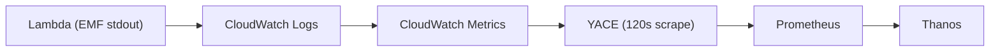

# ZOA Observability

ZOA observability has two pillars: **metrics** (CloudWatch EMF → Thanos) for
dashboards and alerts, and **logs** (CloudWatch Logs) for debugging individual
executions.

## Metrics Pipeline

ZOA emits metrics via AWS CloudWatch Embedded Metric Format (EMF). These
metrics flow through a multi-stage pipeline before reaching Thanos:



**Expected end-to-end latency**: 5–7 minutes from EMF emission to metric
availability in Thanos. This is the sum of CloudWatch log ingestion (~1 min),
CloudWatch Metrics aggregation (~1–2 min), YACE scrape interval (120s), and
Prometheus scrape + remote-write (~30s).

## EMF Metrics Catalog

All metrics are emitted to the `ZOA` CloudWatch namespace via
`pkg/metrics/routes.go`. YACE converts them to Prometheus metrics with the
naming convention: `aws_zoa_<metric_snake_case>_<statistic>`.

**CamelCase-to-snake_case gotcha**: YACE treats consecutive uppercase letters
as a single token. For example, `GCLastRun` becomes `gclast_run` (not
`gc_last_run`). This affects all GC-prefixed metrics:

| CloudWatch name             | Prometheus name                              |
| --------------------------- | -------------------------------------------- |
| `GCLastRun`                 | `aws_zoa_gclast_run_maximum`                 |
| `GCDuration`                | `aws_zoa_gcduration_average`                 |
| `GCErrors`                  | `aws_zoa_gcerrors_sum`                       |
| `GCCleanedResources`        | `aws_zoa_gccleaned_resources_sum`            |
| `ReconcilerLastRun`         | `aws_zoa_reconciler_last_run_maximum`        |
| `ReconcilerDuration`        | `aws_zoa_reconciler_duration_p99`            |
| `ReconcilerErrors`          | `aws_zoa_reconciler_errors_sum`              |
| `ExecutionCount`            | `aws_zoa_execution_count_sum`                |
| `ExecutionDuration`         | `aws_zoa_execution_duration_p99`             |
| `HttpRequestCount`          | `aws_zoa_http_request_count_sum`             |
| `HttpRequestDuration`       | `aws_zoa_http_request_duration_p99`          |
| `RejectionCount`            | `aws_zoa_rejection_count_sum`                |
| `CircuitBreakerStateChange` | `aws_zoa_circuit_breaker_state_change_sum`   |

### Emit Functions

Each `Emit*` function in `pkg/metrics/routes.go` produces one EMF log line
with specific dimensions:

| Function                        | Dimensions                                                   | Metrics emitted                                        | When emitted                    |
| ------------------------------- | ------------------------------------------------------------ | ------------------------------------------------------ | ------------------------------- |
| `EmitHTTPRequest`               | Cluster, HandlerMode, Method, RouteTemplate, StatusClass     | HttpRequestCount, HttpRequestDuration                  | Every API request               |
| `EmitRejection`                 | Cluster, Reason                                              | RejectionCount                                         | Cooldown, circuit breaker, etc. |
| `EmitExecution`                 | Cluster, Action, Status, Mode, Scope, Type                   | ExecutionCount, ExecutionDuration                       | Terminal TA state transition    |
| `EmitGCCleaned`                 | Cluster, ResourceType                                        | GCCleanedResources                                     | Each resource cleaned by GC     |
| `EmitCircuitBreakerStateChange` | Cluster, State                                               | CircuitBreakerStateChange                              | Circuit breaker open/close      |
| `EmitReconciler`                | Cluster, HandlerMode                                         | ReconcilerDuration, ReconcilerErrors, ReconcilerLastRun | Every reconciler tick           |
| `EmitGC`                        | Cluster, HandlerMode                                         | GCDuration, GCErrors, GCLastRun                        | Every GC tick                   |

### Cost Model

EMF metrics incur CloudWatch custom metric costs (~$0.30/metric/month). Native
AWS metrics (Lambda invocations, DynamoDB throughput, SQS depth) are free — the
cost is only in the YACE API calls to scrape them.

The base EMF footprint is fixed per cluster (reconciler, GC, HTTP, circuit
breaker metrics). The variable part comes from `EmitExecution`, which produces
timeseries per `Action × Status × Mode` combination. Each new TA adds roughly
$2–3/month per cluster.

**Quick cost estimate**: base EMF ~$24/cluster/month + ~$2.50 per TA per cluster.

## Recording Rules, Alerts, and Dashboard

Recording rules, alerting rules, and the Grafana dashboard are defined in the
[`rosa-hyperfleet`](https://github.com/openshift-online/rosa-hyperfleet) repo:

| What                | Source of truth |
| ------------------- | --------------- |
| Recording rules and alerts | [`argocd/config/regional-cluster/alerting-rules/templates/zoa.yaml`](https://github.com/openshift-online/rosa-hyperfleet/blob/main/argocd/config/regional-cluster/alerting-rules/templates/zoa.yaml) |
| Dashboard           | [`argocd/config/regional-cluster/grafana/dashboards/zoa/zoa.json`](https://github.com/openshift-online/rosa-hyperfleet/blob/main/argocd/config/regional-cluster/grafana/dashboards/zoa/zoa.json) |
| YACE scrape config (RC) | [`argocd/config/regional-cluster/cloudwatch-exporter/values.yaml`](https://github.com/openshift-online/rosa-hyperfleet/blob/main/argocd/config/regional-cluster/cloudwatch-exporter/values.yaml) |
| YACE scrape config (MC) | [`argocd/config/management-cluster/cloudwatch-exporter/values.yaml`](https://github.com/openshift-online/rosa-hyperfleet/blob/main/argocd/config/management-cluster/cloudwatch-exporter/values.yaml) |

Refer to those files for the definitive list of rule names, alert thresholds,
`for` durations, and PromQL expressions. Below is the design philosophy — the
*why* behind the choices, which changes less often than the *what*.

### Recording Rules

Recording rules pre-compute values consumed by alerts and dashboard panels.
They fall into three categories:

- **SLO ratios** — TA success rate, API availability, Lambda error rate.
  Aggregated per cluster for fleet-level monitoring.
- **Tick health** — gap-filled last-run timestamps and `changes()` counts for
  both reconciler and GC. CloudWatch metrics have natural gaps due to the
  5–10 min scrape/aggregation cycle; `last_over_time()` fills those gaps so
  alerts and panels always have a value.
- **Traffic guards** — total execution volume, used by SLO alerts to suppress
  false-positives when there is no traffic.

### Alerting Philosophy

Two severity levels:

- **Critical** (page oncall) — ZOA's operational capability is lost.
  Reserved for total TA failure (dependency outage) and reconciler stall
  (silent async pipeline failure). These require human intervention to
  restore ZOA's ability to respond to incidents.
- **Warning** (Slack) — degradation that needs attention but is not
  an immediate operational risk. SLO breaches, throttling, Lambda errors,
  GC issues, circuit breaker flapping, DLQ growth.

Design constraints for a fleet of 40+ regions:

- Alerts aggregate per cluster, not per action — keeping oncall burden
  proportional to regions, not to TA count.
- SLO alerts include traffic guards to avoid false-positives on idle clusters.
- `for` durations account for the 5–7 min CloudWatch pipeline delay.
- All alerts carry `runbook` annotations with troubleshooting steps, designed
  to evolve into SOPs.

### Dashboard Sections

- **SLO Overview** — stat panels for success rate, availability, error rate,
  execution count, duration (sync/async), DLQ depth.
- **Activity Overview** — bar charts breaking down executions by cluster,
  status, scope, type, mode over the dashboard time range.
- **Trusted Action Executions** — per-action count, duration, rejections.
- **HTTP API** — request count by route and status, 5xx vs 4xx, duration.
- **Worker Pipeline** — reconciler/GC duration, errors, tick health, circuit breaker.
- **Infrastructure** — Lambda (invocations, errors, duration), DLQ (depth, age),
  DynamoDB (throttling, latency, capacity).

Dashboard variables: `$datasource`, `$cluster` (RC/MC), `$action` (TA name).

## Lambda Logs

Each ZOA Lambda function writes structured JSON logs to CloudWatch Logs. These
are the primary tool for debugging individual executions, reconciler ticks,
and GC runs.

### Log Group Naming

Each cluster has two log groups per Lambda deployment:

```
/aws/lambda/<cluster>-zoa-api
/aws/lambda/<cluster>-zoa-worker
```

### Viewing Logs in Grafana Explorer

1. Open **Grafana → Explore**
2. Select the **datasource** matching the target AWS account:
   - Regional cluster account → for RC Lambda logs
   - Management cluster account → for MC Lambda logs
3. Switch the datasource mode to **CloudWatch Logs** (not the default CloudWatch Metrics)
4. Click **Search log groups** and type `/aws/lambda/` to find ZOA log groups
5. Select one or both (`-zoa-api`, `-zoa-worker`)
6. Use CloudWatch Logs Insights query syntax, for example:

```
fields @timestamp, @message
| sort @timestamp desc
| limit 50
```

Useful filters:

```
# Find a specific execution
fields @timestamp, @message
| filter @message like /execution_id/
| sort @timestamp desc

# Find errors only
fields @timestamp, @message
| filter @message like /error/i
| sort @timestamp desc
```

## E2E Validation

The monitoring E2E suite (`test/e2e-monitoring/`) validates that the full
pipeline is healthy: metrics reach Thanos, recording rules are loaded, and
alerting rules are present. See [e2e-testing.md](e2e-testing.md#monitoring-suite-details)
for details on running the tests.
